# Java Learning 

###  Francio PKU_CCME 

资料来源：哔哩哔哩-求知讲堂

<!-- more -->

## Day01  Hello World

### Java入门

​	Java的编写用文件（源文件）：**.Java，其基本组成部分为类（class）

​	public class:后面应与文件名一致，否则会报编译错误。

​	编写完Java文件以后，使用cmd命令 javac **.java 进行编译，多出一个class文件

​	运行：输入 Java **即可运行

​	Java严格区分大小写，用中文标点会报非法字符。

### 注释

​	单行注释: //     VS Code中快速注释掉代码块：选中后 ctrl + /

​	多行注释: /* */ 

​	文档注释: /** 回车后每行前面加星号

​	/n 换行  /t 制表符（制表符即为多个空格）

## Day 02  基础语句 Part 1

### 关键字

​	关键字为被Java赋予了特殊含义，作专门用途，特点为其中的所有字符为小写。通俗来说关键字表示了程序中某部分的性质或含义（e.g. public 公共；void 不返回值;4；static 静态）

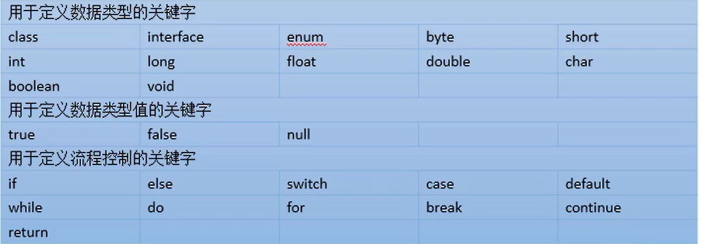

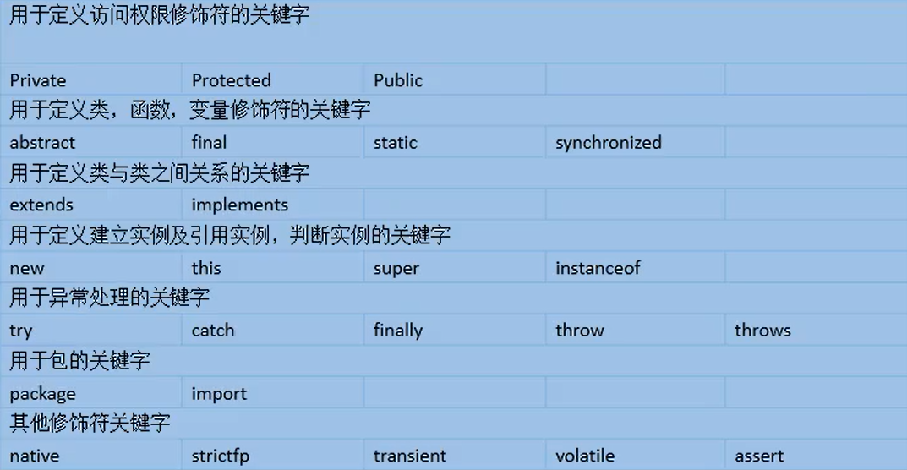

### 保留字

​	可能以后被作为关键字使用，在写程序时应注意规避。

​	e.g. byValue  cast  future  genneric  inner  operator  outer  rest  var  goto  const

### 标识符

​	Java中对各种变量、方法、类等要素的命名时使用的字符为标识符，简单来说就是可以由编程者起名的部分

#### 合法标识符

1. 由英文字母，大小写，0-9，_，$组成
2. 不可以用数字开头，不可以包含空格
3. 不能用关键字或保留字，但可以包含关键字与保留字
4. 严格区分大小写，对长度无限制
5. 为提高阅读性，应尽量使标识符有含义

#### 命名规范

1. 包名：所有字母小写  xxxyyyzzz
2. 类名、接口名：所有单词首字母大写  XxxYyyZzz
3. 变量名、方法名：第一个单词首字母小写，其余单词首字母大写  xxxYyyZzz
4. 常量名：所有字母大写，多单词间用下划线 "_" 相连  XXX_YYY_ZZZ

### 变量

​	Java中变量的定义："数据类型 变量名 = 变量值"  e.g.  int i =1   java中所有变量需要先声明再使用，变量是值可以在所定义的数据类型下变化，直接使用等号赋值即可。

注意：声明变量时所用等号为赋值符号；变量的作用域为一对大括号内；声明变量时必须赋初始化值

#### 变量的分类：以数据类型分

​	在Java中数据类型分为基本数据类型和引用数据类型，其中基本数据类型有八种，除了这八种外其他所有类型均为引用数据类型。

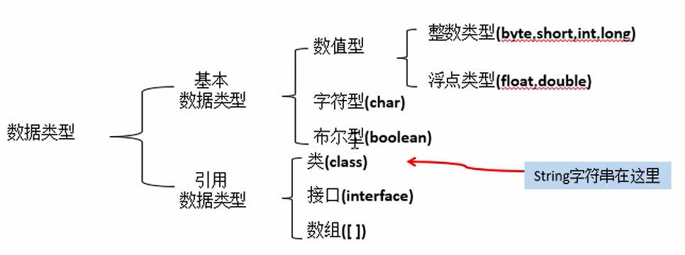

##### 整数型：byte short int long 

​	java的整形常量默认int型，声明long型常量需在值后面加"l"或"L"  e.g. long i = 3L

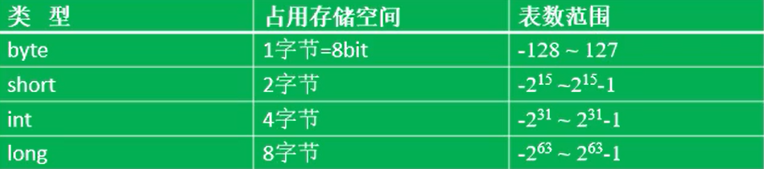

##### 浮点型 float double 

​	浮点型常量默认double型，声明float型常量需在值的后面加"f"或"F

##### 字符型 char

​	字符常量为用英文单引号括起来的**单个字符**，char类型可以进行运算。

​	常用转义字符：\b 退格符  \n 换行符  \r 回车符  \t 制表符   \\" 双引号  \\' 单引号  \\\ 反斜线

​	e.g. char i = ''' 会报错，char i = '\\''即可将单引号存储为char型。

##### 布尔型 boolean

​	只有true false      e.g. boolean b = true;

##### 引用类型 String类

​	String类用于接收字符串（用双引号括起来），是典型的的不可变类，String对象创建后就不可能被改变。该类属于引用类型，可用null赋值。

​	null可以赋值给任何引用类型的变量，用以表示该引用类型变量中保存的地址为空。

​	e.g. String str = "hello world";

​	int i0 = 1;   int i1 = 1;  会在内存中存储两个1的值

​	String s0 = "hello";  String s1 = "hello"; 仅在内存中存储一个hello，两个变量名去引用hello

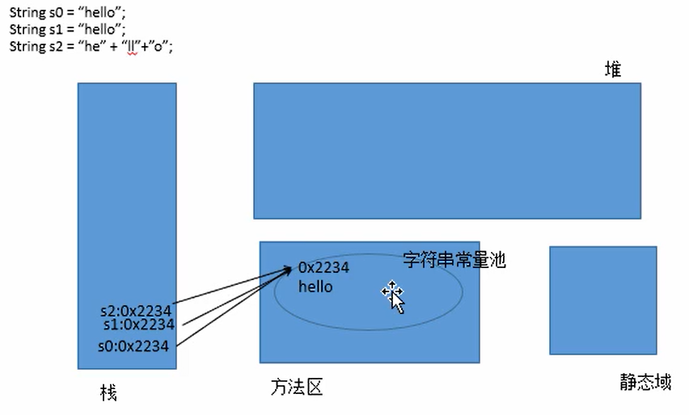

​	假设“hello”的内存地址为xxxxx,声明s0变量时，给s0赋值实际上是让s0变量引用"hello"的内存地址xxxxx;当我们再声明变量s1为"hello"时，实际上是直接把已存在的"hello"的内存地址给s1引用。

#### 基本数据类型转换

##### 自动类型转换

- 自动类型转换：容量小的类型自动转化为容量大的类型（小类型可以赋值给大类型，反之不可以）         e.g. int i = 0; byte b = i; 此语法会报异常，此类异常称为编译期异常。

    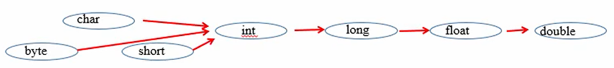

- 多种数据类型参与运算时，系统先将所有数据转化为最大容量的类型再进行运算。

- 数字类型的运算中，多个相同变量参与的运算，变量首先要转化为对应数据类型的**默认类型**再进行计算。此规则只有原变量类型比默认类型小的时候适用。（比如两个byte型变量相加，会先把两个byte型变量转化成默认的int型后进行计算，得到的结果为int型。）

- byte short char 间不发生转化，计算时首先转化为int类型。

- 任何基本类型的值与字符串值进行连接（加法）运算时，全部转化为字符串型。                                  e.g. String str = “”+1+2+3；输出123     但 String str = 1+2+3；会报错。而String str = 1+2+“a”+3输出的是3a3

- 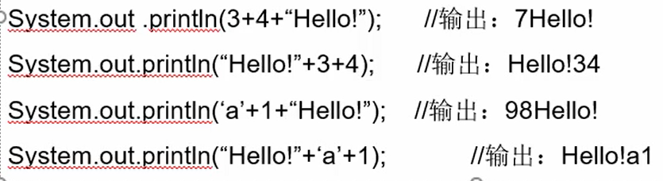

- char类型在进行运算时，转换为ASCII码的值后再以数字参与运算，此时为int型。

##### 强制类型转换

​	为自动类型转换的逆过程，使用时要加上强制转换符（()）,但可能早场精度降低或溢出                   	 	e.g. byte b0 = (byte)k;

​	通常字符串不能转化为基本类型，但通过基本类型对应的包装类可以实现转化                                   	e.g. String a = "43"; int i = Integer.parceint(a);

​	boolean不可转化为其他类型

### 运算符

​	运算符用于表示数据的运算、赋值与比较等。

#### 算术运算符

​	用于计算数字，规则与数学一致。

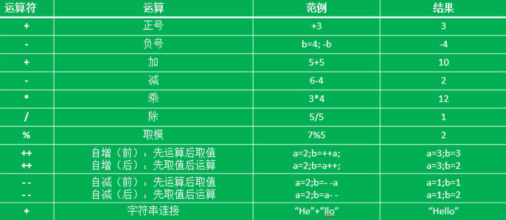

​	注意事项：

1. 当整数除以整数的时候会将小数部分舍弃，只保留整数部分。

2. 若对负值取模，可以把模数的负号忽略。但若被模数为负数，则负号不可忽略。5%-2=1；-5%2=-1

3. “+”除字符串相加功能外，还可以把非字符串转化为字符串。

4. 区别：System.out.println( ' * ' + '\\t'  + ' * ' );与System.out.println( " * "+ '\\t'  + ' * ' );

5. Java中没有乘方运算。

6. x++ 先取值后运算  ++x 先运算后取值。

    ​	e.g. int x = 1;

    ​    System.out.println(x++);

    ​    System.out.println(x);

    ​	System.out.println(++x);

    输出 1  2  3

#### 赋值运算符

​	符号：“=”。当数据类型不一致时可以应用自动类型转换或强制类型转换。支持连续赋值。                	e.g.  a=b=c=0

​	扩展赋值运算符：+=、-=、*=、/=、 %=       e.g. i += 2 等价于 i = i + 2。字符串的+=为拼接。

​	注意：设 s 为 short 型，则 s = s + 3 不能通过编译（参见 自动类型转换）但 s += 3 可通过编译，即在使用扩展的赋值运算符时，变量在参与运算时会将结果强制转化为当前变量的类型。

#### 比较运算符

​	输出结果均为 Boolean 型。

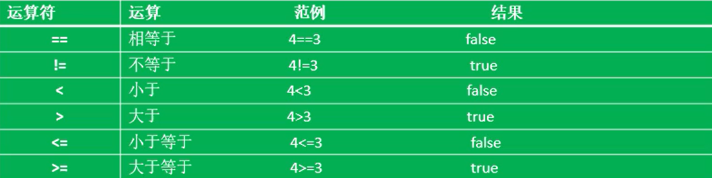

## Day 03  基础语句 Part 2

### 运算符

#### 逻辑运算符

​	& 逻辑与  | 逻辑或  ！ 逻辑非        && 短路与  || 短路或  ^ 逻辑异或

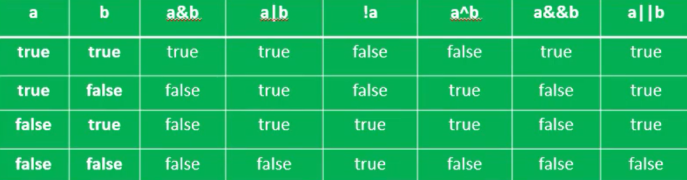

- 逻辑运算符用于连接布尔型表达式，在Java中不可以写成 3<x<6，应写成 x>3 & x<6。
- & 与 && 的区别：单 & 时左边无论真假，右边都参与运算；双 && 时若左边为真，右边参与运算，若为假，右边不运算。e.g.  i != 0 && ++k 此类语句可以看出差别。
- || 与上述 && 规则相同，当左边为真，右边不参与运算
- 异或（^）与或（|）不同之处为：当左右都为true时，结果为false。 
- if （Boolean值）{代码}：若小括号内为true，则执行代码段

	#### 位运算符

​	位运算是直接对二进制进行运算。

​	负数的二进制表示：补码（负数的二进制）= 反码+1，反码即为正数的0 1互换。负数和某正数具有相同的二进制表示，但由于有数据类型的范围限制，该正数已经超出范围，故不会引起混乱。

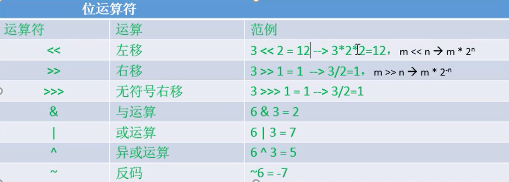

​	注：没有 <<<

​	区别>> 与 >>>：仅在对负数操作时有区别。

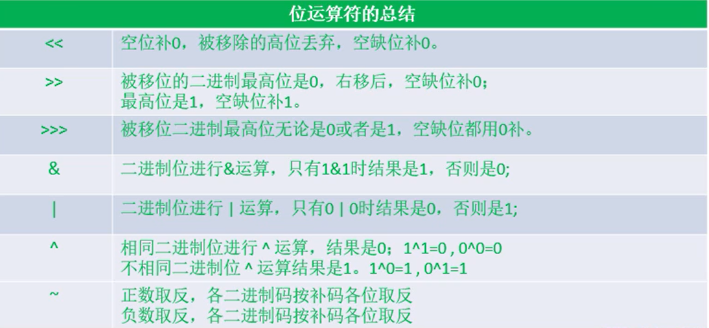

​	以&为例：

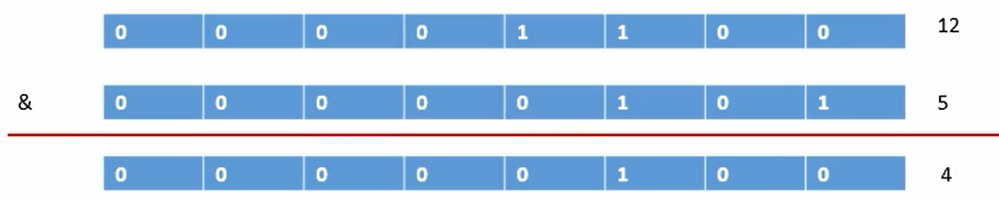

#### 三目（元）运算符

​	格式：（条件表达式）？表达式1：表达式2；为true，运算表达式1；为false，运算表达式2。

​	e.g. int i = 1;   int k = i > 0 ? 1 : 0;   最后k为1.

​	运算符可嵌套：x =  m>n? (m>k? m:k) : (n>k n:k);

#### 运算符优先级

​        	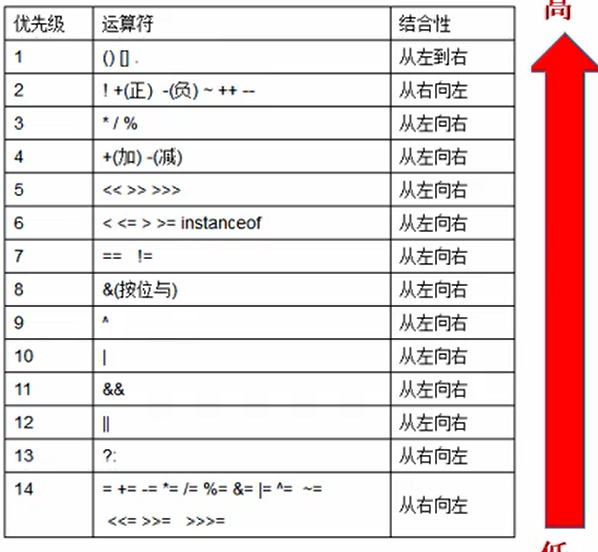

​	只有单目运算符、三元运算符和赋值运算符是从右向左运算。结合性指的是同一组内的优先级顺序从高到低排列。

​	小括号优先级最高，可使用小括号提高优先级。

### 程序流程控制

​	分为顺序结构、分支结构（if else switch）、循环结构(while do...while for foreach)。

#### 顺序结构

​	Java中定义成员变量时采用合法的前向引用。通俗来说，即为代码的执行顺序为从上到下。

#### 分支结构

##### if-else语句

 格式：if（条件表达式）{代码块；}

​			else if （条件表达式）{代码块；}

​			else{代码块；}

​	大括号区域内允许嵌套另外的分支语句

##### switch语句

​	用于变量取各种不同值时产生的分支。default作用类似于else。

​	格式： swich(变量){

​				case 常量1：语句1；break；

​				case 常量N：语句N；break；

​				default：语句；break；

​				}

- swich（变量）中变量的返回值必须是以下几种类型：byte short char int Sting 枚举
- case 子句中的值必须是常量，且所有 case 子句中的值应是不同的
- default 子句是可任选的，当没有匹配的 case 时，执行 default
- break 语句用来执行完一个 case 分支后使程序跳出 switch 语句块；如果没有 break ，程序会从匹配到的 case 处开始顺序执行到 switch 结尾
- if 语句可进行区间和 boolean 类型的判断，范围更广，但对于满足 switch 条件的简单判断， switch语句效率更高。

## Day 04  基础语句 Part 3

### 程序流程控制

#### 循环结构  for  while  do/while

​	功能：反复执行特定代码段

​	组成部分：初始化（init_statement）循环条件（test _exp）循环体（body\_statement）迭代部分（alter\_statment）

​	循环结构可以互相嵌套，在写嵌套循环时要注意尽量保证外层循环的循环次数小于内层循环次数。

##### for循环

​	语法： for (int i = 1 ; i <= 100 ; i++){ System.out.println(i) }

​	运行顺序：判断，若为true，执行代码块，再自增，最后对i重新赋值

​	无限循环 ：for(;;)

##### while循环

​	语法：[初始化语句]; while(布尔值测试表达式){语句块; [更改语句]}

​	无限循环：while(true)

##### do-while 语句

​	语法：[初始化语句]; do{语句块; [更改语句]}while(布尔值测试表达式)

### 特殊流程控制语句

​	break：用于终止某个语句块的执行，主要用在循环结构里。	

​	continue：用于跳过某个循环语句的**一次**执行

​	return：用于结束一个方法，不管这个return处于多少层循环内

- break只能用于switch语句和循环语句中
- continue只能用到循环语句中
- continue与break功能相似，但continue终止本次循环，break终止本层循环
- continue与break间不能有其他语句，因为程序永远不会执行后面的语句。

### 数组

##### 一维数组

​	声明方式：type var[];   或   type[] var;   e.g. int a[];  int[] a; Mydate[] c;（对象数组）

​	初始化：动态初始化：int[] ii = new int[n]  声明一个能放n个int型数据的数组

​				  静态初始化：int[] ii = new int[]{a,b,c,d}  声明了一个存放a,b,c,d四个数的数组

​				  默认初始化：在动态初始化时，初始存储的为0（数字类型）或null（对象类型）

​	元素引用：使用元素下标（从左到右从0开始），ii[n]即为取第n位的元素。

​				      使用 ii.length 查看数组长度

​	赋值： 类似于给变量赋值，ii[n] = xxx;
}}
##### 多维数组

​	多维数组不必是规则矩阵。

​	动态初始化 1：`int[][] arr = new int[m][n]`  定义名为arr的二维数组，其中有m个一维数组，每个一维数组中有n个元素，第k个一维数组名称为`arr[k]`，赋值使用 `arr[k][l] = xxxx`。

​	动态初始化 2 ：`int[][] arr = new int[m][]  定义名为arr的二维数组，其中有m个一维数组，第二维不定义，默认值为空，`

``可对第k个一维数组单独定义：arr[k] = new int[m]。注意，int[][] arr = new int[][m]非法。`

​	静态初始化：`int[][] arr = new int[][]{}`

​	注意特殊写法：int[] x,y[];定义得到的x为一维数组，y为二维数组。

##### 数组中的常见算法

​	代码参见 [numgroup.java](Day 04\numgroup.java) 

###### 最大值、最小值、中位数、平均数、求和、复制、翻转

###### 排序：

​	插入排序：直接插入排序、折半插入排序、Shell排序

​	交换排序：冒泡排序、快速排序（分区交换排序）

​	选择排序：简单选择排序、堆排序

​	归并排序

​	基数排序

##### 数组常见问题

- 数组下标越界：访问到了数组中不存在的角标

- 空指针异常：引用没有指向实体，却在操作实体中的元素。e.g.操作了值为null的数组

    以上两种问题在编译时不会报错

## Day 05  面向对象（OOP）编程 Part 1

​	面向对象强调具备了**功能**的对象，将功能封装入对象。其特征为封装、继承与多态。面向对象程序设计的重点是**类的设计**。

### Java类及类成员

​	Java代码世界由诸多不同功能的类组成，类中包含属性（成员变量，Field）和行为（成员方法，函数，Method）。定义类即为定义类中的成员（成员变量与成员方法）

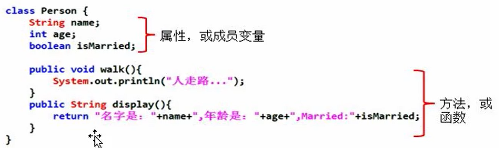

### 类的语法格式

​	修饰符 class 类名{ 属性声明；方法声明；}

​	修饰符 public 意为类可以被任意访问。类的正文要用{}括起来。类的成员变量可以先声明，不初始化，有默认值。引用类型（如String）默认为null，数字类型默认为0，char默认‘\u0000’，boolean默认false

​	示例代码参见 [Person.java](Day 05\Person.java) 

​	创建Java自定义类的一般步骤：

1. 定义类：考虑修饰符（一般为public）和类名
2. 编写类的属性：修饰符、属性类型、属性名、初始化值
3. 编写类的方法：修饰符、返回值类型（不返回即为void）、方法名、形参等

### 对象的创建与使用：实例化

​	可以使用new+构造器创建新的对象，使用对象名.对象成员的方式访问对象成员

​	示例代码参见 [Test1.java](Day 05\Test1.java) 

​	对于对象的使用无外乎两种方法：操作对象的变量，调用类的方法。

​	若创建了一个类的多个对象，则每个对象都拥有各自的一套副本，互不干扰。

### 类的成员之一：属性（成员变量）

​	语法格式：修饰符 类型 属性名 = 初值

​	修饰符：private：该属性只能由该类访问，不能在类的外面（实例化后用对象.属性）使用；  public：该属性可以被该类以外的方法访问，较常用。

##### 变量的分类

- 在方法体外，类体内声明的变量称为成员变量
- 在方法体内部声明的变量称为局部变量
- 实例变量：在类实例化为对象后才能使用
- 类变量：静态的，不需要类实例化为对象即可使用，直接可以通过**类名**.属性（注意与一般的**对象**.属性区分！！）的方式直接调用。
- 代码块局部变量：在类里直接写一个大括号，在该大括号里定义的变量

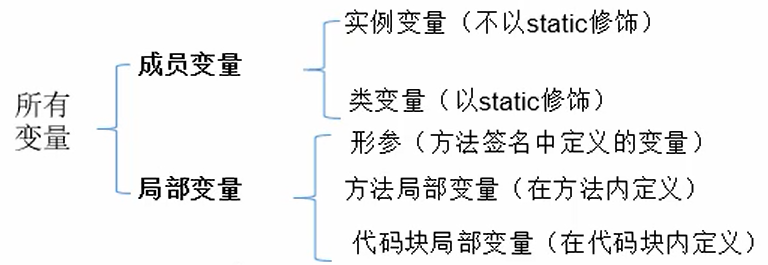

##### 成员变量（属性）与局部变量的区别

###### 成员变量

- 定义在类中，在整个类中可以被访问
- 分为类成员变量和实例成员变量。实例变量存在于对象所在的堆内存中，只有在类实例化后的对象中可以使用。
- 有默认的初始化值，该初始化值的赋予在实例化时进行
- 权限修饰符可以根据需要任选

###### 局部变量

- 只定义在局部范围内
- 存在于栈内存中
- 作用的范围结束，变量空间会自动释放
- 没有默认初始化值，每次必须显式初始化（形参除外）
- 声明时不指定权限修饰符

### 类的成员之二：方法

​	Java的方法必须定义在类内，只有在被调用时才执行

​	语法格式：修饰符 返回值类型 方法名（参数列表）{方法体语句；}

​	修饰符：public private protected 等

​	返回值类型：return语句传递返回值，无返回值则用void

​	参数列表：可以定义无穷个各种类型的参数，参数间用逗号隔开，其中定义的参数名又被称为形式参数（形参），对应概念为实参：调用方法时实际传给函数形参的数据。任何的**类**也可以作为形参递交给方法，格式为（类名 变量名）

​	注意：方法中可以**调用**其他方法，但不能**定义**新方法。同一个类中所有的方法可以直接互相调用，无需实例化。

### 匿名对象

​	即为不定义对象的句柄，直接调用对象的**方法**。e.g. new Person().shout()

​	使用情况：一个对象仅需要进行一次方法调用，或将匿名对象作为实参传递给一个方法调用。

### 类的访问机制

​	同一个类中：类中的方法可以直接访问类中的成员变量。例外：static方法访问非static时编译不通过

​	不同类中：先创建要访问的类的对象，再用对象访问类中的成员。

### 方法的重载（Overload）

​	重载：在同一个类中，允许存在一个以上的**同名**方法，只要它们的参数个数或者参数类型不同即可

​	特点：与返回值类型无关，只看**参数列表**，且参数列表必须不同（参数**个数或类型或不同类型间的顺序**）。调用时根据方法参数列表的不同来区别。

## Day 06  面向对象（OOP）编程 Part 2

### 方法的可变个数的参数

​	示例代码参见 [Person.java](Day 06\Person.java) 

​	当不知道在实例化时会传给方法多少值时，用可变个数的形参，此时可用数组作为形参。

​	若一个方法有多个形参，可变形参一定要放在所有参数的最后。

​	两种写法示例：

1. public void printInfo(String[] args){} 此种写法若实例化时没有参数传进，必须写xxx.printInfo(null)
2. public void printInfo1(String...args){}  此种写法若实例化时没有参数传进，可直接xxx.printInfo1().以此种方法书写，对参数的操作方法与数组的操作方法一致。若一个方法有多个形参，可变形参一定要放在所有参数的最后。

### 方法的参数传递

#### JVM内存模型

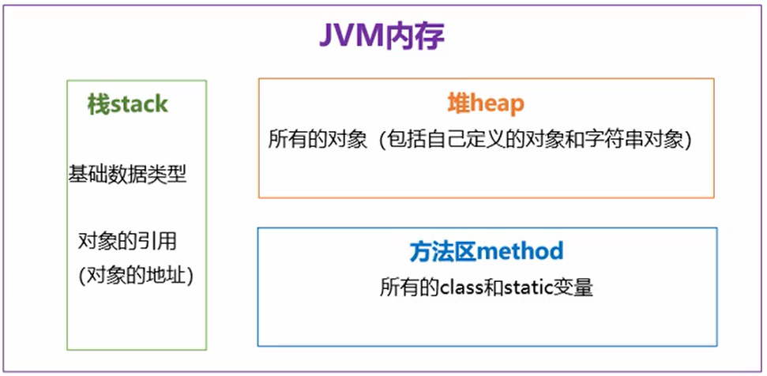

​	以 Person p = new Person 为例：引用对象首先在堆中生成一个new Person()对象，同时对应一个地址（如：BE95000）。而栈中储存的是堆中的地址BE95000，此时栈中对应有一个地址（如AG84300），该地址即为引用对象p的地址。

​	而对基础数据类型（如int i=1），直接在栈中存值1，具有一个地址（如AG84100）。

#### 基本数据类型的传参

​	Java中传参方式只有一种，“值传递”，即将实际参数值（栈内存中保存的东西）的副本传入方法内，参数本身不受影响。

​	验证该方式的代码参见 [mem.java](Day 06\mem.java) 

#### 引用对象的传参

​	验证该方式的代码参见 [DataSwap.java](Day 06\DataSwap.java) 与 [DataSwap_main.java](Day 06\DataSwap_main.java) 

​	本质上引用对象传参传的值是引用对象在堆内存中的地址。

​	运行过程：

1. DataSwap ds = new Dataswap()，把new Dataswap()对象存在堆内存中，地址假设为BE2500
2. ds引用对象，存到栈中，地址是AD9500，值为BE2500
3. 调用swep方法，给ds1引用对象保存到栈中，地址为AD9600，存的值来源于实参（ds），即ds在栈中存的值BE2500。此时ds和ds1同时指向了同一个对象（BE2500处保存的swep对象），操作的也是同一个对象。

### 软件包

​	类似于文件夹的概念，为了解决同名文件冲突，文件太乱难以管理的问题。

​	关键字：package 格式为 package 顶层包名.子包名。包通常用小写单词，类名通常首字母大写。

​	调用包下的文件：import xxx.xxx.xxx 或程序自动引用。若不引用，也可直接在需要的语句中写包名。如 day06.test.Person p = new day06.test.Person()

​	调用整个包：import xxx.xxx.*  该语句出现在package语句之后，类定义之前。若引入的包为java.lang,则编译器默认可以获取此类下的包，无需再声明。使用同一个包下的类，无需import。

Java 中的包：

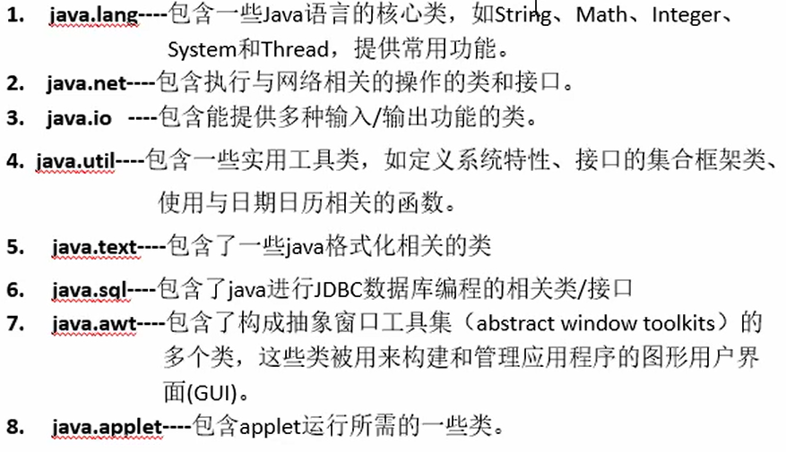

### 面向对象的特征之一：封装与隐藏

​	前述类的调用过程中，类的属性是开放的，调用者可以随意使用或赋值，这样会有问题。我们需要对这样不能让调用者随意使用的属性作封装和隐藏，即private的使用。先把变量设置为私有，再使用公共的方法对其进行设置（setXxx() getXxx()）

​	示例代码参见 [private0.java](Day 06\private0.java) 

### 四种访问权限修饰符

​	权限修饰符用于类的成员定义前，限定对象对该类成员的访问权限。

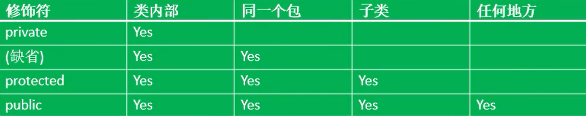

​	对于class的权限修饰只能用public和default（缺省）。public类可在任意地方被使用，default类只可以被**同一个包**内部的类访问

​	如果子类和父类在同一个包下，那么对于父类成员的修饰符只要不是private，子类都可以访问。但对于不在同一个包内的父子类，子类只能使用父类中protected和public修饰的成员

​	在同一个Java文件里可以写多个class，但只能有一个是public的，其他的class只能缺省。

​	子类：定义方法示例：public class PersonChild extends Person{} 子类需要import父类

​			   示例代码参见 [PersonChild.java](Day 06\PersonChild.java) 

### 类的成员之三：构造器（构造方法）

​	构造器特征：

- 有着与类相同的名称
- 不声明返回值的类型（与声明为void不同）
- 不能被static final synchronized abstract native 修饰，不能有return返回值
- 作用：创建对象，给对象初始化。new对象实际上就是调用类的构造方法。
- 隐式无参构造器：当生成一个类（设类名为xxx）后，会自动对应xxx（）的构造方法。默认的构造方法前面有没有访问的修饰符跟定义的类一致。
- 显示定义一个或多个构造器：此时可以有参也可以无参（无参类似于python中的CONFIG）。写了显式构造方法后就不会使用默认的构造。示例代码参见 [Person2.java](Day 06\Person2.java) 
- 一个类可以创建多个重载的构造器
- 父类的构造器不可被子类继承

### 构造器的重载

​	类似于前面提到的方法的重载，构造器重载也要求参数列表的个数、类型或顺序不同。重载的意义为方便调用方可以灵活地创造出不同需要的对象，相当于提供了多种对象模板。

​	使用时new xxxx()即为无参调用，当括号里有参数时为重载的其它方法的调用。

### 关键字 this

​	this 表示当前对象，可以调用类的属性、方法和构造器。

​	当**在方法内**需要调用**该方法的对象**时，就用this。示例代码参见 [PersonThis.java](Day 06\PersonThis.java) 

​	this 在构造器中使用时，表示该构造器正在初始化的对象；在方法内部使用，表示该方法所属对象的引用。

​	this可以明确标识出输出的为类成员变量，防止混淆。增强程序的阅读性

​	注意：使用this()必须放在构造器首行，；在使用this调用本类中其他构造器时，必须保证至少有一个构造器不用this（规避循环调用和自己调用自己）

### JavaBean

​	JavaBean是个约定俗成的规矩，指的是符合如下标准的java类：

1. 类是公共的

2. 有一个无参公共构造器

3. 有属性，属性一般为私有的，且有对应的get、set 方法。

    标准示例代码参见 [PersonBean.java](Day 06\PersonBean.java) 

    注：VScode可以通过鼠标右键-源代码操作-Generate Getters and Setter批量设置get、set方法

## Day 07 高级类特性  Part1

### 面向对象的特征之二：继承

​	继承的存在是为了避免代码的繁琐型，避免不必要的重复,同时让类与类之间产生了关系，提供了多态的前提 。注意，子类不是父类的子集，是父类的扩展

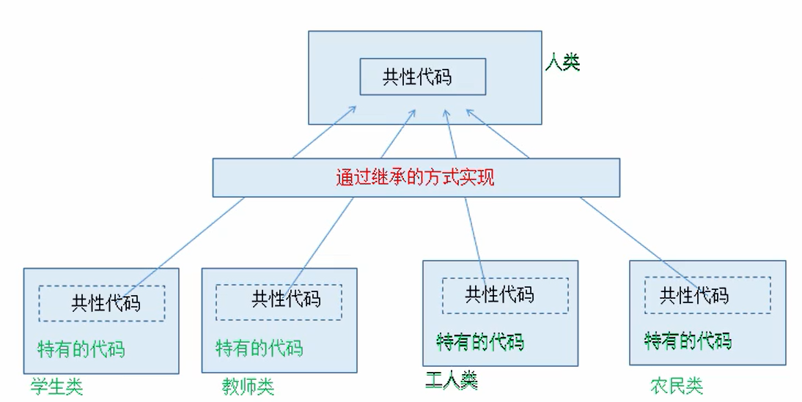

​	语法：class Subclass extends Superclass()    示例代码参见 [Student.java](Day 07\Student.java) 

​	注意：不要仅为了获取其他类中的某个功能而去继承。继承应有逻辑关系在其中

### 类的继承

​	Java只支持单继承，不允许多重继承，但可以多层继承（一个子类只能对应一个父类，但一个父类可以对应多个子类）

### 方法的重写（Override）

​	定义：在子类中可以根据需要对从父类中继承来的方法进行改造，也称为方法的重置、覆盖,该操作仅仅是重新编写方法体的代码。在程序执行时，子类的方法将覆盖父类的方法。

​	快捷键：Alt+/   示例代码参见[Student.java](Day 07\Student.java) 

​	要求：

- 重写方法必须和被重写方法具有相同的方法名称、参数列表和返回值类型

- 重写方法不能使用比被重写方法更严格的访问权限

- 重写和被重写的方法必须同时为static或非static的

- 子类方法抛出的异常不能大于父类被重写方法的异常

    注意：当父类有private时，子类压根无法访问，更谈不上重写。

### 关键字 super

​	Java类中使用Super来调用父类中的指定操作（变量或方法）（用法类似于this）：

- 访问父类中定义的属性

- 调用父类中定义的成员方法

- 在子类构造方法中调用父类的构造器，示例代码参见 [Kk.java](Day 07\Kk.java) 

    - 子类中所有构造器默认会访问父类中空参数构造器
    - 当父类中没有空参数构造器时，子类的构造器必须通过this（参数列表）或者super(参数列表)语句指定调用本类或父类的构造器，且必须放在构造器第一行
    - 当父类没有无参构造器，而子类又没有显式调用父类或本类的构造器时，编译出错

    注意：

    - 子父类出现同名成员时，可用super进行区分
    - super的追溯不仅限于直接父类，示例代码参见 [Kk.java](Day 07\Kk.java) 
    - this代表本类对象的引用，super代表父类的内存空间的标识

### this 和 super 的区别

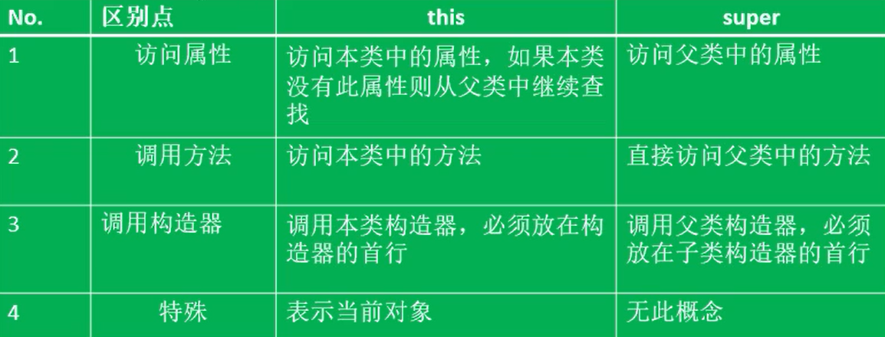

​	在子类中，通过this或是super调用构造器，只能使用一个，因为都要占据第一行。

### 简单类对象的实例化过程

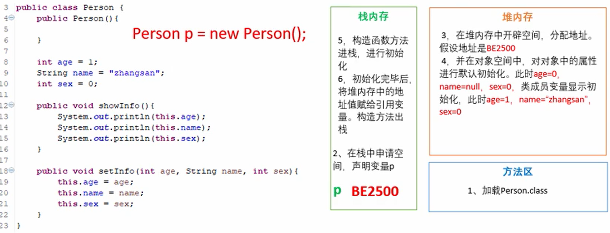

### 子类对象的实例化过程

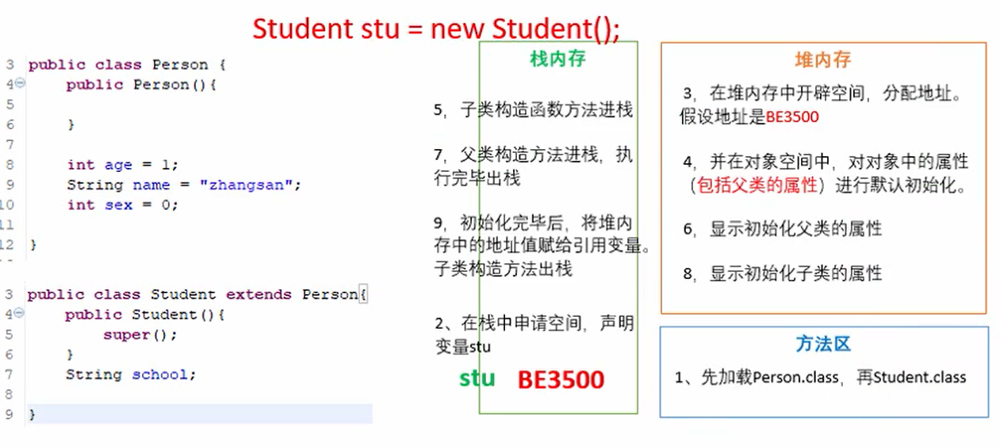

### 面向对象的特征之三：多态性

​	示例代码参见 [Kk.java](Day 07\Kk.java)

​	Java中多态性体现在方法的重载（同名方法实现了不同逻辑）和重写（子类对父类的覆盖，子类可以使用与父类相同的方法名覆盖掉父类的逻辑）与对象的多态性，后者可直接应用在抽象类与接口上。

​	Java引用变量有两个类型：编译时类型和运行时类型。编译时类型由声明该变量时使用的类型决定，运行时类型由实际赋给该变量的对象决定。若编译时类型和运行时类型不一致就会出现多态。（如引用变量定义的数据类型在堆中，而栈中变量名对应的值是一个内存地址，不是所定义的数据类型）

#### 对象的多态性

​	Java中子类的对象可以替代父类的对象使用。一个变量只能有一个确定的数据类型，但一个引用类型的变量可能指向多个不同类型的变量。（如已经定义了 p = new Person(),还可以通过p = new Student()将其改变。）	

​	向上转型(upcasting)：子类可以看成特殊的父类，所以父类类型的引用可以指向子类的对象。e.g. Person e = new Student();//父类引用对象可以指向子类实例

​	向上转型后的变量只能访问父类中的变量，在子类中新添加的成员将无法访问

#### 虚拟方法的调用

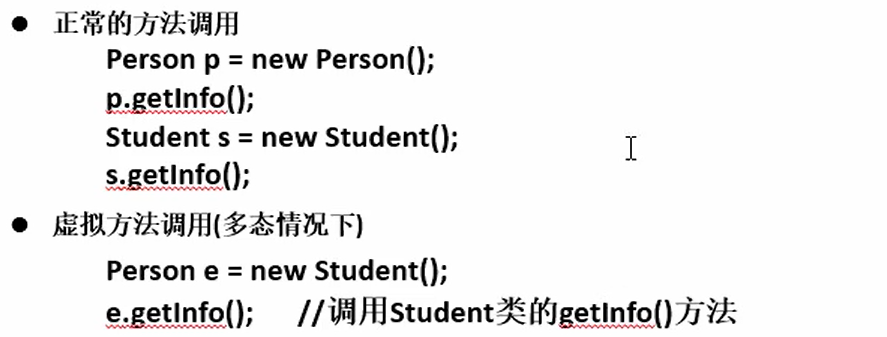

​	动态绑定：编译时e为Person类型，而方法是在运行时确定的，所以调用的是Student类中的getInfo()方法。

​	Java的方法运行在栈内存中，在运行方法时会动态的进栈和出栈，e指向的是Student对象，故调用的方法是Student的。

#### 小结

- 多态的前提：需要存在继承或实现关系；要有覆盖操作。

- 成员方法：编译时要查看引用变量所属的类中是否有所调用的方法；运行时调用实际对象所属类中的重写方法。动态绑定必须建立在方法重写的基础上。

- 成员变量： 不具备多态性，只看引用变量所属的类。

​	造成以上现象的本质是变量和方法在内存中存储方式的不同。若子类重写了父类的方法，就意味着子类定义的方法彻底覆盖了父类的同名方法，系统不可能将父类的方法转移到子类中。而子类的实例变量却不可能覆盖父类中的实例变量。

#### 多态性的应用

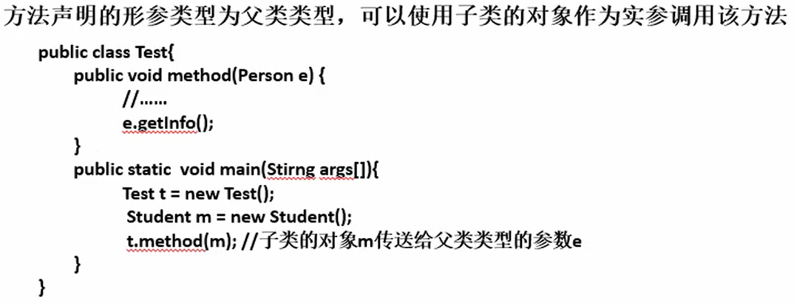

### instanceof 操作符

​	x instanceof A:检验x是否为类A的对象，返回值为boolean型。

​	要求：x所属的类与类A必须是子类或父类的关系，否则编译错误；如果x属于类A的子类B，x instanceof A返回值也为true.

### Object 类

​	Object类是所有Java类的根父类（基类），若在类的声明中没有使用extends关键字指明其父类，则默认父类为Object类。

​	想给Test方法设置一个形参，但该参数不确定到底会传进来一个什么类，但可以确定的是传递的实参一定会是一个类，那么Test方法的形参就要设置一个Object类，作为父类可以接收所有子类。

​	使用方法示例代码参见 [test.java](Day 07\test.java) 

​	Object类中的主要方法：

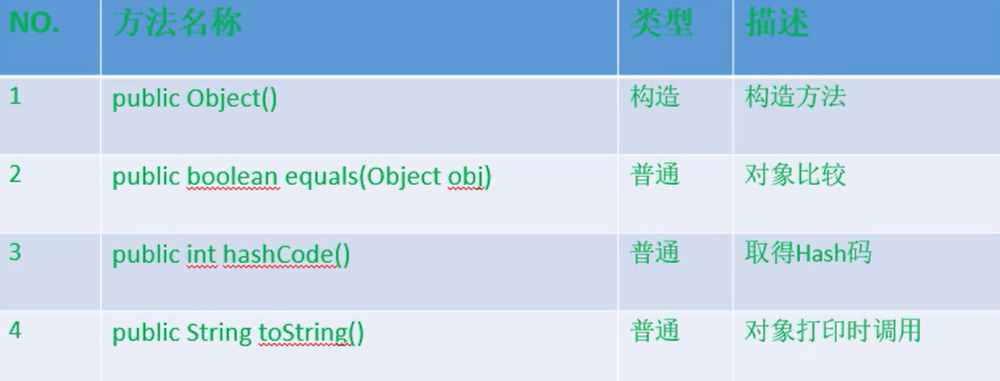

​	 System.out.println(p.toString());  打印当前对象的内存地址

## Day 08 高级类特性  Part2

### 对象的类型转换（Casting）

​	对Java对象的强制类型转换称为造型

​	子类到父类的类型转换可以自动进行，父类到子类的类型转换必须通过造型实现，无继承关系的引用类型间转换是非法的

​	应用示例代码参见 [Test.java](Day 08\Test.java) ，类在强制转换前应先用instanceof检验转换是否合法

### ==操作符与equals方法

​	==：基本数据类型比较时，两个变量的值相等即为true；引用类型比较时，只有指向同一个对象才返回True。使用该符号做判断时，两边的数据类型必须兼容或可以进行自动转换，否则编译出错。、

​	equals():只能比较引用类型，其作用与==相同，比较是否指向同一个对象。格式：obj1.equals(obj2)

​	当用equals作比较时的特例：对类File、String、Date及包装类，equals是比较**内容**（如String类中的字符串是否一样）而不考虑引用的是否是同一个对象，因为这些类中重写了equals方法。但这些类使用==作比较时，比较的是对象而不是内容。故要判断字符串是否一致应使用equals而不是==。

​	当不想让equals比较某类的对象，应重写equals方法。示例代码参见 [Order.java](Day 08\Order.java)  [MyDate.java](Day 08\MyDate.java) 

### String 对象的创建

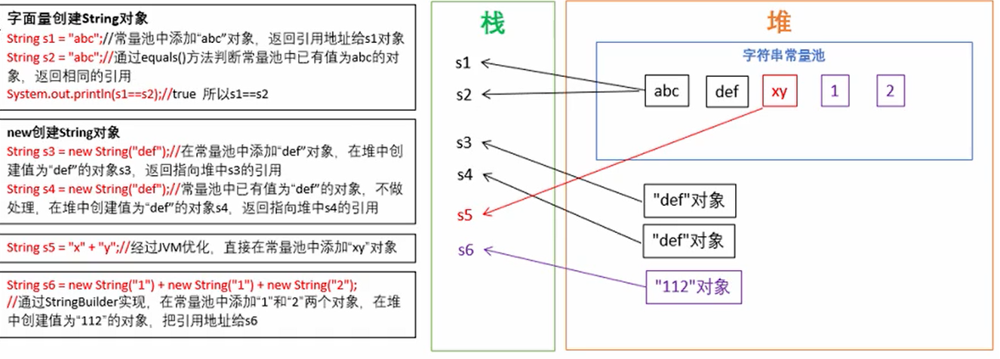

​	第一种方法创建的对象用==判断，返回true，此方法要比第二种方法省内存。用第二种方法创建的对象用==判断返回false，用equals判断为true。

### 包装类（Wrapper）

​	示例代码参见 

​	包装类主要是用于基本数据类型与字符串间的转换 

​	包装类是针对八种基本数据类型定义的响应的引用类型，有类的特点，可以调用类中的方法。使用时可以传入数字也可传入字符串：如Integer i = new Integer("111");也可以运行。

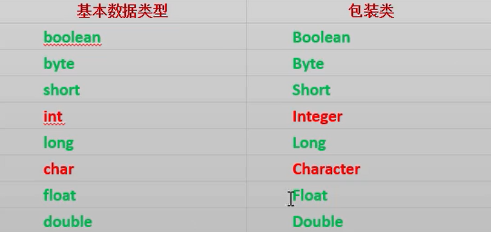

​	装箱：基本数据类型包装成包装类

​	拆箱：获得包装类对象中的基本类型变量用法：调用xxxValue()方法。如boolean b = bObj.booleanValue()

​	字符串转化为基本数据类型：使用包装类的构造器：int i= new Intager("12")或用包装类的parseXxx(String s)静态方法：Float f = Float.parseFloat("12")

​	基本数据类型转字符串：调用字符串重载valueOf()方法：String fstr = String.valueOf(2.34f)或使用更直接的方法：String intStr = 5 + ""

### toString 方法

​	继承自Object类，父类Object的tostring方法就是输出当前对象的内存地址。若想要输出其他信息，需要在类中重写tostring方法。

​	示例代码参见 [Test.java](Day 08\Test.java)  [MyDate.java](Day 08\MyDate.java) 

### 关键字 ststic

​	示例代码参见  [Test.java](Day 08\Test.java)  [Chinese.java](Day 08\Chinese.java) 

​	类和方法均可以用ststic修饰。

​	static String country;//类变量，不用实例化，直接通过类名.属性名即可使用，是类的一部分，被所有这个类的实例化对象共享，也可叫做静态变量

​	String name;//实例变量：只有实例化后才可使用，属于实例化对象的一部分，不能共用

​	适用范围：修饰属性、方法、代码块、内部类

​	被修饰后的成员随着类的加载而加载，优先于对象存在（不用new就能用），被所有对象共享，且访问权限允许时可以不创建对象，直接被类调用。

​	这种可以被所有对象共享的属性要慎重使用，因为只要一改，所有类都会跟着变化。

​	由于this和super意为对象，故对ststic的类不可以使用super或this。对于重载的方法，需要同时为ststic或非ststic。

#### 类属性与类方法的设计思想

- 类属性作为该类各个对象间共享的变量，在设计类时，分析哪些类属性不因对象的不同而改变，讲这些属性设置为类属性。相应的方法设置为类方法。
- 如果方法与调用者无关，则这样的方法通常被声明为类方法，由于不需要创建对象就可以调用此类方法，从而简化了方法的调用
- 静态方法在做工具类的时候常用。示例代码参见 [Utils.java](Day 08\Utils.java) 

### 单例（Singleton）设计模式

​	设计模式是优化的代码结构、编程风格、解决问题的思考方式。通俗来说就是套路。单例即开发过程中有且只有一个实例（类只被实例化一次），用于应对构造器中要执行很多行代码，耗时很长的情况。

​	懒汉式和饿汉式的区别在于对象是什么时候创建的。

​	Java中本身就有单例设计模式的应用，如java.lang.Runtime是个饿汉式单例模式

#### 饿汉式

​	提前实例化一个静态对象，谁调用就给谁

​	在类中即将对象new好并设置为私有static类型，同时将构造器设为私有，令使用者无法使用new方法。最后设置一个public方法访问已经造好的静态new对象，实现不管外界调用该方法多少次，指向的都是之前已经造好的静态对象。

​	示例代码参见 [Single.java](Day 08\Single.java) 

#### 懒汉式

​	最开始对象是null，直到有第一个人调用时new出对象，以后所有调用都会指向这个对象。

​	原理与饿汉式相似，示例代码参见 [Single1.java](Day 08\Single1.java) 

### 再谈main方法

​	public static void main(String[] args) {}

​	示例代码参见 [TestMain.java](Day 08\TestMain.java) 

​	main方法可以接收一个字符串数组args，属性是公有、静态且不返回值的。

## Day 09 高级类特性  Part3

### 类的成员之四：初始化块

​	示例代码参见 [Person.java](Day 09\Person.java)  [Test.java](Day 09\Test.java) 

​	作用：对Java对象进行初始化。语法为直接一个大括号或是static{}。代码块的运行优先于构造器。

​	new Person()执行的时候，首先执行对类属性的默认初始化和显式初始化，再执行代码块的代码，最后执行构造器的代码。若有多个代码块，从上到下执行。

​	初始化块只能被static修饰，称为静态代码块。当类被载入时，类属性的声明和静态代码块先后顺序执行，且**只被执行一次**（与前述静态方法原理类似）。静态代码块只能使用静态的方法和属性。

​	非静态代码块每次new对象都要重新执行，静态代码块只执行一次，且其执行优先程度优于非静态代码块。

​	编程中静态代码块较常用，一般用于**初始化静态的类属性**。尤其是处理类变量的初始化（如示例代码的TestPerson类的初始化）

​	普通代码块{}常用作使用**匿名内部类**时给类内成员的初始化

### 关键字：final

​	Java中的类、属性和方法可用关键字final修饰，表明“最终”。

​	被final标记后，类不可被继承，方法不可被重写，变量只能赋值一次（变成常量，名称一般大写，单词间用 "_" 连接），且必须显式赋值。final与static一起修饰变量时，称为全局常量。

### 抽象类

​	示例代码参见 [Animal.java](Day 09\Animal.java)  [Employee.java](Day 09\Employee.java) 

​	抽象类用abstract修饰。abstract也可修饰方法，称作抽象方法。抽象方法只有方法的声明，没有方法的实现，不写大括号及方法体，而是以分号结尾。abstract int abstractMethod(int a);

​	含有抽象方法的类必须被声明为抽象类。

​	抽象类不能被实例化，该类是用来被继承的，抽象类的子类必须重写父类的抽象方法并提供方法体，若没有重写全部抽象方法则仍为抽象类。

​	不能用abstract修饰属性、私有方法、构造器、静态方法和final的方法

​	应用：抽象类是用来模型化那些父类无法确定全部实现，而是由其子类提供具体实现的对象的类。(类似于模板或者To-Do List)

### 模板方法设计模式（TemplateMethod）

​	原理：抽象类作为多个子类的通用模板，里面的抽象方法类似于每个章节的标题。子类在此基础上进行扩展和改造。

​	解决的问题：可以将能确定的方法实现，并让不确定的部分暴露出来让子类实现。

​	示例代码参见 [Template.java](Day 09\Template.java) 

### 接口

​	有时必须从几个类中派生出一个子类，继承他们所有的属性与方法，但Java不支持多重继承，故产生了接口的概念。接口（interface）是抽象方法和常量值的定义的集合，从本质上讲是一种特殊的抽象类，这种抽象类只包含常量和方法的定义，没有变量和方法的实现。

​	实现接口类：class SubClass implements InterfaceA{}。语法：先写extends，再写implements。

​	示例代码参见 [TestInImpl2.java](Day 09\TestInImpl2.java) 

​	一个类可以实现多个接口，接口也可以继承其他接口。与继承关系类似，接口与实现类间也具有多态性。

​	接口的主要用途就是**被实现类实现**（面向接口编程）

特点：

- 用interface定义（public interface Xxxxx{}）

- 所有成员变量默认由public static final修饰

- 所有方法默认由public abstract修饰

- 没有构造器

- 采用多层继承机制，使用extends关键字继承。

- 示例代码参见 [TestIn.java](Day 09\TestIn.java)  [TestIn1.java](Day 09\TestIn1.java) （接口） [TestInImpl.java](Day 09\TestInImpl.java) （接口的实现） [TestIn2.java](Day 09\TestIn2.java) （继承）

- 如果类没有实现接口的**所有**方法，这个类就要定义成抽象类。示例代码参见 [TestInImpl1.java](Day 09\TestInImpl1.java) 

    接口的用处：灵活添加抽象方法

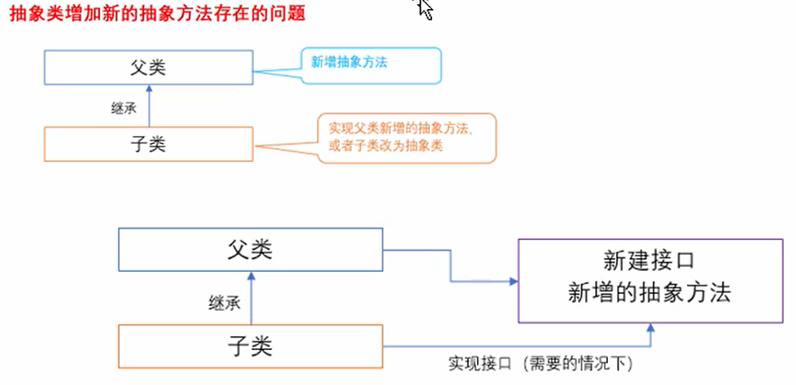

​	父类需要稳定的抽象，因为它会影响到全部子类，故要通过接口进行改动以扩展方法，令需要的子类自行实现。示例代码参见 [Person1.java](Day 09\Person1.java)  [Cooking.java](Day 09\Cooking.java)  [Sing.java](Day 09\Sing.java)  [SCTeacher.java](Day 09\SCTeacher.java) （描述了会唱歌的厨子是一个老师的类）。可以用接口new出一个新对象，如此例中可以Cooking c = new SCTeacher();，此时**只能访问cooking中的方法**。（体现了对象的多态）

​	**抽象类**是对一类事物的高度抽象，其中**既有属性又有方法**，而**接口**只是对**方法**的抽象，也就是对一系列动作的抽象。

### 工厂方法（FactoryMethod）模式

​	示例代码参见 [BWM.java](Day 09\BWM.java)  [BWMFactory.java](Day 09\BWMFactory.java)  [Test3.java](Day 09\Test3.java) 。对BWM做的改动不会影响到Test3的代码，只需要改动BWMFactory中的部分代码。new对象在工厂中进行，相当于用BWMFactory做了缓冲和隔离，避免开发人员不同造成的上层代码改掉导致下层代码必须跟着改的问题，实际类名的改变不影响其他合作开发人员的编程。

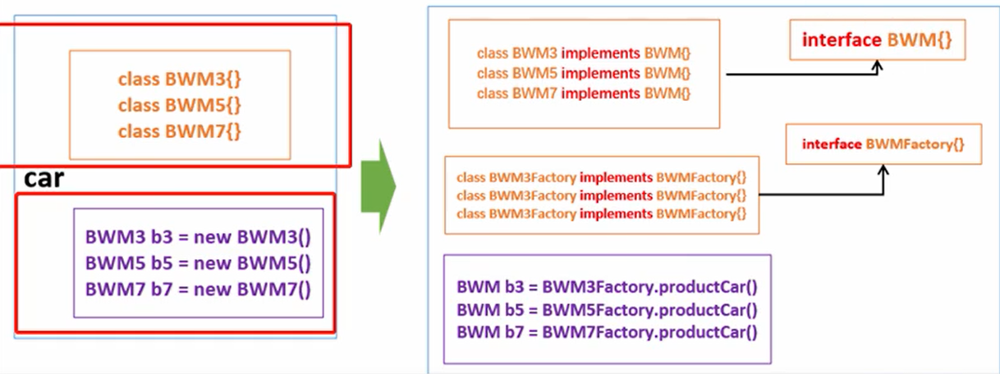

### 类的成员之五：内部类 

​	Java中允许在一个类的内部再定义一个类，称为内部类。内部类又分为成员内部类（static成员内部类和非static成员内部类）、局部内部类（不谈修饰符）和匿名内部类。

​	Inner class 一般用在定义它的类或语句块内，在外部引用它时必须给出完整的名称，内部类的名字不能与包含它的类名相同。但内部类定义与外部类同名的属性不会引起冲突。

​	内部类可以使用外部类的私有数据，使用语法为 **外部类名.this.变量名 = xxxxx** 而外部类访问内部类中的成员需要：内部类.成员 或者 内部类对象.成员 。外部类用自己的内部类的方法需要先new这个内部类的对象。示例代码参见 [Test4.java](Day 09\Test4.java) 

​	内部类特征：作为**类的成员**，可以声明为final、private或proected；也可声明为static，但此时就不能再使用外层类的非static的成员变量。作为**类**，可以声明为abstract，可以被其他内部类继承。

​	注意：非static的内部类中的成员不能声明为static的，只有在外部类或static的内部类中才可以声明static成员。

​	内部类解决的主要是**Java不能多重继承的问题**。示例代码参见 [Test5.java](Day 09\Test5.java) 

### 面向对象总结

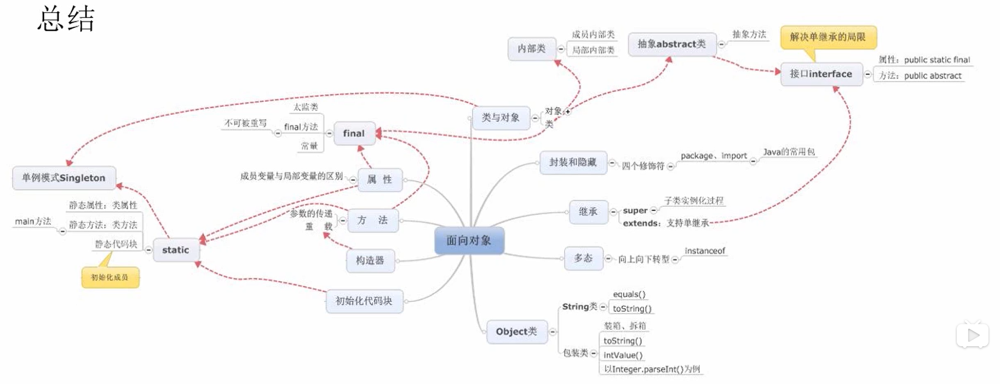

## Day 10 异常处理与集合

### Java异常

​	程序执行过程中发生的不正常的情况称为“异常”。可分为两类：Error：JVM系统内部错误、资源耗尽等严重情况；Exception：因编程错误或者偶然的外在因素导致的一般性问题，例如空指针访问、读取不存在的文件、网络连接中断等。异常示例代码参见 [Test.java](Day 10\Test.java) 

​	处理异常的方法：遇到错误就终止程序运行，或者在编写程序时就考虑到错误的检测、错误消息的提示以及错误的处理。

#### Java异常类层次

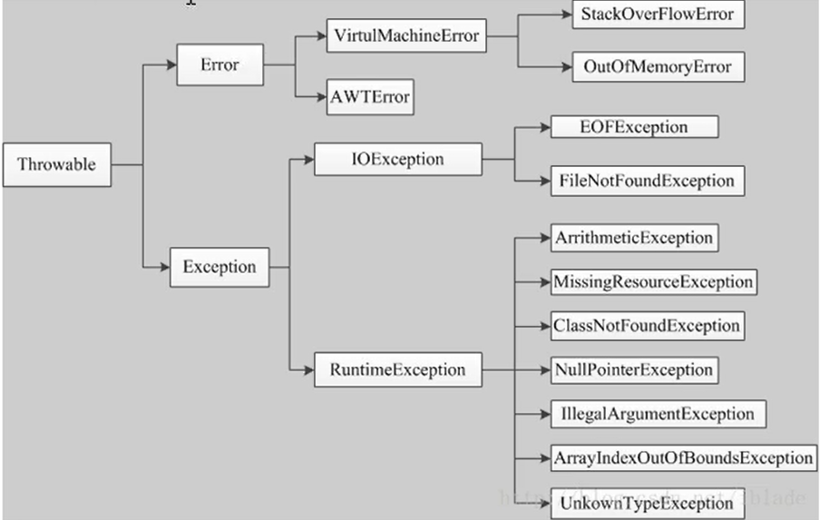

### 异常处理机制

​	Java的异常处理机制将异常处理的程序代码集中在一起，与正常的程序代码分开，使得程序简洁并易于维护。机制主要分为捕获（抓）和抛出（抛）两种。程序员只能处理exception，无法处理error。

#### 捕获异常

​	使用try{} catch(){} finally{}，其中finally可写可不写，可以用于将捕获错误的部分过渡到其它代码中。try catch为了防止程序可能出现的异常，有多个异常时，只捕获第一个出现的异常，其它的异常会直接跳过。不清楚具体会报什么异常，可以直接catch Exception即可。异常捕获后，可以用getMessage()方法得到有关异常事件的信息，printStackTrace()用来跟踪异常事件发生时执行堆栈的内容。示例代码参见 [Test.java](Day 10\Test.java)

#### 抛出异常

​	示例代码参见 [Test1.java](Day 10\Test1.java) 

​	如果一个**方法**在执行时可能出现异常，但并不能确定如何处理这种异常，就要显式地声明抛出异常，表明该方法不对异常进行处理，而由该方法的调用者负责处理。

​	若父类抛出了异常，子类在重写时也要抛出异常，但不能抛出比父类范围更大的异常类型。

##### 人工抛出异常

​	首先要生成异常类对象，然后通过throw语句实现抛出操作。可抛出的异常必须是Throwable或其子类的实例。（如 throw new String("xxx")会报语法错误）

​	人工抛出异常可以自定义一些不符合逻辑的错误。throw new Exception();

##### 创建用户自定义的异常类

​	自行创建的异常类必须继承现有的异常类。（一般情况下用不着自己写，java提供的异常的类够用）

### 集合

​	集合只能存放对象，存基础数据类型时实际上已自动转换成对应的引用类型。集合存放的是对象的引用，对象本身还是放在堆内存中。集合可以存放不同类型，不限数量的数据类型。

​	Java集合的三种大体系：

- Set：无序、不可重复的集合
- List：有序、可重复的集合
- Map：具有映射关系的集合

JDK 5 以后Java增加了泛型，集合可以记住容器中对象的数据类型。

### HashSet

​	HashSet为Set接口的典型实现，具有很好的存取和查找性能。特点为：不能保证元素的排列顺序、不可重复（equals值无关紧要，主要看hashCode不相同）、不是线程安全的、集合元素可以使用null。

​	该方法由对象的hashCode值决定存储位置。如果两元素的equals()方法返回true，但hashCode值不同，就可以添加到HashSet里，存储位置不同。

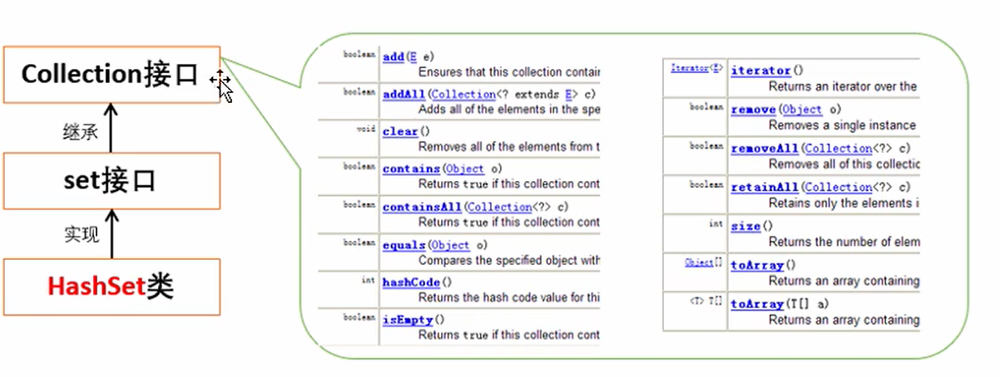

​	遍历集合：迭代器Iterator方法和for each方法，常用后者。

​	如果想要集合只能存同样类型的对象，就要使用泛型。Set\<String> set1 = new HashSet\<String>();

​	用法代码参见 [Test3.java](Day 10\Test3.java) 

### TreeSet

​	TreeSet 是SortedSet接口的实现类，可以确保集合元素处于排序的状态。其有两种排序方式：自然排序和定制排序。默认采取自然排序。TreeSet必须放入同样类的对象，否则可能会发生类型转换异常，常用泛型加以限制。

​	TreeSet会调用集合元素的compareTo方法比较元素间的大小，将集合元素按照升序排列。

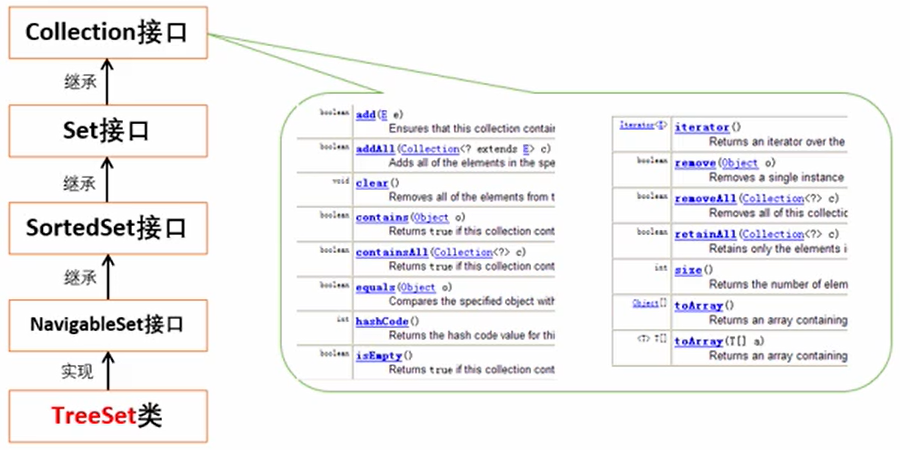

​	基础用法与HashSet一致。在使用迭代器时需要添加相应的泛型。Iterator\<Integer>

​	定制排序即要为类添加Comparator<类名>接口并重写比较方法，返回值为1,0，-1，表示数据的相对大小。

​	用法代码参见 [Test4.java](Day 10\Test4.java) 

### List与ArrayList

​	List有序可重复，每个元素有一个对应的索引，默认按元素的添加顺序设置元素的索引，且可通过索引操作集合元素。ArrayList继承自List接口，最常用。

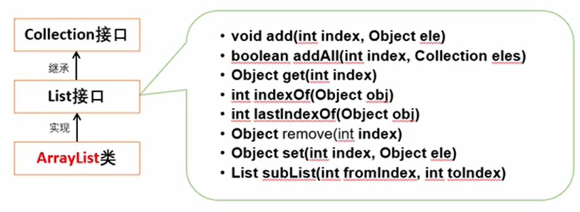

​	使用list.get(x)访问编号为x的元素；list.add(1,"f")指定位置插入数据；list.addAll(2,list2)指定位置插入集合。list.subList(2, 4)列表的截取，截取时包含开始时的索引，不包含结束时的索引。

​	详细用法代码示例参见 [Test5.java](Day 10\Test5.java) 

​	Vector是一个线程安全的古老集合，也继承自List接口，现在不推荐使用，用法与ArrayList一致。

### Map

​	Map用于保存具有映射关系的数据，存有两组值，一组用于保存Map里的Key，一组用于保存Map里的Value。key 和 value 可以是任意引用类型的数据，map 中的 key 不允许重复，key 与 value 间存在**单向**的一对一关系，通过 key 总能找到惟一的、确定的value。

​	Java中Map是个接口，通常使用的是HashMap

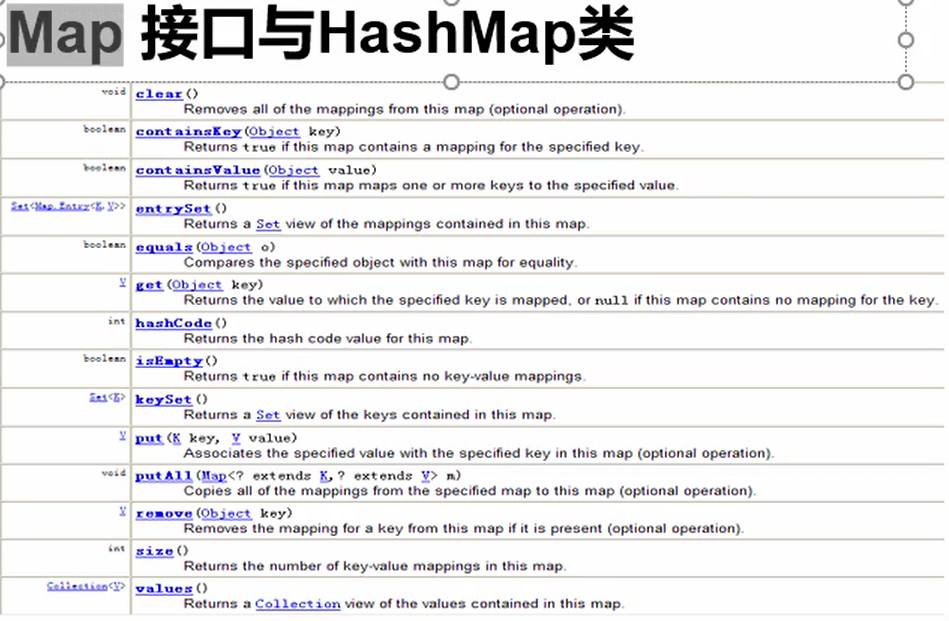

​	遍历map集合与之前不同，要用map.keySet()获取key的集合后使用for each方法遍历。或map.entrySet()方法。

​	详细用法代码示例参见  [Test6.java](Day 10\Test6.java) 

​	Hashtable是一个古老的Map实现类，是线程安全的。

​	TreeMap类似于前面提到的TreeSet，也可自然排序或定制排序。字符串的自然排序是英文字典排序。自然排序要求所有的Key必须实现Comparable接口，而且所有的key应该是同一个类的对象，否则报错。示例代码参见 [Test6.java](Day 10\Test6.java) 

### 操作集合的工具类：Collections

​	Collections中提供了大量方法对集合元素进行排序、查询和修改等操作，还提供了对集合对象设置不可变、对集合对象实现同步控制等方法。

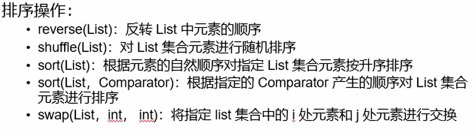

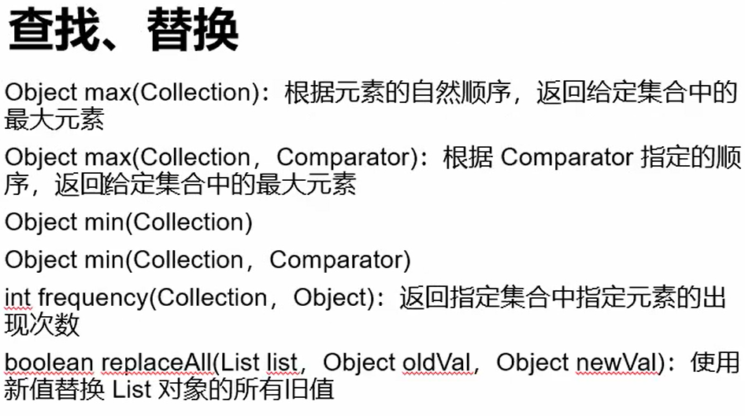

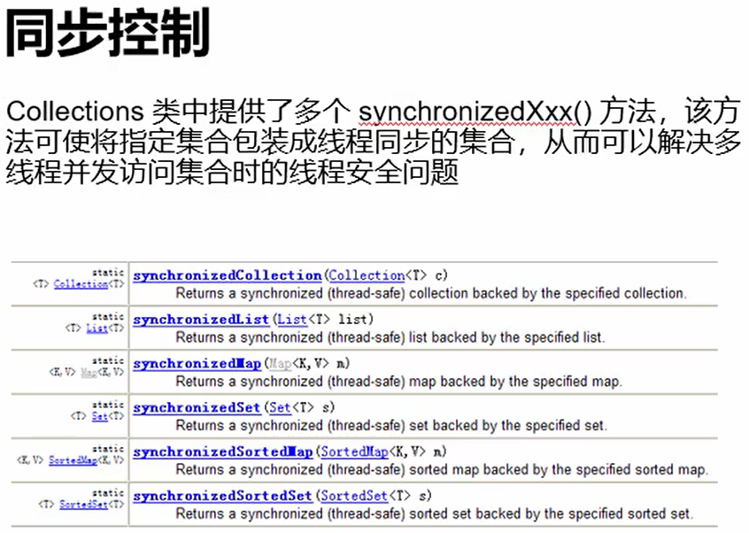

​	示例代码参见 [Test7.java](Day 10\Test7.java) 

## Day 11 泛型，枚举与注解

​	引入泛型是为了解决数据安全性问题，可以保证如果程序在编译时没有发出警告，运行时就不会产生ClassCateException异常，代码更加简洁、健壮。

​	Java中的泛型只在编译阶段生效，泛型信息不会进入到运行时阶段

### 泛型类

​	对象实例化时不指定泛型，默认为Object。泛型不同的引用不能相互赋值。

​	语法：创建：class ClassName\<T>{};  使用：ClassName\<T> name = new ClassName\<T>();  此处的泛型T可以任意的取名，尽量用首字母大写，一般使用大写的T（意为Type）

​	示例代码参见 [Test.java](Day 11\Test.java) 

### 泛型接口

​	示例代码参见 [Test1.java](Day 11\Test1.java) 

​	创建接口语法：interface Generator\<T>{T next();}

​	实现接口：未传入泛型实参时，与泛型类的定义相同，在声明类的时候需要将泛型的声明一起加到类中。即class ClassName\<T> implements Generator\<T>{}，在使用该类时仍需指明泛型。如果实现接口时指定接口的泛型数据具体类型，这个类实现接口所有方法的位置都要将泛型替换成实际数据类型，且new该类时不需要再指定泛型。

### 泛型方法

​	在类上定义的泛型可以在类中的普通方法中使用。注意：静态方法不能使用类上定义的泛型，如果要使用泛型，只能用静态方法自己定义的泛型

​	泛型方法的语法为在public语句后添加泛型，之后所有的数据类型改用该泛型名称

​	泛型方法在调用之前没有固定的数据类型，在调用时，传入的参数是什么类型就会把泛型给成什么类型。

​	示例代码参见 [Test1.java](Day 11\Test1.java) 

### 泛型通配符

​	当不确定集合中元素的具体数据类型时，使用？表示所有类型。

​	示例代码参见 [Test2.java](Day 11\Test2.java) 

#### 有限制的通配符

​	例：

- \<? extends Person> (无穷小，Person]  只允许泛型为Person及Person的子类引用调用
- \<? super Person> [Person, 无穷大)  只允许泛型为Person及Person的父类引用
- \<? extends Comparable>  只允许泛型为实现 Comparable 接口的实现类引用调用

### 枚举类

​	有些情况下一个类的对象是有限且固定的。

​	手动实现枚举类：private修饰构造器、属性使用private final修饰、把该类的所有实例都使用public staticfinal来修饰

​	关键字：enum  示例代码参见 [Test3.java](Day 11\Test3.java) 

​	可以在switch表达式中使用枚举类的对象作为表达式，case字句可以直接使用枚举值的名字，无需添加枚举类作为限定

​	在使用枚举类时，返回的是一个枚举的对象。**枚举类是一个单例模式**，示例代码中为饿汉式。

​	若枚举组只有一个成员，则可以作为一种单子模式的实现方式。

​	枚举类可以像普通类一样调用接口

​	枚举类与普通类的区别：

- 使用enum定义的枚举类默认继承了java.lang.Enum类
- 枚举类的构造器只能使用private访问控制符
- 枚举类中的所有实例必须在枚举类中显式列出，以逗号分隔，分号结尾。列出的实例系统会自动添加public static final 修饰
- 所有枚举类都提供了一个values方法，可以很方便地遍历所有枚举值

​	枚举类的方法：

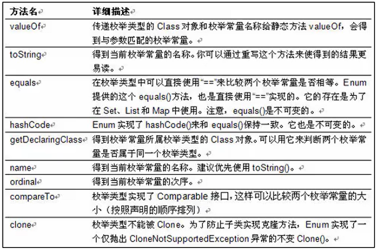

​	比较重要的是compareTo方法

### 注解（Annotation）

​	做开源项目可能会用到注解，现在仅作了解。拓展内容见 [注解Annotation实现原理与自定义注解例子.pdf](Course\PDF\注解Annotation实现原理与自定义注解例子.pdf) 

​	示例代码参见 [Test4.java](Day 11\Test4.java) 

​	Annotation是代码里的特殊标记，这些标记可以在编译，类加载，运行时被读取并执行相应的处理。通过Annotation可以在不改变原有代码逻辑的情况下在原文中嵌入一些补充信息。

​	Annotation可以像修饰符一样被使用，可以用于修饰包，类，构造器，方法，成员变量，参数，局部变量的声明，这些信息被保存在Annotation的“name=value”对中

​	Annotation 能被用来为程序元素（类，方法，成员变量等）设置元数据。使用Annotation时要在前面增加@符号，并把该Annotation当成一个修饰符使用

​	三个基本的Annotation：@Override：限定重写父类方法，该注释只能用于方法；@Deprecated：用于表示某个程序元素（类，方法等）已过时；@SuppressWaring：抑制编译器警告

#### 自定义Annotation

​	定义新的Annotation类型需要使用@interface关键字

​	Annotation的成员变量在Annotation定义中以无参数方法的形式来声明，其方法名和返回值定义了该成员的名字和类型

​	可在定义Annotation的成员变量是为其指定初始值，指定成员变量的初始值可以使用default关键字

​	没有成员定义的Annotation称为**标记**；包含成员变量的Annotation称为**元数据Annotation**

## Day 12 IO流 Part1

​	IO (Input Output) 与输入输出有着密切联系，主要涉及java.io.File类的使用，文件流（FileInputStream / FileOutputStream / FileReader / FileWriter）、缓冲流（BufferedInputStream / BufferedOutputStream / BufferedReader /  BufferedWriter）文件流是基于文件的操作，缓冲流是基于内存的操作，另外还有转换流、标准输入输出流、打印流、数据流、对象流（把一个对象转换为数据流进行读写）、随机存取文件流（不是字面意义上的随机，是可以从中间读写数据）。

### File类

​	File可以用来操作文件，但不能访问文件内容。File可以作为参数传递给流的构造函数。

​	构造方法： public File（String pathname）以pathname为路径创建File对象可以是绝对路径或是相对路径。默认当前路径在user.dir中存储。另外可用public File （String parent，String Child）以parent为父路径，child为子路径创建File对象。注意，写路径时要用 \\\ 或 / 分隔路径，而不是 \\ 。

​	File 类中的方法:

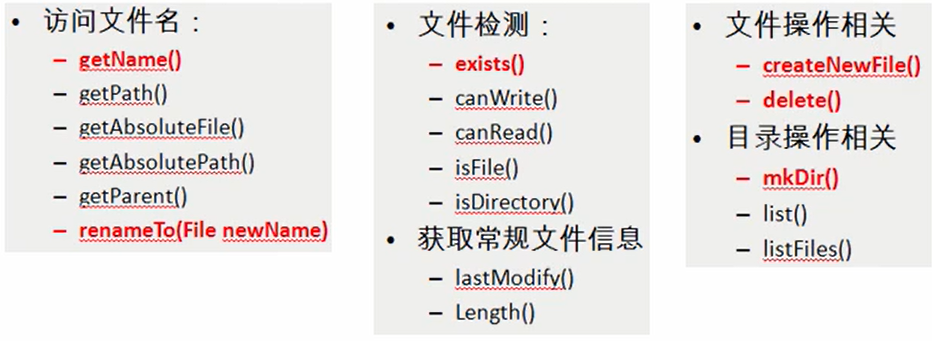

​	示例代码参见 [Test.java](Day 12\Test.java) 

### Flie类递归遍历文件

​	示例代码参见 [Test.java](Day 12\Test.java) 

### Java IO 原理

​	IO流用于处理设备间的数据传输。不论输入还是输出，都是指的计算机

​	流的分类：以数据单位分：字节流（8 bit）、字符流（16 bit）；以数据流向分：输入流、输出流；以角色不同分：节点流、处理流

​	处理流的40多个类都是从下面的四个基类派生出的

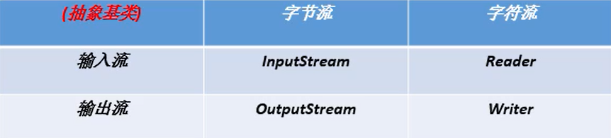

#### IO流体系

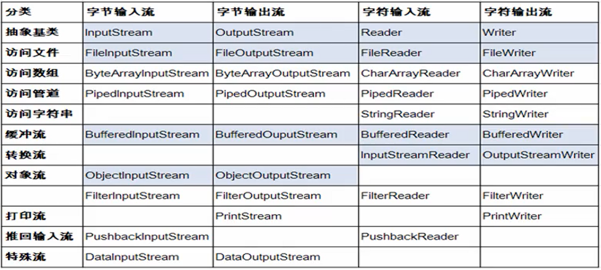

### 文件流

​	计算机与硬盘间进行的IO操作，硬盘读写相对较慢

#### 文件字节流

​	通过字节的方式读取或写一个文件。注意，流在使用完毕后要关闭，一般关闭流的顺序与打开流相反。

​	在写入文件时，同名文件将被覆盖。读取文件时，必须保证文件存在，否则报异常。

​	应用输入流和输出流可以复制文件。文件字节流非常通用，可以用来操作文档或任何其他类型的文件，因为字节流直接使用二进制。

​	示例代码参见 [Test1.java](Day 12\Test1.java) 

#### 文件字符流

​	文件字符流拷贝文件时只能拷贝文档，不可以拷贝图片、压缩包等

​	读取文件操作步骤：

1. 建立一个流对象，将已存在的一个文件加载进流 FileReader fr = new FileRader("Text.txt")

2. 创建一个临时存放数据的数组 char[] ch = new char[1024]  (字节流用的byte型)

3. 调用流对象的读取方法将流中的数据读入到数组中 fr.reac(ch)

   示例代码参见  [Test2.java](Day 12\Test2.java) 

## Day 13 IO流 Part2

### 缓冲流

​	缓冲流可以提高数据的读写速度，使用缓冲流时java会创建一个内部缓冲区数组。缓冲流要套接在相应的节点流上，对读写数据提供了缓冲的功能，提高了读写的效率，同时增加了一些新的方法。基于内存的IO操作大致比基于硬盘的操作快75000倍。

​	对于输出的缓冲流，写出的内存会先在内存中缓存，使用flush()将会使内存中的数据立刻写出

#### 缓冲字节流

​	BufferedInputStream 与 BufferedOutputStream 的使用

​	示例代码参见 [Test.java](Day 13\Test.java) 

#### 缓冲字符流

​	BufferedReader 与 BufferedWriter 的使用

​	示例代码参见 [Test1.java](Day 13\Test1.java) 

### 转换流

​	所以的文件都是有编码格式的，对于我们来说，TXT与Java文件一般来讲有三种编码，ISO8859-1：西欧编码，纯粹英文编码，不适用于汉字。GBK和UTF-8适用于中英文，我们一般使用UTF-8编码。在转换字符流的时候，设置的字符集编码要与读取文件的数据的编码一致，否则出现乱码。

​	转换流用于在字节流和字符流间进行转换，Java提供了两种转换流：InputStreamReader OutputStreamWriter。字节流中都是字符时，转换为字符流操作更高效。InputStreanReader 用于将字节流中读取到的字节按照指定字符集解码成字符，需要和InputStream “套接”。

​	示例代码参见 [Test2.java](Day 13\Test2.java) 

### 标准输入输出流

​	System.in 和 Sustem.out 分别代表了系统标准的输入（键盘）和输出（显示器）设备，其中输入的类型是InputStream，输出是PrintStream。

​	示例代码参见 [Test3.java](Day 13\Test3.java) 

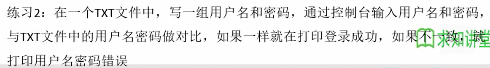

### 打印流

​	整个IO包中，打印流是输出信息最方便的类。分为PrintStream（字节打印流）和PringWriter（字符打印流），二者的输出不会抛出异常且有自动flush功能。

### 数据流

​	数据流专门用于读写基本数据类型，分为DataInputStream和DataOutputStream两个类，分别套接在InputStream和OutputStream上

​	用数据输出流写到文件中的基本数据类型的数据是乱码的，不能直接辨认出来，需要数据的输入流来读取。用数据输入流读取数据输出流输出的数据时，要保证使用和当时写的数据类型一致的类型来读取。

​	DataInputStream的方法有：

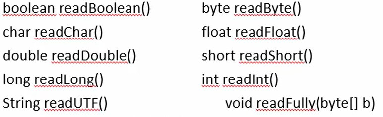

​	将上述方法中的read改为write即为DataOutputStream对应的方法。

### 对象流

​	ObjectInputStream和ObjectOutputStream，用于存储和读取对象的处理流，可以把Java中的对象写入到数据源中，也能把对象从数据源中还原出来。注意，这两个类不能序列化static和transient修饰的成员变量。对象流用于解决保存对象到硬盘（对象的持久化）和对象的网络传输问题。

​	序列化（Serialize）:用 ObjectOutputStream 将一个 Java 对象写进 IO 流中。为了使某个类是可序列化的，该类必须实现 Serializable 和 Externalizable 两个接口之一。一般使用前者。凡是实现 Serializable 接口的类都要有一个表示序列化版本标识符的静态变量 Private static final long serialVersionUID，用以表明类的不同版本间的兼容性。

​	反序列化（Deserialize）:用ObjectInputStream从IO流中恢复该Java对象

​	序列化与反序列化针对的都是对象的各种属性，不包括类的属性。

​	注意：对象的序列化和反序列化使用的类要严格一致，一致到包名、类名、类结构等等所有都要一致。

​	示例代码参见 [Person.java](Day 13\Person.java) （对象类的写法） [Test5.java](Day 13\Test5.java) （序列化与反序列化）

### 随机存取流

​	RandomAccessFile类支持随机访问，程序可以直接跳到文件的任意地方来读写文件，支持只访问文件的部分内容，可以向已存在的文件后追加内容。

​	RandomAccessFile对象包含一个记录指针，用以标示当前读写处的位置。该类对象可以自由移动记录指针：long hetFilePointer():获取文件记录指针的当前位置。void seek(long pos)：将文件记录指针定位到pos位置。注意：换行符也算字节（/t，算两个。）设置写的起始点时，xxx.seek(0)代表从开头写，xxx.seek(xxx.lenth())代表从文件的最后写，此时即为文件的追加。

​	RandomAccessFile构造由两个参数，参数一为读取文件的路径，参数二是文件的读取方式（访问模式）。

​	创建该类实例需要指定一个mode参数，该参数指定了类的访问模式：r（只读） rw（打开以便读取和写入） rwd（打开以便读取和写入；同步文件内容更新）rws（打开以便读取和写入；同步文件内容和元数据更新），最常用的是 **r 和 rw** 。

​	注意：如果是在文件的开头或是中间的某个位置开始写，就会用写的内容**覆盖掉等长度的原内容**。

### 流基本应用小结

​	流是用来处理数据的，是对于数据的一种描述。处理数据时，一定要先明确数据源（文件或键盘）和数据目的地（文件，显示器，其他设备）。

​	流只是在帮助数据进行传输，并对数据传输进行处理，比如过滤，转换等。

​	这部分重点为字节流-缓冲流、字符流-缓冲流，难点在于对象流（序列化与反序列化）。随机存取流掌握读取与写入即可。

## Day 14 反射（Reflection）

​	反射机制前提：jvm 已经加载过所需的类

​	反射机制允许程序在执行期间借助 Reflection API 取得任何类的内部信息，并能直接操作任意对象的内部属性与方法。

​	反射机制可以提供的功能有：在运行时判断任意对象所属的类、构造任意一个类的对象、判断任意类具有的成员变量和方法、调用任意对象的成员变量和方法，还可**生成动态代理**。

### Class 类

​	public final Class getClass()方法的返回值是一个class类，此即Java反射的源头。Class类是一个可以描述所有的类的类。

​	反射可以得到的信息：类的属性、方法、构造器、实现的接口。对于每个类，JRE均为其保留了一个不变的Class类型的对象，该对象中包含了特定某个类的有关信息。

​	Class本身也是一个类，Class对象仅能由系统建立对象，一个类在JVM中只会有一个Class实例，一个Class对象对应的是一个加载到JVM中的一个.class 文件，每个类的实例都会记得自己是由哪个Class实例所生成，通过Class可以完整地得到一个类中的结构。

#### Class类常用方法

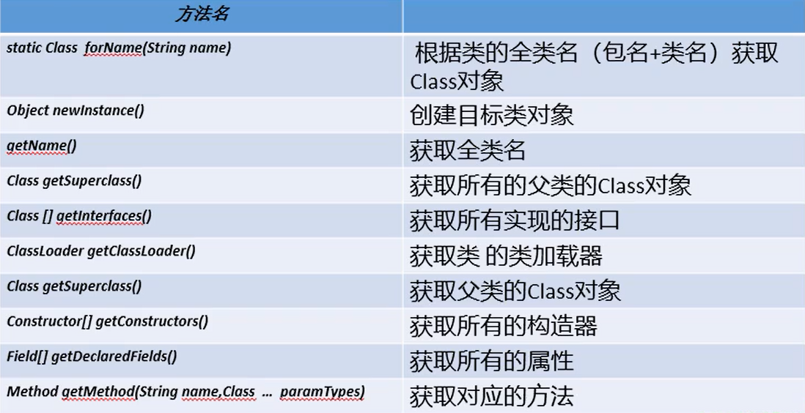

#### 实例化Class对象

​	当已知具体的类，通过类的class属性获取，最为安全可靠，程序性能最高。 Class clazz = String.class;

​	当已知某个类的实例时：Class clazz = "xxxxxxx".getClass();

​	当已知一个类的全类名，且在该类的路径下时：Class clazz = Class.forName("java.lang.String"); 该方法可能抛出ClassNotFoundException。此方法最常用

​	其他方法：ClassLoader cl = this.getClass().getClassLoader();  Class clazz = cl.loadClass("类的全类名")

​	示例代码参见 [Test.java](Day 14\Day14pac\Test.java) 

### 通过反射调用类的完整结构

​	Field Method Constructor Superclass Interface Annotation 等均可获取

​	全部示例代码参见 [Test1.java](Day 14\Day14pac\Test1.java) 

#### 得到实现的全部接口和父类

​	public Class\<?>[] getInterface() : 确定此对象所表示的类或接口实现的接口

​	public Class\<? Super T> getSuperclass() ：返回表示此Class多表示的实体（类，接口，基本类型）的父类的Class

#### 获取类的构造方法

​	public Constructor\<T>[] getConstructors() 返回此Class对象所表示的类的所有**public**构造方法

​	public Constructor\<T>[] getDeclaredConstructors()	返回此Class对象表示的类声明的**所有**构造方法

​	Constructor 类中：取得修饰符（返回数字1代表public，2代表private）：public int getModifiers()  取得方法名称：public String getName()  取得构造方法的参数的类型：public Class\<?>[] getParameterTypes();

#### 通过反射创建对象

​	无参构造：Object obj = clazz.newInstance();   相当于调用类的无参公有构造

​	有参构造：Constructor c = clazz.getConstructor(String.class);   此处参数填的是class类型的参数，参数前面要点上所调用构造器中参数的类型,构造器需要为公有的。

​	强制调用私有构造：clazz.getDeclaredConstructor(String.class,int.class)  指定获取有两个参数的私有构造方法。此时直接newInstance在编译上不会报错，但运行时无法调用私有方法。必须 c1.setAccessible(true);解除私有封装，此后即可对私有方法强制调用。

#### 通过反射获取类的方法

​	public Method[] getMethods() 返回此Class对象所表示的类或接口的所有**public**方法

​	public Method[] getDeclaredMethods()	返回此Class对象表示的类或接口声明的**所有**方法

​	Method类中：public Class\<?> getReturnType()取得全部返回值；public Class\<?> getParameterType()取得全部参数；public int getModifiers()取得修饰符

#### 通过反射机制获取类的属性和包

​	public Field[] getFields() 返回此Class对象所表示的类或接口的所有**public**的Field，包含了父类的公有属性。

​	public Field[] getDeclaredFields() 返回此Class对象所表示的类或接口的**所有**的Field，只包含本类的属性。

​	Field 方法中：public int getModifiers 以整数形式返回Field的修饰符；public Class\<?> getType()得到Field的属性类型 public String getName()返回Field的名称。

​	Package getPackage()  获取类所在的包

### 通过反射调用类的指定方法

​	步骤：首先通过Class类的getMethod(String name,Class...parameterTypes)方法取得一个Method对象（...意为此处可填零到多个参数），并设置此方法操作时所需的参数类型，然后使用Object invoke(Object obj,Object[] args)进行调用，并向方法中传递要设置的obj对象的参数信息

​	在调用私有方法时，注意进行m1.setAccessible(true);解除封装

​	示例代码参见 [Test1.java](Day 14\Day14pac\Test1.java) 

### 通过反射调用类的指定属性

​	与调用指定方法的操作类似，主要命令为getField(String name)  getDeclaredField(String name)

​	Field中的命令有get(Object obj)  set(Object obj,Object value).

​	对private的变量操作时仍需要setAccessible(true);解除封装

​	示例代码参见 [Test1.java](Day 14\Day14pac\Test1.java) 

### Java动态代理

​	Proxy：专门完成代理的操作类，是所有动态代理类的父类。通过此类为一个或多个接口动态地生成实现类。

​	直接创建一个动态代理对象： static Object newProxyInstance(ClassLoader loader,Class\<?> interfaces, InvocationHandler h)

​	注意：如果一个对象想要通过Proxy.newProxyInstance方法被代理，那么这个对象的类一定要有对应的接口，就像本例中的testDemo接口和实现类TestDemoImpl	

​	示例代码参见 [Test2.java](Day 14\Day14pac\Test2.java) （测试入口）  [ItestDemo.java](Day 14\Day14pac\ItestDemo.java) （示例接口） [TestDemoImpl.java](Day 14\Day14pac\TestDemoImpl.java) （接口的实现）

 [ProxyDemo.java](Day 14\Day14pac\ProxyDemo.java) （动态代理类）

## Day 15  线程

​	电脑的CPU核心数即代表在同一个瞬间能处理的任务数（进程），CPU主频即为进程间切换的频率

​	程序(program)是为完成特定任务、用某种语言编写的一组指令的集合。即指一段静态的代码，静态对象。

​	进程(process)是程序的一次执行过程，或是正在运行的一个程序。动态过程：有它自身的产生、存在和消亡的过程。

​	线程(thread)，进程可进一步细化为线程，是一个程序内部的一条执行路径。若一个程序可同一时间执行多个线程，就是支持多线程的（并行执行多个子程序）

​	当程序需要同时执行多个任务、实现需要等待的内容（防止等待时程序占着CPU不干活）、需要后台运行程序（多线程是进程的支流，分支后就与主程序互不相关了，主程序运行时线程就要在后台运行）时，就需要使用多线程。

### 多线程的创建与使用

​	多线程通过java.lang.Thread类来实现。该类的特性为，每个线程都是通过某个特定Thread对象的run()方法（想要在开启的多线程中运行的代码逻辑就要写到run方法里）来完成操作的，经常把run()方法的主体称为线程体，通过该Thread对象的start()方法来调用（启动）这个线程。

​	多线程优点：

- 提高应用程序的响应。对图形化界面更有意义，可增强用户体验。
- 提高计算机系统CPU的利用率
- 改善程序结构。将既长又复杂的进程分为多个线程，独立运行，利于理解和修改

​	Thread类构造方法：

- Thread()：创建新的Thread对象 ；

- Thread(String threadname)：创建线程并指定线程实例名；

- Thread(Runnable target)：指定创建线程的目标对象，它实现了Runnable接口中的run方法；

- Thread(Runnable target, String name)：创建新的Thread对象 

#### 创建线程的两种方式

​	使用Thread.currentThread().getName()可以得到线程名称，new Thread(new TestRunnable(), "t-1")第二个参数为设置线程名称。

1. **继承**Thread类：线程代码存放Thread子类run方法中。重写run方法

     1) 定义子类继承Thread类。

     2) 子类中重写Thread类中的run方法。

     3) 创建Thread子类对象，即创建了线程对象。

     4) 调用线程对象start方法：启动线程，调用run方法。

    ​	示例代码参见 [Test.java](Day 15\Test.java) （主程序） [TestThread.java](Day 15\TestThread.java) （线程）

2. **实现**Runnable接口：线程代码存在接口的子类的run方法。实现run方法

     1）定义子类，实现Runnable接口。

     2）子类中重写Runnable接口中的run方法。

     3）通过Thread类含参构造器创建线程对象。

     4）将Runnable接口的子类对象作为实际参数传递给Thread类的构造方法中。

     5）调用Thread类的start方法：开启线程，调用Runnable子类接口的run方法。

     ​	示例代码参见 [Test.java](Day 15\Test.java) （主程序） [TestRunnable.java](Day 15\TestRunnable.java) （线程名称）

     实现接口方式的好处：避免了单继承的局限性；多个线程可以共享同一个接口实现类的对象，非常适合多个相同线程来处理**同一份**资源。**一般使用实现接口的方法实现多线程**

### Thread类的相关方法

- void start(): 启动线程，并执行对象的run()方法

- run(): 线程在被调度时执行的操作

- String getName(): 返回线程的名称，默认名称为（Thread-x  x为一个数字序号）

- void setName(String name):设置该线程名称

- static currentThread (): 返回当前线程

- static void yield()：线程让步

    - 暂停当前正在执行的线程，把执行机会让给优先级相同或更高的线程（仍然是概率问题）

    - 若队列中没有同优先级的线程，忽略此方法

- join() ：当某个程序执行流中调用其他线程的 join() 方法时，调用线程将被阻塞，直到 join() 方法加入的 join 线程执行完为止  相当于直接在这个位置插入run方法中的代码，此时执行不再异步，而是顺序执行。

    - 低优先级的线程也可以获得执行 

- static void sleep(long millis)：(指定时间:毫秒)

    - 令当前活动线程在指定时间段内放弃对CPU控制,使其他线程有机会被执行,时间到后重排队。

    - 抛出InterruptedException异常

- stop(): 强制线程生命期结束

- boolean isAlive()：返回boolean，判断线程是否还活着

    示例代码参见 [Test1.java](Day 15\Test1.java) 

### 线程优先级

​	优先级界定了在系统中运行多个代码时那个代码会有较大的概率被执行。注意，这里仅仅是对概率的变动，不是绝对的优先级排序。

​	优先级控制：MAX_PRIORITY (10）;MIN _PRIORITY （1）; NORM_PRIORITY （5）;用数组1-10表示，默认优先级为5。

​	涉及的方法：

- getPriority() ：返回线程优先值 
- setPriority(int newPriority) ：改变线程的优先级
- 线程创建时继承父线程的优先级

### 线程的生命周期

- 新建：即为线程实例的创建（new出来）。当一个Thread类或其子类的对象被声明并创建时，新生的线程对象处于新建状态

- 就绪：（执行.start方法之后）处于新建状态的线程被start()后，将进入线程队列等待CPU时间片，此时它已具备了运行的条件

- 运行：（run中的代码开始执行）当就绪的线程被调度并获得处理器资源时,便进入运行状态， run()方法定义了线程的操作和功能

- 阻塞：（run方法暂停执行）在某种特殊情况下，被人为挂起或执行输入输出操作时，让出 CPU 并临时中止自己的执行，进入阻塞状态

- 死亡：线程完成了它的全部工作（自然死亡）或线程被提前强制性地中止  （强制死亡）

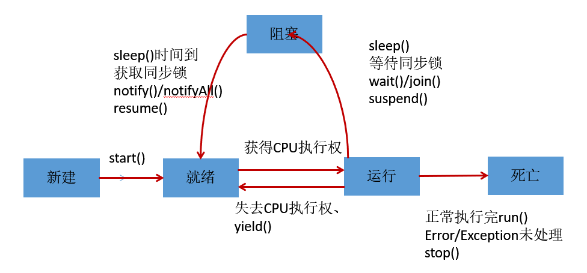

### 线程的同步与死锁

​	多个线程执行的不确定性引起执行结果的不稳定；多个线程对账本的共享，会造成操作的不完整性，会破坏数据。出问题的实例代码参见 [Test2.java](Day 15\Test2.java) （多线程共享资源，在一个线程的方法没有完毕时另一个线程又开始执行）。解决方法：对多条操作共享数据的语句，只能让一个线程都执行完，在执行过程中，其他线程不可以参与执行。

#### Synchronized（同步锁）的使用方法

​	如果针对对象加锁，那就加在方法上，若对代码块加锁，直接用同步锁扩住代码块。

1. 放在方法声明中，表示整个方法为同步方法。  public synchronized void show (String name){ } 在普通方法里加同步锁，锁的是**整个的对象**，**不是某个方法**。不同的对象就是不同的锁了。但若方法是static的，加同步锁，则对于所有的对象都是同一个锁。

2. synchronized (对象）{ // 需要被同步的代码；}，括号内的（对象）一般为this，表示当前对象。如果其他方法中也有synchronized(this)的代码块，使用的是**同一个**同步锁。synchronized(a){ }//给传递进来的对象加锁,不同对象就有不同的同步锁了。

    示例代码参见 [Test2.java](Day 15\Test2.java) 

#### 线程的死锁问题

​	不同的线程分别占用对方需要的同步资源不放弃，都在等待对方放弃自己需要的同步资源，就形成了线程的死锁。例：线程a0要执行方法f0，线程a1要执行方法f1，两个方法都有同步锁。现在的情况是a0调用f1方法，一直没有执行完，a1调用f0方法，一直没有执行完，导致两者都在等对方释放方法，对方都不释放，形成线程的死锁

​	解决方法：专门的算法、原则，比如加锁顺序一致；尽量减少同步资源的定义，尽量避免锁未释放的场景

### 线程通信

​	下面的三个方法只有在synchronized方法或synchronized代码块中才能使用，否则会报java.lang.IllegalMonitorStateException异常

​	这些命令用于调整线程的运行顺序。

- wait()：令当前线程挂起并放弃CPU、同步资源，使别的线程可访问并修改共享资源，而当前线程排队等候再次对资源的访问。调用此方法后，当前线程将释放对象监控权 ，然后进入等待，在当前线程被notify后，要重新获得监控权，然后从断点处继续代码的执行。

- notify()：唤醒正在排队等待同步资源的线程中**优先级最高者**结束等待

- notifyAll ()：唤醒正在排队等待资源的所有线程结束等待.

    示例代码参见 [Test2.java](Day 15\Test2.java) 

### 生产者和消费者

​	生产者(Productor)将产品交给店员(Clerk)，而消费者(Customer)从店员处取走产品，店员一次只能持有固定数量的产品(比如:20），如果生产者试图生产更多的产品，店员会叫生产者停一下，如果店中有空位放产品了再通知生产者继续生产；如果店中没有产品了，店员会告诉消费者等一下，如果店中有产品了再通知消费者来取走产品。

​	这里可能出现两个问题：

​     生产者比消费者快时，消费者会漏掉一些数据没有取到。

​     消费者比生产者快时，消费者会取相同的数据。

## 附录：资料

### 课件

1.  [第1章_Java语言概述.pptx](Course\PPT\第1章_Java语言概述.pptx) 
2.  [第2章_Java基本语法1.pptx](Course\PPT\第2章_Java基本语法1.pptx) 
3.  [第2章_Java基本语法2.pptx](Course\PPT\第2章_Java基本语法2.pptx) 
4.  [第3章_面向对象编程.pptx](Course\PPT\第3章_面向对象编程.pptx) 
5.  [第4章_高级类特性1.pptx](Course\PPT\第4章_高级类特性1.pptx) 
6.  [第5章_高级类特性2.pptx](Course\PPT\第5章_高级类特性2.pptx) 
7.  [1.java_异常处理.pptx](Course\PPT\1.java_异常处理.pptx) 
8.  [2.java_集合.pptx](Course\PPT\2.java_集合.pptx) 
9.  [3.java_泛型.pptx](Course\PPT\3.java_泛型.pptx) 
10.  [4.java_枚举和注解.pptx](Course\PPT\4.java_枚举和注解.pptx) 
11.  [5.java_io.pptx](Course\PPT\5.java_io.pptx) 
12.  [7.java_反射.pptx](Course\PPT\7.java_反射.pptx) 
13.  [8.java_线程.pptx](Course\PPT\8.java_线程.pptx) 

### 书籍与拓展内容

1.  [二进制与十进制互转.pdf](Course\PDF\二进制与十进制互转.pdf) 
2.  [计算机二进制正负数转换.pdf](Course\PDF\计算机二进制正负数转换.pdf) 
3.  [注解Annotation实现原理与自定义注解例子.pdf](Course\PDF\注解Annotation实现原理与自定义注解例子.pdf) 
