# 基本 HDFS Shell 命令操作

Francio PKU_CCME

Shell 命令整理

<!-- more -->

## 全分布式版Hadoop环境搭建

#### 遇到的问题

​		依照教学网Hadoop指导文档中的步骤进行搭建，在配置网络环境步骤与教学网所给步骤出现了不一致。

​		教学网使用 VMware Workstation 15.0 进行配置，编辑 NAT 网络的选项卡位于全局设置中。VMware Workstation 15.5 可用虚拟网络编辑器（编辑-->虚拟网络编辑器）进行相同的设置。操作如下：

- 进入虚拟网络编辑器，选中 VMnet8 ( NAT 模式 )，于串口右下角点击“更改设置”
- 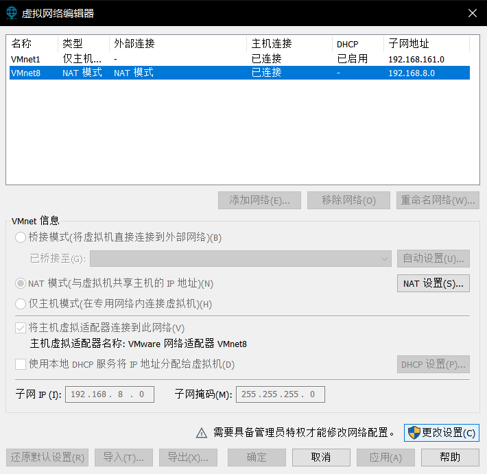
- 取消勾选“使用本地DHCP服务将IP地址分配给虚拟机”
- 更改子网IP为192.168.8.0，点击确定，保存设置。
- 之后的配置步骤与教学网文档所示步骤一致。


#### Hadoop的启动与关闭

启动：

```shell
start-dfs.sh
start-yarn.sh
mr-jobhistory-daemon.sh start historyserver
```

关闭：

```shell
stop-yarn.sh
stop-dfs.sh
mr-jobhistory-daemon.sh stop historyserver
```

## 基础命令

| 关键词  |                    命令语句示例                    |                             作用                             |
| :-----: | :------------------------------------------------: | :----------------------------------------------------------: |
| -chmod  |        hadoop fs -chmod 666 /aaa/test1.txt         | 改变访问权限<br /> |
| -chown  |   hadoop fs -chown Administrator /aaa/test1.txt    | 改变文件的所有者<br /> |
|   -cp   | hadoop fs -cp /aaa/test1.txt /hadooptest/test1.txt | 从hdfs的一个路径拷贝到hdfs的另一个路径<br />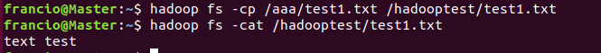 |
|   -du   |           hadoop  fs  -du  -s  -h /aaa/*           | 统计文件夹的大小信息<br /> |
|  -get   |           hadoop fs -get /aaa/test1.txt            | 将文件从hdfs下载到本地<br />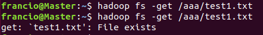 |
|   -ls   |                  hadoop fs -ls /                   | 显示目录信息<br /> |
| -mkdir  |          hadoop fs -mkdir -p /hadooptest           | 在hdfs上创建目录<br /><br />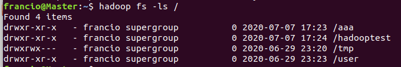 |
|   -mv   |           hadoop fs -mv /aaa/test1.txt /           | 在hdfs目录中移动文件<br />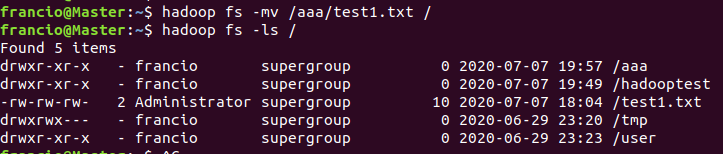 |
|  -put   |     hadoop fs -put test1.txt /aaa/testcopy.txt     | 从本地上传文件到hdfs<br />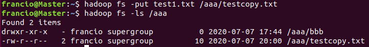 |
|   -rm   |               hadoop fs -rm -r /aaa                | 删除文件或文件夹<br />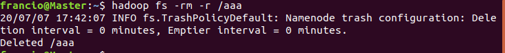 |
| -setrep |       hadoop fs -setrep 3 /aaa/testcopy.txt        | 设置hdfs中文件的副本数量<br /> |
|  -stat  |           hadoop fs -stat /aaa/test2.txt           | 获取文件属性<br />（不同属性需要添加不同参数，此处以获取时间为例）<br /> |
|  -cat   |           hadoop fs -cat /aaa/test1.txt            | 读取文件内容并显示<br />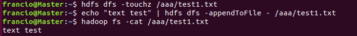 |
|  -tail  |         hadoop fs -tail /aaa/testcopy.txt          | 显示一个文件的末尾<br /> |
|  -test  |    hadoop fs -test -e /aaa/test2.txt ; echo $?     | 检测文件是否存在<br /><br />返回1为不存在，0为存在，需要用echo $?输出返回值 |
| -touchz |          hdfs dfs -touchz /aaa/test1.txt           | 创建新文件<br /> |

## 其他 HDFS Shell 命令

|     关键词     |                     命令语句示例                     |                             作用                             |
| :------------: | :--------------------------------------------------: | :----------------------------------------------------------: |
|     -help      |                     hadoop -help                     | 输出命令手册<br />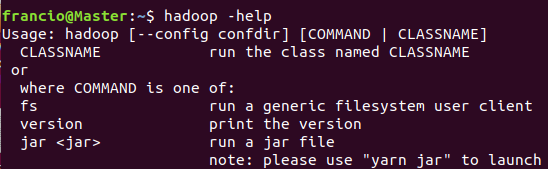 |
| -moveFromLocal | hadoop  fs  -moveFromLocal test2.txt /aaa/test2.txt  | 从本地**剪切**文件到hdfs<br />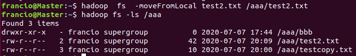 |
| -appendToFile  |   hadoop fs -appendToFile test1.txt /aaa/test2.txt   | 向位于hdfs中的文件的末尾追加内容<br />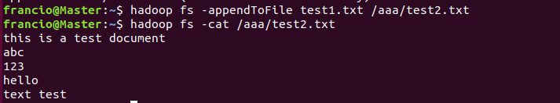 |
|  -copyToLocal  |        hadoop fs -copyToLocal /aaa/test2.txt         | 将hdfs中的文件拷贝到本地<br /> |
| -copyFromLocal |  hadoop fs -copyFromLocal test2.txt /aaa/test4.txt   | 从本地拷贝文件到hdfs<br />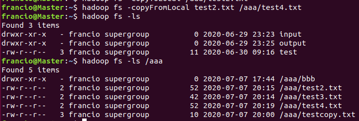 |
|   -getmerge    | hadoop fs -getmerge /hadooptest/test.* testtotal.txt | 合并下载多个文件<br />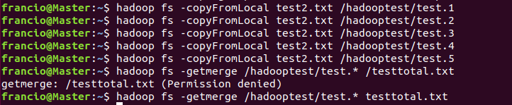 |
|     -rmdir     |              hadoop  fs  -rmdir   /aaa/              | 删除**空**目录<br /> |
|      -df       |                hadoop  fs  -df  -h  /                | 统计文件系统可用空间信息<br />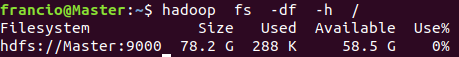 |
|     -count     |                hadoop fs -count /aaa/                | 统计指定目录下文件节点的数量<br /> |
