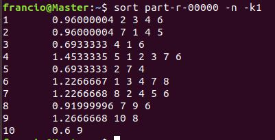
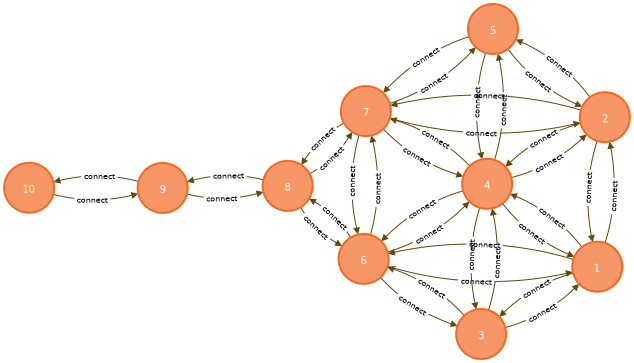

# MapReduce 组队作业一

Francio PKU_CCME

### 摘要

本次实验完成了矩阵的自乘，并计算了该矩阵对应风筝网络的 PageRank 值。在此基础上尝试性地将矩阵数据导入 Neo4J 中。

<!-- more -->

## 实验环境

| 虚拟机 | 处理器                               | 内存 | 硬盘  | 操作系统                     | Hadoop 版本 |
| ------ | ------------------------------------ | ---- | ----- | ---------------------------- | ----------- |
| Master | Inter(R) Core(TM) i7-8750H @ 2.20GHz | 2 GB | 40 GB | ubuntu-18.04.4-desktop-amd64 | 2.7.7       |
| Slave1 | Inter(R) Core(TM) i7-8750H @ 2.20GHz | 2 GB | 40 GB | ubuntu-18.04.4-desktop-amd64 | 2.7.7       |
| Slave2 | Inter(R) Core(TM) i7-8750H @ 2.20GHz | 2 GB | 40 GB | ubuntu-18.04.4-desktop-amd64 | 2.7.7       |

## 实验步骤与结果

###  矩阵乘法

#### Map 阶段

MapReduce 任务将读入的文件分发给各个 Mapper 的机制为逐行分配，每行数据对应一个 Mapper，而矩阵乘法过程中行的原始位置信息是非常重要的，故此处可以通过文本偏移量信息计算得到行号（总偏移量除以单行长度并取整）。由于此处的需求为矩阵自乘，矩阵的每个元素都需要与所在行和列的其他元素做一次乘法，故在 Mapper 中我们对矩阵中的每个元素设置了两类输出：

1. Key 为该元素所在行的每个元素的下标，Value 为 “#列号  该元素的值”
2. Key 为该元素所在列的每个元素的下标，Value 为 “#行号  该元素的值”

这种输出方法保证了 shuffle 和 reduce 过程中所有用到该元素的部分都能分配到一个该元素的值，同时该方法还能保住每个 Reducer 中 Value 内的行号与列号一一对应。

```java
static class MLineMapper extends Mapper<LongWritable, Text, Text, Text>{
	
		protected void map(LongWritable key, Text values, Mapper<LongWritable, Text, Text, Text>.Context context)
				throws IOException, InterruptedException {
			long keyNum = key.get();//获取该行偏移量

			int rollNum = (int) keyNum/values.toString().length();//start : 0，由偏移量得出行数
			
			String[] value = values.toString().split(" ");
			for(int j = 1;j<=value.length;j++) {//两类矩阵
				String outputvalue = value[j-1];
				for(int i = 1;i<=value.length;i++) {
					String outKeyString1 = "("+(rollNum+1)+","+i+")";
					String outKeyString2 = "("+i+","+j+")";
					
					String outValueString1 = "#"+j+" "+outputvalue;
					String outValueString2 = "#"+(rollNum+1)+" "+outputvalue;
					
					context.write(new Text(outKeyString1), new Text(outValueString1));
					context.write(new Text(outKeyString2), new Text(outValueString2));	
				}
			}
		}
	}
```

#### Reduce 阶段

前述 Map 过程保证了每个 Reducer 中 Value 内行号与列号的一一对应关系，故此处我们利用 Map 结构，将行（列）号作为 Key，元素值作为 Value，遍历全部传入 Reducer 中的数据，利用切片的方式将数据分割并使用 Map 自带的 get() 和 put() 方法添加或更改其中的 value 的值。

处理完成后，利用 entrySet() 方法遍历 map 中的 Value 值并加和，得到最终结果，以 "(行号，列号)  元素值" 的形式输出。

```java
static class MReducer extends Reducer<Text, Text, Text, IntWritable>{

		@Override
		protected void reduce(Text key, Iterable<Text> values, Reducer<Text, Text, Text, IntWritable>.Context context)
				throws IOException, InterruptedException {
			
			Map<String, Integer> map = new HashMap<String, Integer>();//各个元素在Map中进行计算
			
			for(Text t:values) {
				String[] buff = t.toString().split(" ");
				int numvalue = Integer.valueOf(buff[1]);
				int mapvalue = 0;
				if(map.containsKey(buff[0])) {//向Map中添加新元素或更改旧元素的值
					mapvalue = map.get(buff[0]);
					map.put(buff[0],numvalue*mapvalue);
				}else {
					map.put(buff[0], numvalue);
				}
			}
			
			int outputnum = 0;
			
			Set<Entry<String, Integer>> entrys =  map.entrySet();//遍历Map，将值加和
	        for(Entry<String, Integer> en : entrys){
	            outputnum += en.getValue();
	        }
	        context.write(key, new IntWritable(outputnum));
		}
	}
```

#### 提交任务

 在main方法中设置输入输出路径等参数，将程序打包为 Jar 包后上传至服务器进行计算。

```java
public static void main(String[] args) {
		try {
			if(args.length!=2){
		        System.err.println("Uage: Matrix <in> <out>");
		        System.exit(2);
		    }
			// 指定hdfs相关的参数
	        Configuration conf = new Configuration();
	        conf.set("fs.defaultFS", "hdfs://Master:9000");
	        System.setProperty("HADOOP_USER_NAME", "francio");         
	        Job job = Job.getInstance(conf);
	        // 设置jar包所在路径
	        job.setJarByClass(Matrix.class);
	        // 指定mapper类和reducer类
	        job.setMapperClass(MLineMapper.class);
	        job.setReducerClass(MReducer.class);
	        // 指定maptask的输出类型
	        job.setMapOutputKeyClass(Text.class);
	        job.setMapOutputValueClass(Text.class);
	        // 指定reducetask的输出类型
	        job.setOutputKeyClass(Text.class);
	        job.setOutputValueClass(IntWritable.class);
	        // 指定该mapreduce程序数据的输入和输出路径
	        Path inputPath = new Path("/Matrix/input");
	        Path outputPath = new Path("/Matrix/output");
	        FileSystem fs;
			fs = FileSystem.get(conf);
			if(fs.exists(outputPath)){
	            fs.delete(outputPath, true);
	        }
	        FileInputFormat.setInputPaths(job, inputPath);
	        FileOutputFormat.setOutputPath(job, outputPath);
	        // 最后提交任务
	        boolean waitForCompletion = job.waitForCompletion(true);
	        System.exit(waitForCompletion?0:1);
		} catch (Exception e) {
			// TODO Auto-generated catch block
			e.printStackTrace();
		}
    }
```

```shell
hadoop fs -mkdir -p /Matrix/input
hadoop fs -mkdir -p /Matrix/output
hdfs dfs -put adj.txt /Matrix/input/
hdfs dfs -put Matrix.jar /
hadoop jar Matrix.jar input output

hdfs dfs -get /Matrix/output/part-r-00000 ./
```

计算完毕后，将结果文件下载至本地，重命名为 MatrixAns.txt 后进行后处理。

#### 结果后处理

MapReduce 计算完成后的输出结果为 “行列位置-值” ，不方便阅读，故将文件取回本地后使用 python 对其进行处理。

待处理矩阵为一个10\*10的方阵，故先创建一个10\*10的空矩阵方便接收数据。遍历每行并使用正则表达式将每行的数字提取出，此时列表 temp 中应存有三个值，分别为行号，列号和元素值。通过前两项下标将元素值填入空矩阵，最后遍历矩阵并输出。

```python
import re

if __name__ == '__main__':
    fileIn = open("MatrixAns.txt","r",encoding="utf-8")
    fileOut = open("Matrix.txt","w",encoding="utf-8")

    matrix = [[0 for i in range(10)] for j in range(10)]

    num_lines =  list(fileIn)
    for num_line in num_lines:
        temp = re.findall(r"\d+\.?\d*",num_line)
        matrix[int(temp[0])-1][int(temp[1])-1] = int(temp[2])

    for line in matrix:
        for column in line:
            fileOut.write(str(column) + " ")
        fileOut.write("\n")
```

最终结果为：
$$
\begin{array}{lllllllll}
4 & 1 & 2 & 3 & 2 & 2 & 3 & 1 & 0 & 0 \\
1 & 4 & 2 & 3 & 2 & 3 & 2 & 1 & 0 & 0 \\
2 & 2 & 3 & 2 & 1 & 2 & 2 & 1 & 0 & 0 \\
3 & 3 & 2 & 6 & 2 & 3 & 3 & 2 & 0 & 0 \\
2 & 2 & 1 & 2 & 3 & 2 & 2 & 1 & 0 & 0 \\
2 & 3 & 2 & 3 & 2 & 5 & 2 & 1 & 1 & 0 \\
3 & 2 & 2 & 3 & 2 & 2 & 5 & 1 & 1 & 0 \\
1 & 1 & 1 & 2 & 1 & 1 & 1 & 3 & 0 & 1 \\
0 & 0 & 0 & 0 & 0 & 1 & 1 & 0 & 2 & 0 \\
0 & 0 & 0 & 0 & 0 & 0 & 0 & 1 & 0 & 1
\end{array}
$$

### PageRank

由于 PageRank 过程需要对矩阵进行重复处理，故要求每次输入输出的文件格式一致，且要包含节点信息，该节点的 PR 值信息和与该节点相连的其他节点的信息，故将输入输出格式确定为 "节点号  PR值  与该节点相连的其他节点编号列表" 。由于原始数据不是该结构，故计算前应有预处理 MapReduce 过程。

#### 预处理 Map 过程

由于行号与节点编号有着对应关系，故可利用文本偏移量确定行号，之后遍历该行并计数，当遍历到 "1" 时计数的值即为与该节点相连的其他节点编号。在该 Map 过程中，我们设置每个节点初始 PR 值为 1。输出的 Key 为节点号与 PR 值，Value 为与该节点相连的其他节点编号。

```java
public static  class PrePRMapper extends Mapper<LongWritable,Text, Text, Text>{
		@Override
		protected void map(LongWritable key, Text value, Mapper<LongWritable, Text, Text, Text>.Context context)
				throws IOException, InterruptedException {
			
			long keyNum = key.get();
			int rollNum = (int) keyNum/value.toString().length()+1;//start : 1，由偏移量得出行数
			String[] values = value.toString().split(" ");
			IntWritable prorigen = new IntWritable(1);
			int node = 0;
			
			String outkey = " " + rollNum + " " + prorigen; 
			
			for (String v:values) {
				node += 1;
				if (v.equals("1")) {
					String outvalue = " " + node;
					context.write(new Text(outkey), new Text(outvalue));
				}
			}
		}
	}
```

#### 预处理 Reduce 过程

此处 Reduce 的作用为将与待研究节点相连的其他节点编号的信息汇总，以空格隔开追加到输出的 Value 后。输出的 Key 为 ”节点号  PR值“，Value为 与该节点相连的其他节点编号列表。

```java
public static class PrePRRecucer extends Reducer<Text, Text, Text, Text>{
		@Override
		protected void reduce(Text key, Iterable<Text> values, Reducer<Text, Text, Text, Text>.Context context)
				throws IOException, InterruptedException {
			String outValue = "";
			for(Text value :values ) {
				outValue = outValue + (value.toString() + " ");
			}
			context.write(key,new Text(outValue));	
		}
	}
```

#### Map 过程

此处传入的数据是一串个数未知的数字列表，此时可以确定前两个数字分别代表待研究的节点号和 PR 值，故可以使用 StringTokenizer() 和其中的 nextToken() 方法对其进行遍历。之后的全部数据为与该节点相连的其他节点的编号，使用 countTokens() 方法即可获得邻接节点的个数，由此计算得出该节点向其他节点分发的 PR 值。

此处设置了两类输出：

1. Key：邻接节点编号 Value：邻接节点获得的 PR 值（以 "A" 开头）
2. Key：当前节点的编号 Value：与该节点相连邻接节点的编号列表（以 "L" 开头）

Value 中设置不同开头的目的为方便在 Reduce 阶段区分不同类型的数据。

```java
public static class PRMapper extends Mapper<Object,Text,Text,Text>{
        private String id;
        private float pr;       
        private int count;
        private float average_pr;       
        public void map(Object key,Text value,Context context) throws IOException,InterruptedException{            
            StringTokenizer str = new StringTokenizer(value.toString());
            id =str.nextToken();
            pr = Float.parseFloat(str.nextToken());
            count = str.countTokens();
            average_pr = pr/count;
            String linklist ="L";
            while(str.hasMoreTokens()){
                String linkid = str.nextToken();
                context.write(new Text(linkid),new Text("A"+average_pr));
                linklist +=" "+ linkid;
            }       
            context.write(new Text(id), new Text(linklist));
        }       
    }
```

#### Reduce 过程

Reduce 过程的作用为遍历收集各节点获得的 PR 值并加和，并整理邻接节点信息，输出。在 PR 值计算完毕后，对其应用冲浪模型，此处设置 80% 为正常 PR 值传递，20% 为值的随机分配。输出结果的 Key 为节点编号和最终的 PR 值，Value 为该节点的邻接节点的编号列表。

```java
 public static class PRReducer extends Reducer<Text,Text,Text,Text>{

        public void reduce(Text key,Iterable<Text> values,Context context)
            throws IOException,InterruptedException{
            String linker = "";
            float pr = 0;
            for(Text val:values){
                if(val.toString().substring(0,1).equals("L")){
                    pr += Float.parseFloat(val.toString().substring(1));
                }
                else if(val.toString().substring(0,1).equals("A")){
                    linker += val.toString().substring(1);
                }
            }
            pr = 0.8f*pr + 0.2f; 
            String result = pr+linker;
            context.write(key, new Text(result));           
        }
    }
```

#### 提交任务

由于此处使用了两个 MapReduce 过程，且第二个过程要重复进行，故要在 main 方法中分别配置任务。此处利用 for 循环重复提交第二个Map Reduce任务，并在循环中重新对输入输出路径赋值以保证上一次循环的输出文件成为下一次循环的输入文件。

```java
public static void main(String[] args) {
		try {
			if(args.length!=2){
		        System.err.println("Uage: Matrix <in> <out>");
		        System.exit(2);
			}
	        Configuration conf = new Configuration();
	        conf.set("fs.defaultFS", "hdfs://Master:9000");
	        System.setProperty("HADOOP_USER_NAME", "francio");
	        
	        Job job = Job.getInstance(conf);
	        job.setJarByClass(PageRank.class);
	        job.setMapperClass(PrePRMapper.class);
	        job.setReducerClass(PrePRRecucer.class);
	        job.setMapOutputKeyClass(Text.class);
	        job.setMapOutputValueClass(Text.class);
	        job.setOutputKeyClass(Text.class);
	        Path inputPath = new Path("/pagerank/input");
	        Path outputPath = new Path("/pagerank/srcdata");
	        FileSystem fs;
			fs = FileSystem.get(conf);
			if(fs.exists(outputPath)){
	            fs.delete(outputPath, true);
	        }
	        FileInputFormat.setInputPaths(job, inputPath);
	        FileOutputFormat.setOutputPath(job, outputPath);
	        job.waitForCompletion(true);
	        
	        Configuration conf2 = new Configuration();
	        String pathIn = "/pagerank/srcdata/";
	        String pathOut = "/pagerank/output/";
	        for(int i=1;i<=10;i++){      
	        	Job job2 = Job.getInstance(conf2);
	            job2.setJarByClass(PageRank.class);
	            job2.setMapperClass(PRMapper.class);
	            job2.setReducerClass(PRReducer.class);
	            job2.setOutputKeyClass(Text.class);
	            job2.setOutputValueClass(Text.class);
	            FileInputFormat.addInputPaths(job2, pathIn);
	    		FileOutputFormat.setOutputPath(job2, new Path(pathOut));
	            pathIn = pathOut;//the last output becomes the new input
	            pathOut = pathOut+i;
	            job2.waitForCompletion(true);
	        }
	        
		} catch (Exception e) {
			e.printStackTrace();
		}
	}
```

打包为 Jar 包后上传至服务器，提交任务。

```shell
hadoop fs -mkdir -p /pagerank/inputh
hdfs dfs -put PageRank.jar /
hdfs dfs -put adj.txt /pagerank/input

hadoop jar PagerRank.jar input output
hdfs dfs -get /pagerank/output/part-r-00000 ./
sort part-r-00000 -n -k1
```

按照第一列排序后最终的输出文件内容为：



文件中包含了我们不需要的邻接节点信息，使用python后处理将其消除：使用正则表达式匹配全部数字信息，将前两个数字写入文件。

```python
import re

if __name__ == '__main__':
    fileIn = open("PageRankResult.txt","r",encoding="utf-8")
    fileOut = open("PageRank.txt","w",encoding="utf-8")

    num_lines =  list(fileIn)
    for num_line in num_lines:
        temp = re.findall(r"\d+\.?\d*",num_line)
        fileOut.write(str(temp[0]) + ": " + str(temp[1]) + "\n")
```

最终结果为：

```
1: 0.96000004
2: 0.96000004
3: 0.6933333
4: 1.4533335
5: 0.6933333
6: 1.2266667
7: 1.2266668
8: 0.91999996
9: 1.2666668
10: 0.6
```

该风筝网络还可导入 Neo4J 中，可以方便地进行可视化和图计算，调用 Graph Algorithms 插件亦可实现 PageRank，命令为：

```cypher
CALL algo.pageRank(label:null, relationship:null,{iterations:20, dampingFactor:0.85, write: true, writeProperty:'pagerank', concurrency:4}) YIELD nodes, iterations, loadMillis, computeMillis, writeMillis, dampingFactor, write, writePropert
```



## 体会

MapReduce 在处理需要将数据拆分分别处理的任务时可以大大简化编程过程，仅需在给定模板上重写即可，但这也导致了 MapReduce 的输入输出格式非常单一，当原始数据格式不符合输入输出格式要求时便需要额外的预处理过程，会使代码变得更加冗长。在遇到需要将前一步的输出作为后一步的输入的任务时，MapReduce 需要重复提交任务，效率较低。

针对不同计算任务灵活使用合适的工具是非常重要的，可以大大提升工作效率。在 MapReduce 框架下需要编程实现的 PageRank 放到图数据库 Neo4J 中就有了已经写好的包，仅需执行相应的 Cypher 命令即可完成相同的工作。且在 Neo4J 中可以实现图数据的可视化，提升了数据处理的体验感。