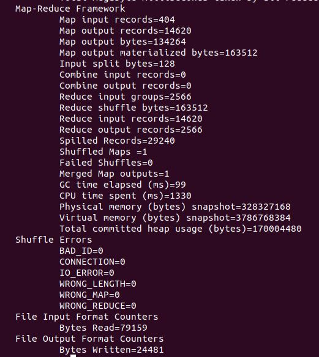
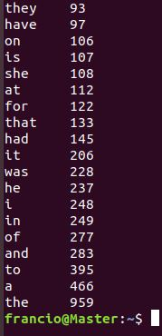

# MapReduce 个人作业

Francio PKU_CCME

### 摘要

本次实验完成了基于MapReduce的英文词频统计，在示例代码的基础上对单词进行了转换大小写和去除标点符号的预处理。

<!-- more -->

## 实验环境

| 虚拟机 | 处理器                               | 内存 | 硬盘  | 操作系统                     | Hadoop 版本 |
| ------ | ------------------------------------ | ---- | ----- | ---------------------------- | ----------- |
| Master | Inter(R) Core(TM) i7-8750H @ 2.20GHz | 2 GB | 40 GB | ubuntu-18.04.4-desktop-amd64 | 2.7.7       |
| Slave1 | Inter(R) Core(TM) i7-8750H @ 2.20GHz | 2 GB | 40 GB | ubuntu-18.04.4-desktop-amd64 | 2.7.7       |
| Slave2 | Inter(R) Core(TM) i7-8750H @ 2.20GHz | 2 GB | 40 GB | ubuntu-18.04.4-desktop-amd64 | 2.7.7       |

## 实验步骤

### Map阶段：分词

Map 阶段，使用 toString() 方法将文本读入并切分为分立的单词，之后遍历单词列表，使用 replaceAll() 方法将可能出现的标点符号移除。处理完成后进一步将所有字母转化为小写以获得更准确的单词计数。

处理完成后该部分输出格式为 (word : 1)，进入 reduce 阶段。

```java
static class WCMapper extends Mapper<Object, Text, Text, IntWritable>{
		@Override
		protected void map(Object key, Text value, Mapper<Object, Text, Text, IntWritable>.Context context)
				throws IOException, InterruptedException {
			String[] words = value.toString().split(" ");
			for (String word : words ) {
				String replace1 = word.replaceAll( "[\\p{P}+~$`^=|<>～｀＄＾＋＝｜＜＞￥×]" , "");
				String replace2 = replace1.toLowerCase();
				context.write(new Text(replace2),new IntWritable(1));
			}
		}
	}
```

### Reduce阶段：统计词频

使用 get() 方法获取 shuffle 后的单词数量信息并求和，得到最终的词频，最后以 “单词  词频” 的形式输出。

```java
static class WCReducer extends Reducer<Text, IntWritable, Text, IntWritable>{		
		@Override
		protected void reduce(Text key, Iterable<IntWritable> values,
				Reducer<Text, IntWritable, Text, IntWritable>.Context context) throws IOException, InterruptedException {
			int sum = 0;
			for (IntWritable v : values) {
				sum += v.get();
			}
			context.write(key, new IntWritable(sum));
		}
	}
```

### 提交任务

在 main 方法中进行 MapReduce 任务的参数设置和提交，如代码中注释所示，在该部分中使用相应的 set 方法指定了服务器端口，用户名，jar 包路径，Mapper 和 Reducer 类，输入输出的类型与路径等参数。

```Java
public static void main(String[] args) {
		try {
			if(args.length!=2){
		        System.err.println("Uage: wordcount <in> <out>");
		        System.exit(2);
		    }
			// 指定hdfs相关的参数
	        Configuration conf = new Configuration();
	        conf.set("fs.defaultFS", "hdfs://Master:9000");
	        System.setProperty("HADOOP_USER_NAME", "francio");
	         
	        Job job = Job.getInstance(conf);
	         
	        // 设置jar包所在路径
	        job.setJarByClass(EngWordCount.class);
	         
	        // 指定mapper类和reducer类
	        job.setMapperClass(WCMapper.class);
	        job.setReducerClass(WCReducer.class);
	         
	        // 指定maptask的输出类型
	        job.setMapOutputKeyClass(Text.class);
	        job.setMapOutputValueClass(IntWritable.class);
	         
	        // 指定reducetask的输出类型
	        job.setOutputKeyClass(Text.class);
	        job.setOutputValueClass(IntWritable.class);
            
	        // 指定该mapreduce程序数据的输入和输出路径
	        Path inputPath = new Path("/wordcount/input");
	        Path outputPath = new Path("/wordcount/output");
            
	        FileSystem fs;
			fs = FileSystem.get(conf);
			if(fs.exists(outputPath)){
	            fs.delete(outputPath, true);
	        }
	        FileInputFormat.setInputPaths(job, inputPath);
	        FileOutputFormat.setOutputPath(job, outputPath);
	        // 最后提交任务
	        boolean waitForCompletion = job.waitForCompletion(true);
	        System.exit(waitForCompletion?0:1);
		} catch (Exception e) {
			// TODO Auto-generated catch block
			e.printStackTrace();
		}
    }
```

编程完成后，先在 Eclipse 中对其进行编译，之后将程序导出为可运行的 jar 包并上传至服务器根目录下。


在上传前，应先在 Hadoop 中建立程序运行所需的输入输出路径，若路径已存在应将其清空。之后将待处理的文件上传至 input 文件夹。

```shell
hadoop fs -mkdir -p /wordcount/input
hadoop fs -mkdir -p /wordcount/output
hdfs dfs -put 新概念英语第二册.txt /wordcount/input/
hdfs dfs -put WordCount.jar /
```

## 结果与结论

上传完毕后，执行 jar 包，运算结束后使用 get 方法将输出的文件抓取到本地，并用 sort 方法依照第二行词频信息进行排序，获得结果。

```shell
hadoop jar WordCount.jar input output
hdfs dfs -get /wordcount/output/part-r-00000 ./
sort part-r-00000 -n -k2
```

下图为任务执行完毕后返回的部分任务参数和得到的词频信息：

  

经过去除标点和大小写转换后，"the" 等常在句子开头出现的词的词频明显较示例代码得到的词频高，可见对原始数据的预处理是非常重要的。

## 体会

MapReduce 的一个很大的优点是变成非常容易，仅需按照给定的模板重写 Mapper 和 Reducer 方法即可，且 shuffle 过程在编程时无需考虑，进一步简化了工作量。之前用 python 写过类似的统计词频程序，其代码长度要要多于使用 MapReduce 编程。

虽然编程过程得到了简化，但任务的提交要远较一般程序复杂，需要设置的参数过多。同时 MapReduce 的运行速度较慢。由于需要在给定框架下进行编程，MapReduce 的灵活性不高，只能用于处理一些特定的任务。


