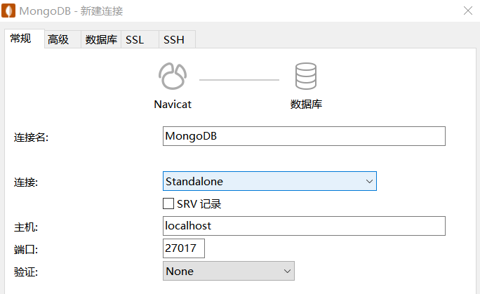
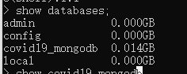

# MongoDB 个人作业

Francio PKU_CCME

### 摘要

本次实习使用 Navicat Premium 将经过预处理的 COVID-19 研究数据导入 MongoDB中，并利用 python 编程的方式实现了对文章作者、国家和文章标题关键词出现频数的统计。在此基础上生成了国家、地区、机构、个人这四类数据的关系文件并将其导入了 Neo4J 数据库中，在 Neo4J 上进一步完成了对国家关系、下属机构关系等信息的查询。

<!-- more -->

## 实验环境

#### 基础环境

| 处理器                               | 内存       | 硬盘                      | 操作系统               |
| ------------------------------------ | ---------- | ------------------------- | ---------------------- |
| Inter(R) Core(TM) i7-8750H @ 2.20GHz | 16 GB DDR4 | 120 GB SSD <br />2 TB HDD | Windows 10<br />专业版 |

#### 所用软件

| 软件名称   | MongoDB | Neo4J Desktop | Navicat Premium | Pycharm Community |
| ---------- | ------- | ------------- | --------------- | ----------------- |
| **版本号** | 4.2.8   | 1.2.9         | 12.1.20         | 11.0.4            |

## 实验步骤及结论

启动MongoDB服务：直接在 powershell 中键入 `mongod`即可。

### 数据预处理与导入

本次实习使用 Navicat 进行数据的导入，首先在 Navicat 中新建一个 MongoDB 连接，双击打开连接。



连接成功后，右键建立库，并在“集合”选项中新建立新集合“covid19”。


由于 Navicat 在导入文件时会对每个文件生成一个新集合，故我们需要将原数据集中的全部 1053 个 JSON 文件整合为一个文件，此处用 python 编程实现。

通过 listdir() 方法获取全部文件名列表，遍历数据集中的所有文件，每份文件间用逗号隔开，并在文件开头结尾添加中括号，形成一个包含全部文件的大列表。最终输出文件为 total.json ,大小为 87.0 MB。

```python
import os

def main():
    file_out = open('total.json', 'w', encoding='utf-8')
    path = "F:\\PKU\\Freshman_summer\\Big_Data_Management\\works\\4.MongoDB_DDL_8_14\\CORD-19-research"
    path_list = os.listdir(path)
    file_out.write("[")
    num = 1053
    count = 0

    for filename in path_list:
        count += 1
        f = open(os.path.join(path, filename), 'r',encoding='utf-8')
        print(count)
        lines = list(f)
        for line in lines:
            file_out.write(line)
        if count < num:
            file_out.write(",")
        file_out.write("\n")
    file_out.write("]")

if __name__== "__main__":
    main()
```

文件处理完毕后，在 Navicat 中点击"导入"，选择“JSON文件(*.json)”,添加文件路径。

在选择表示集合行的标签时，应选择下拉列表中第一行的空白选项，否则导入的只是JSON文件的部分内容。


在定义字段映射时，应将 'metadata' 'abstract' 'body_text'等包含了嵌套信息的模块定义为 Array 类型，此时程序会将所有嵌套的结构展开并导入，原文件中的包含关系可以被保留。设置完毕后跳转到最后一步，点击”开始“，等待导入完成。


导入完成后即可在程序界面直接查找相关信息，所有 Array 和 Document 类型的数据均可展开查看。


使用 cmd 在 Navicat 程序外对建立的数据库进行查询，可以看到 covid19_mongodb 数据库已被创建并存入数据。



### 进行查询

本次实习中使用 python 进行查询。

#### 统计国家信息

本部分实现了统计所有国家在数据集中的出现次数，并输出了排名前十的国家。部分数据中国家一栏为空，无法统计。

在 Navicat 中观察国家数据，发现主要存在以下两个问题：

1. 国家信息中混杂有各种标点符号
2. 同一个国家有多种不同的表示方法

为解决上述问题，程序中利用正则表达式定义了一个去除标点符号的方法，并在获取到国家信息后对主要的存在不同国家名称表示方法的三个国家（中英美）进行处理，统一名称。

此处采取逐层访问的方法获得国家信息，防止数据不存在导致的异常。使用 `country_dict = {}` 创建字典，Key 为国家名称，Value 为该国家出现的次数。遍历完成后使用`sorted()`方法，以 Value 值为依据对字典进行排序，最后遍历字典的前十项并输出。

```python
import pymongo as db
import re

def remove(text):
    remove_chars = '[0-9’!"#$%&\'()*+,-/:;<=>?@，?★、…【】《》？“”‘’！[\\]^_`{|}~]+†.。'
    return re.sub(remove_chars, '', text)

if __name__ == '__main__':
    country_dict = {}
    collection = db.MongoClient()['covid19_mongodb'].covid19
    record_set = collection.find()
    for record in record_set:
        authors = record['metadata']['authors']
        for author in authors:
            if "affiliation" in author.keys():
                affiliation = author['affiliation']
                if 'location' in affiliation.keys():
                    location = affiliation['location']
                    if 'country' in location.keys():
                        country = location['country']
                        if "china" in country or "China" in country:
                            country = "China"
                        elif "USA" in country or "States" in country:
                            country = "USA"
                        elif "United Kingdom" in country:
                            country = "UK"

                        if country in country_dict.keys():
                            country_dict[country] += 1
                        else:
                            country_dict[country] = 1
    #按Value值排序
    sort_dict = sorted(country_dict.items(),
                       key=lambda kv: (kv[1], kv[0]), reverse=True)
    cont = 0
    for i in sort_dict:
        #跳过空数据
        if i[0] == "":
            continue
        print(i)
        cont += 1
        if cont == 10:
            break
```

结果如下图，可见中美两国对 COVID-19 的研究量远超其他国家，


#### 统计作者信息

统计作者信息的流程与上述统计国家信息基本一致，均为逐层获取信息-删除特殊符号-添加入字典并计数-对字典排序并输出，故详细过程不再赘述，仅就作者名称的特殊结构做一些说明。

原始数据中一个作者名被分为了"first""middle""last"三项分开存储，部分作者没有中间名，故程序中以是否存在中间名为依据进行了分类处理，保证单词之间以一个单独的句点截断。同时对用于删除特殊字符的方法进行了改写，使之不能删除句点。

在 Navicat 中可以发现，原始数据中还有一些作者名是一个无意义的字母或特殊符号，针对此种情况，程序在将作者名称输入字典处理前会进行判断，只有以字母开头且长度大于等于3的作者名才能认定为合法名称，进行后续操作。

```python
import re
import pymongo as db

def remove(text):
    remove_chars = '[0-9’!"#$%&\'()*+,-/:;<=>?@，?★、…【】《》？“”‘’！[\\]^_`{|}~]+†'
    return re.sub(remove_chars, '', text)

def main():
    # 存储所有出现过的作者及它们出现的次数
    author_dict = {}
    # 获得表中数据
    collection = db.MongoClient()['covid19_mongodb'].covid19
    record_set = collection.find()

    for record in record_set:
        authors = record['metadata']['authors']
        for author in authors:
            if author['middle'] != []:
                #作者名
                author_name = str(author['first'])+"."+author['middle'][0]+"."+str(author['last'])
            else:
                author_name = str(author['first']) + "." + str(author['last'])
            
            author_name =remove (author_name)
            if author_name[0].isalpha() and len(author_name)>3:#合法作者名称筛选
                if author_name in author_dict.keys():
                    author_dict[author_name] += 1
                else:
                    author_dict[author_name] = 1
        # 排序输出
        sort_dict = sorted(author_dict.items(),
                           key=lambda kv: (kv[1], kv[0]), reverse=True)
    cont = 0
    for i in sort_dict:
        if i[0] == "":
            continue
        print(i)
        cont += 1
        if cont == 10:
            break
            
if __name__ == "__main__":
    main()
```

结果如下图，单从名字看，出现次数排名前十的作者就有六位来自中国，与前面根据国家出现次数得出的结论一致。


#### 统计文章标题词频

文章标题中包含一些无意义的虚词或数字，需要在处理时删除。此处程序读入一个停用词表（forbidden.txt），包含常见的停用词和标点符号。凡是在停用词表中出现的词君不会被统计到。实际操作过程中出现了部分数字等未被停用词表包含的无意义词，使用`extrnd()`方法添加了这些词到停用词列表中。

此处用到的方法仍为遍历文章题目，分词后将单词添加入字典计数并排序，输出排名前十的单词。

```python
import pymongo as db

def main():
    # 读取停用词表
    file_forbidden = open("forbidden.txt","r",encoding='utf-8')
    forbidden = list(file_forbidden)
    nam_lento = len(forbidden)
    forbidden_final = []
    for pre in range(nam_lento):
        stop_null = forbidden[pre].strip('\n')
        forbidden_final += [stop_null]
    file_forbidden.close()
    #添加额外无意义词到停用词列表中
    forbidden_final.extend(["Title:", "2", "A", "1",  "The", "3"])

    title_dict = {}
    collection = db.MongoClient()['covid19_mongodb'].covid19
	#遍历读取单词信息
    record_set = collection.find()
    for record in record_set:
        title = record['metadata']['title']
        words = title.split(" ")
        for word in words:
            if word not in forbidden_final:
                if word in title_dict.keys():
                    title_dict[word] += 1
                else:
                    title_dict[word] = 1
    # 排序输出
    sort_dict = sorted(title_dict.items(), key=lambda kv: (kv[1], kv[0]), reverse=True)
    for i in range(10):
        print(sort_dict[i])
        
if __name__ == '__main__':
    main()
```

结果如下图：


### 将相关的数据导入 Neo4J 

上述查询到的作者与国家等应有一定的联系，将这些联系提取后导入图数据库可以更加直观方便地进行查询。此处提取了"country" "settlement" "institution" "author"四类信息建立关系。

#### 导入文件前的准备

Neo4J 使用 csv 文件导入节点和关系数据。由于数据集中各类信息均有重复，故需要单独生成节点文件和关系文件，保证节点数据不重复、关系数据不缺失。创建文件并添加文件开头后，设置三个全局列表记录已经出现过的信息。

```python
out_country = open('country.csv', 'w', encoding='utf-8')
out_author = open('author.csv', 'w', encoding='utf-8')
out_settlement = open('settlement.csv', 'w', encoding='utf-8')
out_institution = open('institution.csv', 'w', encoding='utf-8')
country_settlement = open('country_settlement.csv', 'w', encoding='utf-8')
settlement_institution = open('settlement_institution.csv', 'w', encoding='utf-8')
institution_author = open('institution_author.csv', 'w', encoding='utf-8')
#写表头
out_country.write("country"+"\n")
out_author.write("author"+"\n")
out_settlement.write("settlement"+"\n")
out_institution.write("institution"+"\n")
country_settlement.write("country,settlement" + "\n")
settlement_institution.write("settlement,institution" + "\n")
institution_author.write("institution,author" + "\n")
#记录已经出现过的信息
country_history=[]
settlement_history=[]
institution_history=[]
```

利用正则表达式定义一个去除单词中的特殊符号的方法。

```python
def remove(text):
    remove_chars = '[0-9’!"#$%&\'()*+,-/:;<=>?@，?★、…【】《》？“”‘’！[\\]^_`{|}~]+†¶'
    return re.sub(remove_chars, '', text)
```

设置一个储存已经出现过的作者的列表。由于国家、地区、机构等信息可能会重复出现，所以不会在读取信息时将其处理掉，而是在写入文件时对其进行处理，但作者名称只能出现一次，所以在读取数据时就要判断该作者是否已经出现过，保证获取到的信息的唯一性。对作者名的处理沿用了前面统计作者信息时的方法。

由于原始数据中存在空信息，故在遍历各份数据时，都将重新定义列表`info_list`用于储存四类信息，默认初始值为 “empty”。之后逐层读取所需信息并对`info_list`中的对应位置作出更改。在处理国家信息时添加了应对可能出现的一个国家对应多种名称的情况的判断语句。信息获取完毕后将`info_list`传入自定义的写文件的方法`output()`中。

```python
def main():
    author_history = []#记录已添加的作者

    collection = db.MongoClient()['covid19_mongodb'].covid19
    record_set = collection.find()

    for record in record_set:
        info_list = ["empty","empty","empty","empty"] #作者，机构，地区，国家
        authors = record['metadata']['authors']
        for author in authors:
            if author['middle'] != []:
                #作者名
                author_name =str(author['first'])+"."+author['middle'][0]+"."+str(author['last'])
            else:
                author_name = str(author['first']) + "." + str(author['last'])
            author_name = remove(author_name)
            if author_name not in author_history and author_name[0].isalpha():
                author_history += author
                info_list[0] = author_name
                #国家
                if "affiliation" in author.keys():
                    affiliation = author['affiliation']
                    if 'institution' in affiliation.keys():
                        info_list[1] = affiliation['institution']
                    if 'location' in affiliation.keys():
                        location = affiliation['location']
                        if 'settlement' in location.keys():
                            info_list[2] = location['settlement']
                        if 'country' in location.keys():
                            country = location['country']
                            country = remove(country)
                            if "china" in country or "China" in country or "P.R.C" in country:
                                country = "China"
                            elif "USA" in country or "States" in country or "U.S.A" in country:
                                country = "USA"
                            elif  "United Kingdom" in country:
                                country = "UK"
                            info_list[3] = country
                output(info_list)
```

写文件的操作分为了写节点文件和写关系文件两部分：

1. 节点文件中要保证不出现重复的项，故添加判断语句保证信息未曾出现过。新信息在处理完毕后需要添加到已出现的信息列表中。
2. 关系文件要保证所有出现过的关系都要写入，故无需进行判断。

```python
def output(group):
    #写节点文件
    if group[1] not in institution_history:
        out_institution.write(group[1] + "\n")
        institution_history.append(group[1])
    if group[2] not in settlement_history:
        out_settlement.write(group[2] + "\n")
        settlement_history.append(group[2])
    if group[3] not in country_history:
        out_country.write(group[3] + "\n")
        country_history.append(group[3])
    out_author.write(group[0] + "\n")
	#写关系文件
    country_settlement.write(group[3]+","+group[2] + "\n")
    settlement_institution.write(group[2]+","+group[1] + "\n")
    institution_author.write(group[1]+","+group[0] + "\n")
```

#### 导入文件

打开 Neo4J Desktop，在 Project 中新建项目“Covid19 Research”，并在右侧新建一个名为 “COVID-19” 的数据库。


建立完毕后，打开数据库所在文件夹，将生成的七个 csv 文件复制到该数据库的 import 文件夹中。


开启数据库，并使用 Neo4J Browser 访问该数据库：


键入命令，建立节点与关系。

```cypher
//建立节点
LOAD CSV WITH HEADERS FROM 'file:///author.csv'As line CREATE (:author{name: line.author})
LOAD CSV WITH HEADERS FROM 'file:///country.csv'As line CREATE (:country{name: line.country})
LOAD CSV WITH HEADERS FROM 'file:///institution.csv'As line CREATE (:institution{name: line.institution})
LOAD CSV WITH HEADERS FROM 'file:///settlement.csv'As line CREATE (:settlement{name: line.settlement})
//建立关系
LOAD CSV WITH HEADERS FROM 'file:///country_settlement.csv'AS line MATCH (from:country{name:line.country}),(to:settlement{name:line.settlement}) MERGE(to)-[r:settlement]->(from)
LOAD CSV WITH HEADERS FROM 'file:///settlement_institution.csv'AS line MATCH (from:settlement{name:line.settlement}),(to:institution{name:line.institution}) MERGE(to)-[r:institution]->(from);
LOAD CSV WITH HEADERS FROM 'file:///institution_author.csv'AS line MATCH (from:institution{name:line.institution}),(to:author{name:line.author}) MERGE(to)-[r:author]->(from);
```

建立完毕后可在右侧导航栏查看建立情况。此处建立了11152个节点和14761个关系。


#### 在 Neo4J 中进行查询

由于数据量过于庞大，为避免图杂乱，下面的查询君仅输出50个左右的结果。

查询与美国芝加哥相关的机构与个人：

```cypher
match (author)-[r1]->(institution)-[r2]->(settlement)-[r3]->(country) where settlement.name = "Chicago" return country,institution,settlement,author,r1,r2,r3 limit 50;
```


从“China”出发查询在地区层面上各个国家间的联系：

```cypher
MATCH p1=(China)-->(m) RETURN p1 LIMIT 25;
```


查询与美国相关的各个机构：

```cypher
MATCH p2=(institution)-[r1:institution]->(settlement)-[r2:settlement]->(country) where country.name = "USA" RETURN p2 LIMIT 50;
```


## 体会

MongoDB 作为功能强大的非关系型数据库，可以用来存储和管理 json 等具有较为松散的数据结构的文件，同时它可以将层级结构存储为 Array 类型，又可以提供类似于关系数据库中中的表结构（如下图），能够实现表查询中的绝大部分功能。


使用 MongoDB 可以方便地通过编程方式对信息进统计。由于 JSON 文件中的层级结构在MongoDB中得以保留，故编程时可以通过指定路径便捷地访问到所需数据，导出的数据还可以灌入其他数据库中进行进一步处理。同时MongoDB在存储JSON文件时可以去除冗余信息，从上面的实验可以看到，原数据集（total.txt）大小为87.0 MB，灌入数据库中后数据库的大小仅为约14 MB。

个人感觉在日常学习中可以像本次实习一样将 MongoDB 应用于文献管理上，达到与 EndNotes 类似的文献管理效果。同时利用 MongoDB 可以深入挖掘众多文献的内容并加以统计，做到快速了解大宗文献的主要内容。


 


