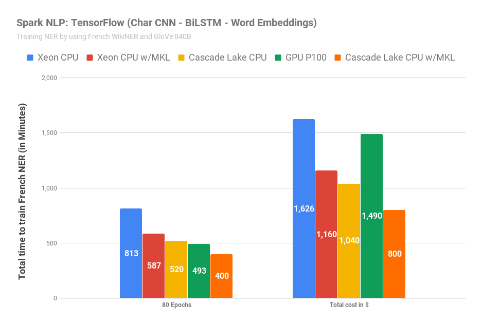
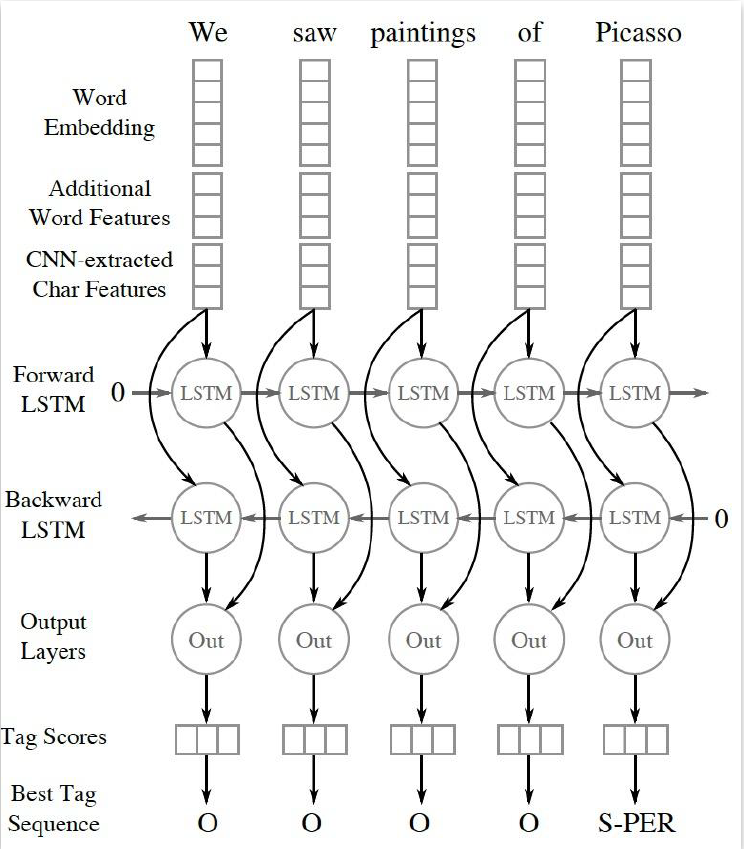
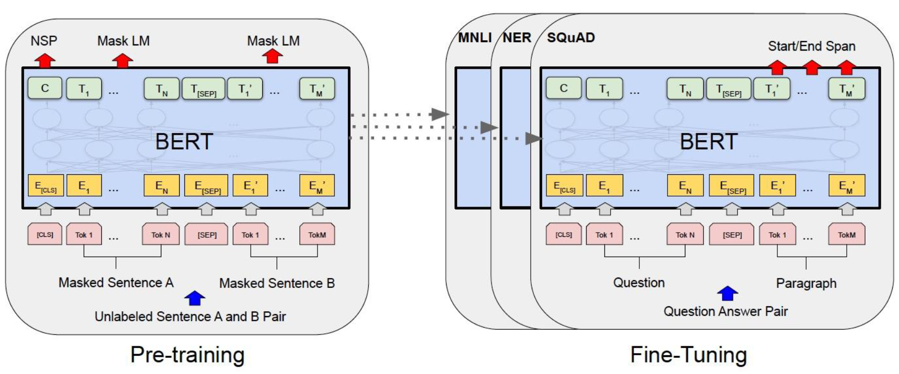

# Spark NLP

Francio PKU_CCME

- Advanced Natural Language Processing with Apache Spark NLP
- Automated and Explainable Deep Learning for Clinical Language Understanding at Roche
- Koalas: Making an Easy Transition from Pandas to Apache Spark
- Koalas: Pandas on Apache Spark

我主要观看了上面列出的四场演讲，前两场主要内容为 Spark NLP 在文字处理和其在医疗领域的应用，后两场主要内容为在 Spark 环境下实现的 Pandas API：Koalas。由于关于 Koalas 的演讲更多地涉及了其使用方法，没有花费太多的篇幅介绍其优势，故下面的内容主要围绕 Spark NLP 展开，仅在最后对 Koalas 进行简述，并在报告最后指出了一些自己的感受。

<!-- more -->

## Spark NLP

### Spark NLP简介

自然语言处理 (NLP) 是人工智能的一个领域，可帮助计算机理解，解释和使用人类语言。NLP 来自于许多学科，包括计算机科学和计算语言学，有着可能填补人类语言与计算机理解之间空白的潜力。

Spark NLP 是一个建立在 Apache Spark 和 Spark ML 库上的开源文本处理库，可通过 Python、Java 或 Scala 编程的方式进行高级自然语言处理，其特点为具有很快的处理速度和高扩展性，并且它可以基于 TensorFlow 实现深度学习的相关训练并进行推理。

Spark NLP 的开发目的是为现有的大规模分布式计算集群提供用于自然语言处理的高扩展性 API ，同时该库还提供了经过预训练的神经网络模型、Pipeline 和嵌入式模型，极大的方便了使用。同时该库也允许用户自行训练自定义模型。

### 演讲内容总结

#### Advanced Natural Language Processing with Apache Spark NLP

本次演讲主要介绍了 Spark NLP 的优势与使用方法示例。基于 Spark 的 NLP 包最显著的特点是高速与强的可扩展性，同时开发人员的维护使其准确型也保持一个很高的水准，至少每隔两周就会发布一次新版本。

在处理性能和扩展性方面，开发人员专门为 Intel 和 Nvidia 的最新处理器作了优化，使之既能在大规模分布式计算集群上使用，又能在独立的个人笔记本电脑上运行，保证其在最新的硬件上运行最快。测试数据指出使用 Intel 芯片时性能要优于使用 Nvidia.

Spark NLP 是一个完整的 NLP 库，具有全部的基础功能，从对语句的拆分与标记开始进行处理，故使用者无需再安装其它的 NLP 库。同时 Spark NLP 还具备诸如拼写检查、拼写矫正、情感分析、实体识别、文本匹配等高级功能，且全部这些功能都可以进行模型训练。开发者已经在 Spark NLP 中内置了常用的 20 种语言的预训练模型和 70 多种预训练 Pipeline，若无特殊需求，使用者仅需使用三五行代码即可完成对模型的训练。若有需求也可从零开始进行模型的训练。

Spark NLP 尽可能地提高用户体验，不需要用户了解深度学习的工作原理，仅仅掌握基本语法后即可使用该库。Spark NLP 甚至将深度学习算法应用于算法的选择上，代替用户获得最合适的算法。

#### Automated and Explainable Deep Learning for Clinical Language Understanding at Roche

本次演讲主要介绍了 Spark NLP 在医疗领域的应用。去结构化的短语型和注释型文本在处方、病情描述等方面提供了重要的信息，传统的手工提取信息进行再加工的方式效率非常低下。随着医疗保健 AI 应用程序的推广，如何通过自然语言处理获取这些去结构化短语中的信息成为不可忽视的挑战。NLP 深度学习的发展为临床语言的理解带来了更高的精度，同时 Spark 的高扩展性赋予了其广泛推广的可能。Spark NLP 在医疗领域已形成了一个生态系统，包含着 100 多个经过预训练的模型和 Pipeline ，使用者可以通过几行代码轻松使用它们。

罗氏 (Roche) 公司基于 Spark NLP 开发了一套用于临床术语自动化解析的深度学习模型，将 OCR 技术与 NLP 联用以识别印刷或手写的字符，提取文本信息。考虑到医疗领域对处理速度和精度要求很高，Spark NLP，Spark NLP for Healthcare 和 Spark OCR 有三个主要设计目标，即准确性，可扩展性和高速度，且要保留列表之类的特殊文档结构。

医疗领域存在者大量专业术语，故准确进行实体识别成为该模型的训练难点。该模型使用了预命名实体识别（NER）技术，该方法旨在将非结构化文本中提取到的文本信息分为预定义的类别中，例如肿瘤位置、肿瘤类型等。传统实体识别方法（如CRF）在处理普通的小数据集时很有效，但扩展至医疗领域后便出现了训练时间过长，训练结果不好等问题。Spark NLP 同时提供了CNN + Bi-LSTM 和 Bio-Bert 模型进行实体识别，经过训练的模型可以从病理报告中提取45种以上的实体标记。CNN + Bi-LSTM 是一种新型的神经网络结构，它使用混合双向 LSTM 和 CNN 来自动检测单词和字符的特征， CNN 是一种卷积神经网络。 BERT 模型旨在通过图层的上下文进行条件处理，Bio-BERT 是第一个基于特定领域的BERT  模型，该模型在生物医学领域进行了预训练，所以在医疗文字识别领域表现出色。

Bi-LSTM 训练模型：

BERT 训练模型：

 Spark 已经在病理学领域崭露头角，现在正向着放射学和基因组学领域发展，甚至可以将情感分析合并入医疗检查中。

## Koalas

### Koalas 简介

在利用 Python 处理普通数据时，Pandas 包为我们提供了很大的便利，仅使用几行易懂的代码即可实现数据格式转换、数据清洗、缺失值插入等功能，还可以方便地与其他数据处理包联用。前面几次实习中对数据的预处理均用到了 Pandas 包。

由于 Pandas 的开发针对的是一般数据，在大数据领域使用不便，为了提高开发者与大数据交互时的效率，开发了 Koalas 项目。Koalas 实现了在 Apache Spark 上使用的 Pandas DataFrame API，其语法与 Pandas 非常相近，若开发者曾使用 Pandas，即可跳过学习步骤直接使用。同时 Koalas 包保留了 Pandas 处理普通数据的能力，使其适用范围进一步拓宽。

## 感受

1. 计算机与信息科学的一个主要研究内容就是信息，而当今互联网时代产生的海量信息亟待处理。随着计算机算力的提高，算法的改进，现在处理这些海量数据的能力大大提高，从这些数据中可以挖掘到更多有价值的信息，形成了“数据即热点”的趋势。比如语言处理、医疗信息处理、计算机视觉等热门领域，均是在可提取出的信息量飞速增加后才成为研究的热点。现在生物技术等领域进入了发展阶段，DNA 测序等技术产生了海量与之前截然不同的信息，为信息技术发展提供了广阔的发展空间。
2. 机器学习与人工智能的兴起为人们提供了新的理解世界的思路，计算机可以突破人类的思考局限，找到各种实例中人类难以理解的规律，在推动各学科发展，指明发展方向上有着积极的意义。
3. 作为化学与分子工程学院的学生，我非常希望大数据与人工智能、机器学习方法等可以应用到化学领域解决实际问题。现如今的化学理论有很大一部分建立在前人的“推断”上，不是严谨的公理、定理或引理，例外颇多，所以利用计算机寻找化学中隐藏的规律可能是解决化学中各种问题的一个好方法，尤其是在机理阐述等方面，描述反应的机制就像是化学中的“自然语言”，我相信对化学特化的自然语言处理会极大的推动化学的发展。
4. 前段时间的 Nature 封面刊登了一篇关于自动合成机器人的报道，文中介绍了一个可以完成全部科研实验操作的自动化实验机器人，在不到三天的时间内自主发现了一种全新的催化剂。这不禁让我感叹，化学已经不再是原先的“劳动密集型”学科了，脱离了大数据等技术的支持，其发展可能是低效的。
5. 处理小数据量的方法与技术已经发展得比较成熟，随着大数据的兴起，将这些便利的方法技术移植到大数据领域，拓宽其适用范围，将极大地方便未接触过大数据领域的研究人员熟悉对大数据的相关操作。
6. 现在的编程发展得对用户越来越友好，用户无需了解程序运行的细节，仅需熟悉操作流程即可使用几行命令完成各种任务。我并没有机器学习和数据库的相关基础，却依然可以完成各项实习。这种用户友好型的开发方式无疑会推广大数据相关技术的使用，使之成为易于上手的工具，在更多的领域发挥作用。

