# Spark性能调优

Francio PKU_CCME

**目录：**

[TOC]

<!-- more -->

## 实验环境

| 虚拟机                      | 处理器                                    | 内存 | 硬盘 | 操作系统                   | spark版本   |
| --------------------------- | ----------------------------------------- | ---- | ---- | -------------------------- | ----------- |
| VMware Workstation 15.5 PRO | Inter(R) Core(TM) i7-7700HQ CPU @C 2.8GHz | 4GB  | 40GB | ubuntu-20.04-desktop-amd64 | spark-3.0.0 |

## 实习要求

针对TPC-H性能测试，选择一组查询，完成Spark上的性能调优。

## Spark模式

Spark有4种常见模式：local（单机）、standalone（独立部署）、Yarn、Mesos。我们的Spark使用模式为local。

## 成果概述

1. 我们对于tpc-h自带的22条sql语句进行了测试，并进行了性能调优，在“性能调优”部分针对各个查询给出了最优的查询条件。

2. 对于是否使用cache进行调优，但由于在cache时，由于自身的内存不足，会有部分内存溢出，最终采用了persist 。(StorageLevel.MEMORY_AND_DISK_SER)的方式使用了有限在内存持久化，当内存不存时，在硬盘持久化的策略。

3. 对于spark的资源配置进行调优，调优的方向在于shuffle的内存比例（设定为60%），设置spark-shell --master local[8]即可使用8个核，修改进程内存（executor memory 6G），driver memory修改为1G等等。

4. 对可能出现的数据倾斜问题，我们使用调整task数量的方法对其进行了优化。
5. 通过控制变量，我们对22条标准查询语句进行了十轮测试，收集了两百余条运行数据，同时我们也跟踪了RDD持久化时的存储位置变更情况。在报告的后半部分对其进行了分析，得出了一些有意义的结论。

## 监视工具

```
localhost:4040
```


## spark 开启

```shell
cd /usr/local/spark/spark-3.0.0-bin-hadoop2.7
./bin/spark-shell
```


## 数据导入

```scala
import org.apache.spark.sql.Row
import org.apache.spark.sql.SparkSession
import org.apache.spark.sql.functions;
import spark.implicits._

case class Nation(N_NATIONKEY:Integer, N_NAME:String,N_REGIONKEY:Integer,N_COMMENT:String)
val data = spark.sparkContext.textFile("file:///home/lzy/nation.tbl").map(_.split('|')).map(p => Nation(p(0).toInt, p(1).toString,p(2).toInt,p(3).toString)).toDF()
data.show()
data.createOrReplaceTempView("nation")

case class Part(P_PARTKEY:Integer,P_NAME:String,P_MFGR:String,P_BRAND:String,P_TYPE:String,P_SIZE:Integer,P_CONTAINER:String,P_RETAILPRICE:Double,P_COMMENT:String)

val data = spark.sparkContext.textFile("file:///home/lzy/part.tbl").map(_.split('|')).map(p => Part(p(0).toInt, p(1).toString,p(2).toString,p(3).toString,p(4).toString,p(5).toInt,p(6).toString,p(7).toDouble,p(8).toString)).toDF()
data.show()
data.createOrReplaceTempView("part")

case class Supplier(S_SUPPKEY:Integer,S_NAME:String,S_ADDRESS:String,S_NATIONKEY:Integer,S_PHONE:String,S_ACCTBAL:Double,S_COMMENT:String)
val data = spark.sparkContext.textFile("file:///home/lzy/supplier.tbl").map(_.split('|')).map(p => Supplier(p(0).toInt, p(1).toString,p(2).toString,p(3).toInt,p(4).toString,p(5).toDouble,p(6).toString)).toDF()
data.show()
data.createOrReplaceTempView("supplier")

case class Partsupp(PS_PARTKEY:Integer,PS_SUPPKEY:Integer,PS_AVAILQTY:Integer,PS_SUPPLYCOST:Double,PS_COMMENT:String)
val data = spark.sparkContext.textFile("file:///home/lzy/partsupp.tbl").map(_.split('|')).map(p => Partsupp(p(0).toInt, p(1).toInt,p(2).toInt,p(3).toDouble,p(4).toString)).toDF()
data.show()
data.createOrReplaceTempView("partsupp")

case class Customer(C_CUSTKEY:Integer,C_NAME:String,C_ADDRESS:String,C_NATIONKEY:Integer,C_PHONE:String,C_ACCTBAL:Double,C_MKTSEGMENT:String,C_COMMENT:String)
val data = spark.sparkContext.textFile("file:///home/lzy/customer.tbl").map(_.split('|')).map(p => Customer(p(0).toInt, p(1).toString,p(2).toString,p(3).toInt,p(4).toString,p(5).toDouble,p(6).toString,p(7).toString)).toDF()
data.show()
data.createOrReplaceTempView("customer")

case class Orders(O_ORDERKEY:Integer,O_CUSTKEY:Integer,O_ORDERSTATUS:String,O_TOTALPRICE:Double,O_ORDERDATE:String,O_ORDERPRIORITY:String,O_CLERK:String,O_SHIPPRIORITY:Integer,O_COMMENT:String)
val data = spark.sparkContext.textFile("file:///home/lzy/orders.tbl").map(_.split('|')).map(p => Orders(p(0).toInt, p(1).toInt,p(2).toString,p(3).toDouble,p(4).toString,p(5).toString,p(6).toString,p(7).toInt,p(8).toString)).toDF()
data.show()
data.createOrReplaceTempView("orders")

case class LineItem(L_ORDERKEY:Integer,L_PARTKEY:Integer,L_SUPPKEY:Integer,L_LINENUMBER:Integer,L_QUANTITY:Double,L_EXTENDEDPRICE:Double,L_DISCOUNT:Double,L_TAX:Double,L_RETURNFLAG:String,L_LINESTATUS:String,L_SHIPDATE:String,L_COMMITDATE:String,L_RECEIPTDATE:String,L_SHIPINSTRUCT:String,L_SHIPMODE:String,L_COMMENT:String)
val data = spark.sparkContext.textFile("file:///home/lzy/lineitem.tbl").map(_.split('|')).map(p => LineItem(p(0).toInt, p(1).toInt,p(2).toInt,p(3).toInt,p(4).toDouble,p(5).toDouble,p(6).toDouble,p(7).toDouble,p(8).toString, p(9).toString,p(10).toString,p(11).toString,p(12).toString,p(13).toString,p(14).toString,p(15).toString)).toDF()
data.show()
data.createOrReplaceTempView("lineItem")

case class Region(R_REGIONKEY:Integer,R_NAME:String,R_COMMENT:String)

val data = spark.sparkContext.textFile("file:///home/lzy/region.tbl").map(_.split('|')).map(p => Region(p(0).toInt, p(1).toString,p(2).toString)).toDF()
data.show()
data.createOrReplaceTempView("region")
```


共耗时31.8s（1个核，1GB）


共耗时：0.75s（2个核，2GB）

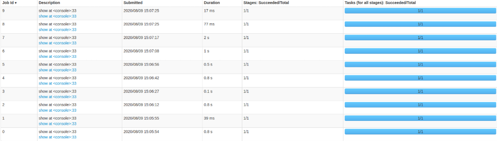

更改持久化方式后，导入数据耗时基本不变。

## 查询调优

由于 Spark shell 中无法识别标准 SQL 语句内的换行符，故所有语句均经过 Python 处理，使之归为一行。

在查询调优过程中进行了参数调优，若报告中未指明进行了参数调优，即运用的默认参数。若指出进行了参数调优，则在启动Spark时进行了如下配置：

```shell
./bin/spark-shell --master local[8] --executor-memory 6G --conf spark.shuffle.memoryFraction=0.7 --executor-cores 4 --con.shuffle.spill=true --driver-memory 1g --conf spark.kryoserializer.buffer.max=2000 --conf spark.rpc.message.maxSize=500 --conf spark.sql.shuffle.partitions=50 --conf spark.default.parallelism=50
```

调整后Spark环境配置如下：

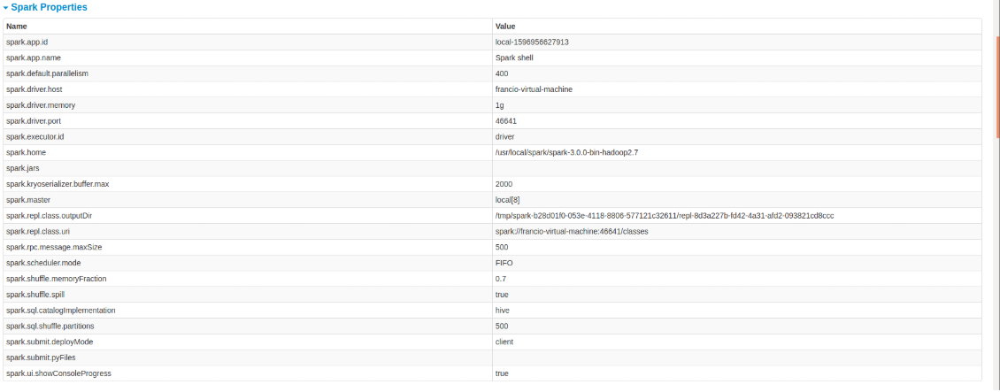

------

**查询1:**

```scala
val sql_1 = spark.sql("select l_returnflag, l_linestatus, sum(l_quantity) as sum_qty, sum(l_extendedprice) as sum_base_price, sum(l_extendedprice * (1 - l_discount)) as sum_disc_price, sum(l_extendedprice * (1 - l_discount) * (1 + l_tax)) as sum_charge, avg(l_quantity) as avg_qty, avg(l_extendedprice) as avg_price, avg(l_discount) as avg_disc, count(*) as count_order from lineitem where l_shipdate <= date '1998-12-01' - interval '84' day group by l_returnflag, l_linestatus order by l_returnflag, l_linestatus limit 1;")

sql_1.show()
```

结果：

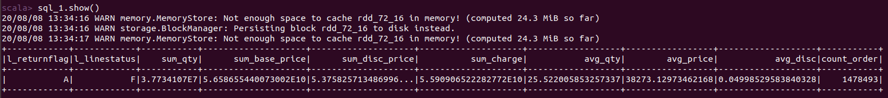


耗时：4.9min  即294s（1GB 1个核，无数据持久化）


共耗时：14s（2个核，2GB，无数据持久化）

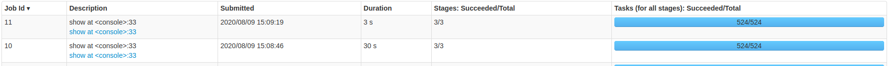

更改持久化方式为 persist (StorageLevel.MEMORY_AND_DISK_SER) ，连续测试两次。


**最优方法：**总耗时 1 s，进行参数调优，利用 catch() 方法固定，Task 数为 50，第二次执行。

------

**查询2:**

```scala
val sql_2 = spark.sql(" select s_acctbal, s_name, n_name, p_partkey, p_mfgr, s_address, s_phone, s_comment from part, supplier, partsupp, nation, region where p_partkey = ps_partkey and s_suppkey = ps_suppkey and p_size = 16 and p_type like '%STEEL' and s_nationkey = n_nationkey and n_regionkey = r_regionkey and r_name = 'AFRICA' and ps_supplycost = ( select min(ps_supplycost) from partsupp, supplier, nation, region where p_partkey = ps_partkey and s_suppkey = ps_suppkey and s_nationkey = n_nationkey and n_regionkey = r_regionkey and r_name = 'AFRICA' ) order by s_acctbal desc, n_name, s_name, p_partkey limit 100;")

sql_2.show()
```

结果：

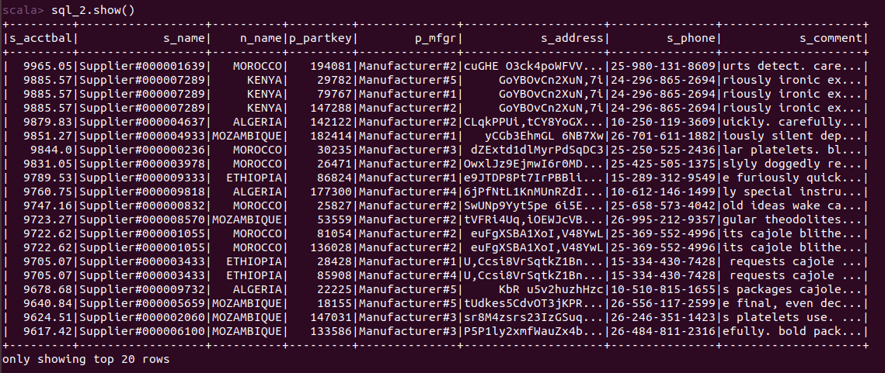


总耗时：378s（1个核 1GB，无数据持久化）


共耗时：24s（2个核，2GB，无数据持久化）

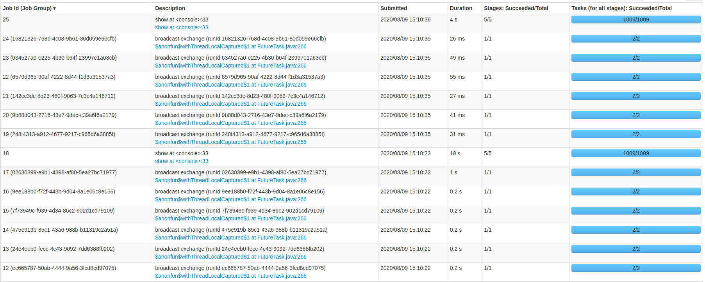

更改持久化方式为 persist (StorageLevel.MEMORY_AND_DISK_SER) ，连续测试两次。

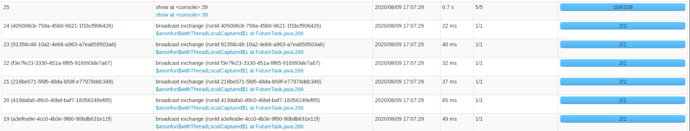

**最优方法：**总耗时 0.8 s，进行参数调优，利用 catch() 方法固定，Task 数为 50，第二次执行。

------

**查询3:**

```scala
val sql_3=spark.sql(" select l_orderkey, sum(l_extendedprice * (1 - l_discount)) as revenue, o_orderdate, o_shippriority from customer, orders, lineitem where c_mktsegment = 'MACHINERY' and c_custkey = o_custkey and l_orderkey = o_orderkey and o_orderdate < date '1995-03-06' and l_shipdate > date '1995-03-06' group by l_orderkey, o_orderdate, o_shippriority order by revenue desc, o_orderdate limit 10;")

sql_3.show()
```

结果：

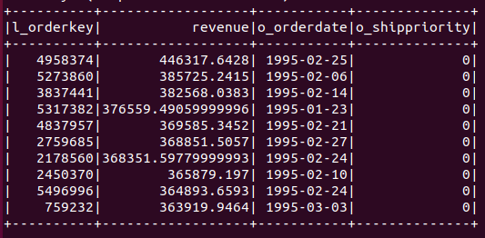


总耗时：395s（1个核 1GB，无数据持久化）


共耗时：22s（2个核，2GB，无数据持久化）

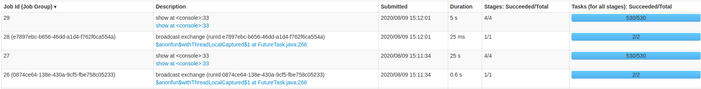

更改持久化方式为 persist (StorageLevel.MEMORY_AND_DISK_SER) ，连续测试两次。

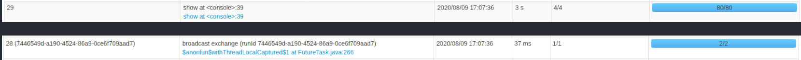

**最优方法：**总耗时 3 s，进行参数调优，利用 catch() 方法固定，Task 数为 50，第二次执行。

------

**查询4：**

```scala
val sql_4=spark.sql(" select o_orderpriority, count(*) as order_count from orders where o_orderdate >= date '1993-10-01' and o_orderdate < date '1993-10-01' + interval '3' month and exists ( select * from lineitem where l_orderkey = o_orderkey and l_commitdate < l_receiptdate ) group by o_orderpriority order by o_orderpriority limit 1;")
 
sql_4.show()
```

结果：

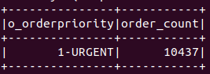


总耗时：378s（1个核 1GB，无数据持久化）


共耗时：18s（2个核，2GB，无数据持久化）

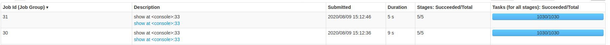

更改持久化方式为 persist (StorageLevel.MEMORY_AND_DISK_SER) ，连续测试两次。

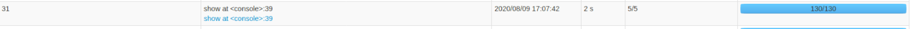

**最优方法：**总耗时 2 s，进行参数调优，利用 catch() 方法固定，Task 数为 50，第二次执行。

---

**查询5：**

```scala
val sql_5=spark.sql("select n_name, sum(l_extendedprice * (1 - l_discount)) as revenue from customer, orders, lineitem, supplier, nation, region where c_custkey = o_custkey and l_orderkey = o_orderkey and l_suppkey = s_suppkey and c_nationkey = s_nationkey and s_nationkey = n_nationkey and n_regionkey = r_regionkey and r_name = 'AMERICA' and o_orderdate >= date '1996-01-01' and o_orderdate < date '1996-01-01' + interval '1' year group by n_name order by revenue desc limit 1;")

sql_5.show()
```

结果：

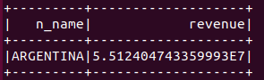


共耗时：32s（2个核，2GB，无数据持久化）

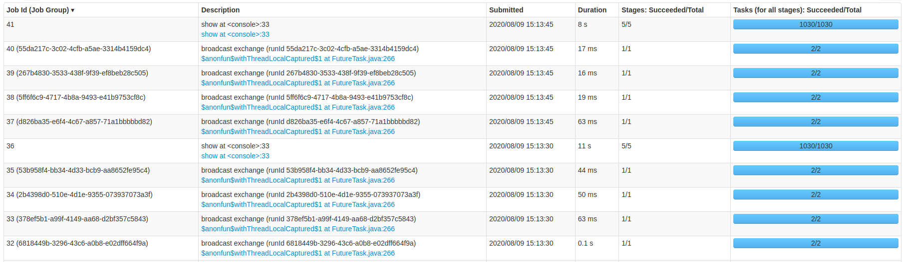

更改持久化方式为 persist (StorageLevel.MEMORY_AND_DISK_SER) ，连续测试两次。

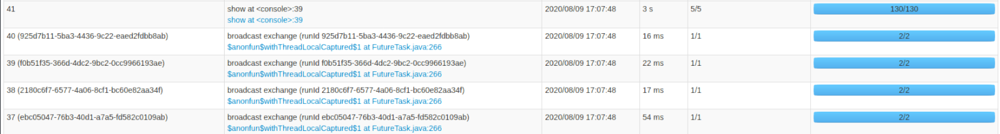**最优方法：**总耗时 3.1 s，进行参数调优，利用 catch() 方法固定，Task 数为 50，第二次执行。

---

**查询6：**

```scala
val sql_6=spark.sql(" select sum(l_extendedprice * l_discount) as revenue from lineitem where l_shipdate >= date '1996-01-01' and l_shipdate < date '1996-01-01' + interval '1' year and l_discount between 0.05 - 0.01 and 0.05 + 0.01 and l_quantity < 25 limit 1;")

sql_6.show()
```

结果：

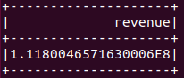


共耗时：8s（2个核，2GB，无数据持久化）

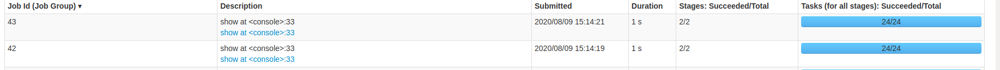

更改持久化方式为 persist (StorageLevel.MEMORY_AND_DISK_SER) ，连续测试两次。


**最优方法：**总耗时 0.5 s，进行参数调优，利用 catch() 方法固定，Task 数为 50，第二次执行。

---

**查询7：**

```scala
val sql_7=spark.sql("select supp_nation, cust_nation, l_year, sum(volume) as revenue from ( select n1.n_name as supp_nation, n2.n_name as cust_nation, extract(year from l_shipdate) as l_year, l_extendedprice * (1 - l_discount) as volume from supplier, lineitem, orders, customer, nation n1, nation n2 where s_suppkey = l_suppkey and o_orderkey = l_orderkey and c_custkey = o_custkey and s_nationkey = n1.n_nationkey and c_nationkey = n2.n_nationkey and ( (n1.n_name = 'IRAN' and n2.n_name = 'ROMANIA') or (n1.n_name = 'ROMANIA' and n2.n_name = 'IRAN') ) and l_shipdate between date '1995-01-01' and date '1996-12-31' ) as shipping group by supp_nation, cust_nation, l_year order by supp_nation, cust_nation, l_year limit 1;")

sql_7.show()
```

结果：

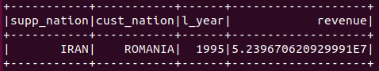


共耗时：33s（2个核，2GB，无数据持久化）

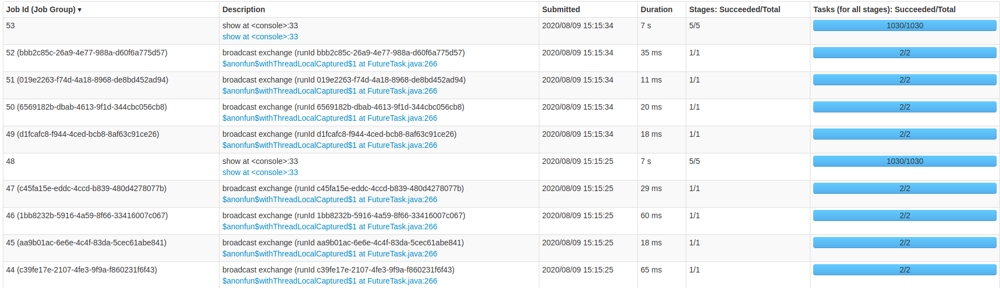

更改持久化方式为 persist (StorageLevel.MEMORY_AND_DISK_SER) ，连续测试两次。

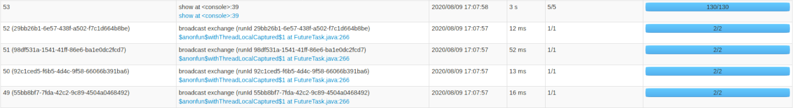

**最优方法：**总耗时 3.1 s，进行参数调优，利用 catch() 方法固定，Task 数为 50，第二次执行。

---

**查询8：**

```scala
val sql_8=spark.sql(" select o_year, sum(case when nation = 'ROMANIA' then volume else 0 end) / sum(volume) as mkt_share from ( select extract(year from o_orderdate) as o_year, l_extendedprice * (1 - l_discount) as volume, n2.n_name as nation from part, supplier, lineitem, orders, customer, nation n1, nation n2, region where p_partkey = l_partkey and s_suppkey = l_suppkey and l_orderkey = o_orderkey and o_custkey = c_custkey and c_nationkey = n1.n_nationkey and n1.n_regionkey = r_regionkey and r_name = 'EUROPE' and s_nationkey = n2.n_nationkey and o_orderdate between date '1995-01-01' and date '1996-12-31' and p_type = 'STANDARD ANODIZED COPPER' ) as all_nations group by o_year order by o_year limit 1;")

sql_8.show()
```

结果：

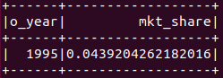


共耗时：29s（2个核，2GB，无数据持久化）


更改持久化方式为 persist (StorageLevel.MEMORY_AND_DISK_SER) ，连续测试两次。

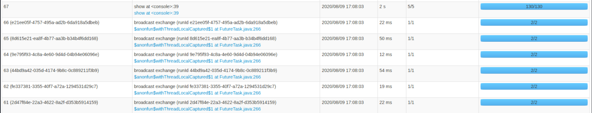

**最优方法：**总耗时 2.1 s，进行参数调优，利用 catch() 方法固定，Task 数为 50，第二次执行。

---

**查询9：**

```scala
val sql_9=spark.sql(" select nation, o_year, sum(amount) as sum_profit from ( select n_name as nation, extract(year from o_orderdate) as o_year, l_extendedprice * (1 - l_discount) - ps_supplycost * l_quantity as amount from part, supplier, lineitem, partsupp, orders, nation where s_suppkey = l_suppkey and ps_suppkey = l_suppkey and ps_partkey = l_partkey and p_partkey = l_partkey and o_orderkey = l_orderkey and s_nationkey = n_nationkey and p_name like '%aquamarine%' ) as profit group by nation, o_year order by nation, o_year desc limit 1;")

sql_9.show()
```

结果：

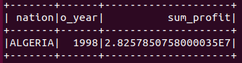


共耗时：35s（2个核，2GB，无数据持久化）

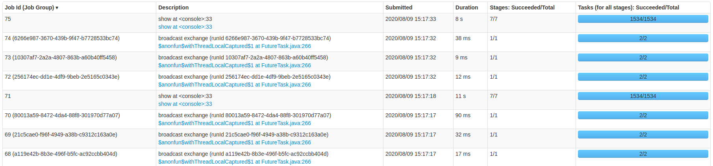

更改持久化方式为 persist (StorageLevel.MEMORY_AND_DISK_SER) ，连续测试两次。

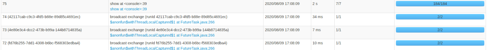

**最优方法：**总耗时 2 s，进行参数调优，利用 catch() 方法固定，Task 数为 50，第二次执行。

---

**查询10：**

```scala
val sql_10=spark.sql(" select c_custkey, c_name, sum(l_extendedprice * (1 - l_discount)) as revenue, c_acctbal, n_name, c_address, c_phone, c_comment from customer, orders, lineitem, nation where c_custkey = o_custkey and l_orderkey = o_orderkey and o_orderdate >= date '1994-03-01' and o_orderdate < date '1994-03-01' + interval '3' month and l_returnflag = 'R' and c_nationkey = n_nationkey group by c_custkey, c_name, c_acctbal, c_phone, n_name, c_address, c_comment order by revenue desc limit 20;")

sql_10.show()
```

结果：

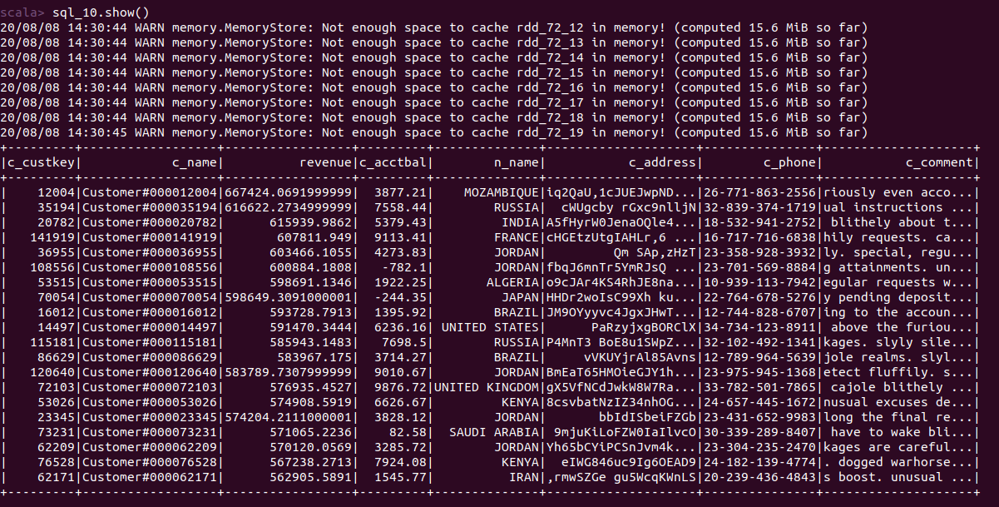


共耗时：22s（2个核，2GB，无数据持久化）

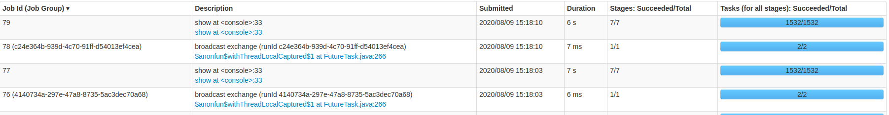

更改持久化方式为 persist (StorageLevel.MEMORY_AND_DISK_SER) ，连续测试两次。

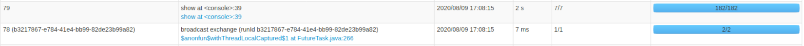

**最优方法：**总耗时 2 s，进行参数调优，利用 catch() 方法固定，Task 数为 50，第二次执行。

---

**查询11：**

```scala
val sql_11=spark.sql(" select ps_partkey, sum(ps_supplycost * ps_availqty) as value from partsupp, supplier, nation where ps_suppkey = s_suppkey and s_nationkey = n_nationkey and n_name = 'PERU' group by ps_partkey having sum(ps_supplycost * ps_availqty) > ( select sum(ps_supplycost * ps_availqty) * 0.0001000000 from partsupp, supplier, nation where ps_suppkey = s_suppkey and s_nationkey = n_nationkey and n_name = 'PERU' ) order by value desc limit 1;")

sql_11.show()
```

结果：

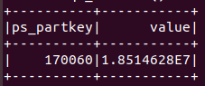


共耗时：11s（2个核，2GB，无数据持久化）

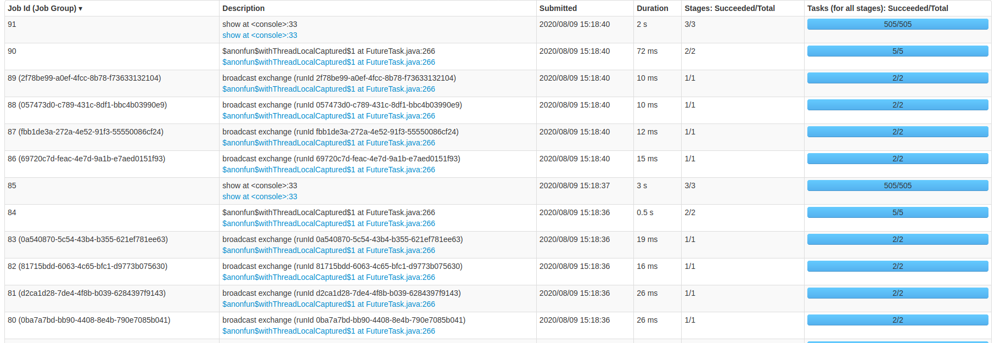

更改持久化方式为 persist (StorageLevel.MEMORY_AND_DISK_SER) ，连续测试两次。

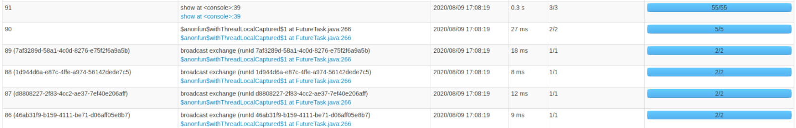

**最优方法：**总耗时 0.3 s，进行参数调优，利用 catch() 方法固定，Task 数为 50，第二次执行。

---

**查询12：**

```scala
val sql_12=spark.sql(" select l_shipmode, sum(case when o_orderpriority = '1-URGENT' or o_orderpriority = '2-HIGH' then 1 else 0 end) as high_line_count, sum(case when o_orderpriority <> '1-URGENT' and o_orderpriority <> '2-HIGH' then 1 else 0 end) as low_line_count from orders, lineitem where o_orderkey = l_orderkey and l_shipmode in ('RAIL', 'SHIP') and l_commitdate < l_receiptdate and l_shipdate < l_commitdate and l_receiptdate >= date '1993-01-01' and l_receiptdate < date '1993-01-01' + interval '1' year group by l_shipmode order by l_shipmode limit 1;")

sql_12.show()
```

结果：

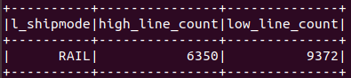


共耗时：17s（2个核，2GB，无数据持久化）

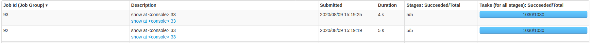

更改持久化方式为 persist (StorageLevel.MEMORY_AND_DISK_SER) ，连续测试两次。


**最优方法：**总耗时 2 s，进行参数调优，利用 catch() 方法固定，Task 数为 50，第二次执行。

---

**查询13：**

```scala
val sql_13=spark.sql(" select c_count, count(*) as custdist from ( select c_custkey, count(o_orderkey) as c_count from customer left outer join orders on c_custkey = o_custkey and o_comment not like '%pending%deposits%' group by c_custkey ) as c_orders group by c_count order by custdist desc, c_count desc limit 1;")

sql_13.show()
```

结果：

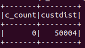


共耗时：10s（2个核，2GB，无数据持久化）

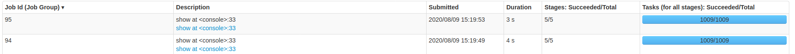

更改持久化方式为 persist (StorageLevel.MEMORY_AND_DISK_SER) ，连续测试两次。

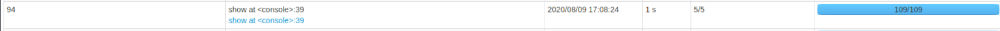

**最优方法：**总耗时 1 s，进行参数调优，利用 catch() 方法固定，Task 数为 50，第二次执行。

----

**查询14：**

```scala
val sql_14=spark.sql(" select 100.00 * sum(case when p_type like 'PROMO%' then l_extendedprice * (1 - l_discount) else 0 end) / sum(l_extendedprice * (1 - l_discount)) as promo_revenue from lineitem, part where l_partkey = p_partkey and l_shipdate >= date '1997-12-01' and l_shipdate < date '1997-12-01' + interval '1' month limit 1;")

sql_14.show()
```

结果：

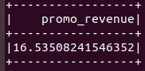


共耗时：21s（2个核，2GB，无数据持久化）


更改持久化方式为 persist (StorageLevel.MEMORY_AND_DISK_SER) ，连续测试两次。

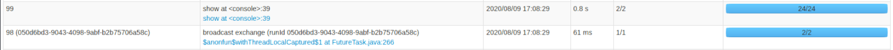

**最优方法：**总耗时 0.8 s，进行参数调优，利用 catch() 方法固定，Task 数为 50，第二次执行。

---

**查询15：**

本次查询需要注册“revenue0”表以供查询，在spark sql不支持creat view

```scala
val temp1=spark.sql("select l_suppkey as supplier_no, sum(l_extendedprice * (1 - l_discount)) as total_revenue from lineitem where l_shipdate >= date '1993-03-01' and l_shipdate < date '1993-03-01' + interval '3' month group by l_suppkey;")
temp1.createOrReplaceTempView("revenue0")

val sql_15=spark.sql(" select s_suppkey, s_name, s_address, s_phone, total_revenue from supplier, revenue0 where s_suppkey = supplier_no and total_revenue = ( select max(total_revenue) from revenue0 ) order by s_suppkey;")

sql_15.show()
```

结果：

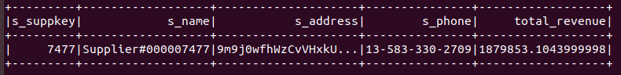


共耗时：35s（2个核，2GB，无数据持久化）

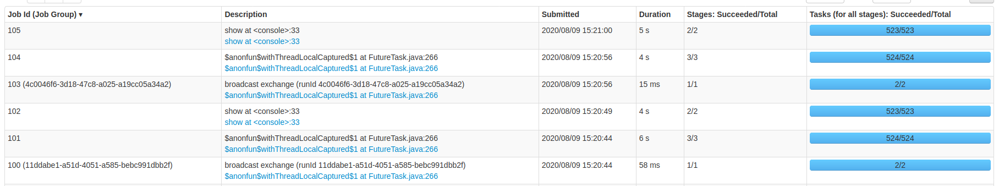

更改持久化方式为 persist (StorageLevel.MEMORY_AND_DISK_SER) ，连续测试两次。

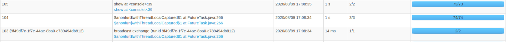

**最优方法：**总耗时 2 s，进行参数调优，利用 catch() 方法固定，Task 数为 50，第二次执行。

---

**查询16：**

```scala
val sql_16=spark.sql(" select p_brand, p_type, p_size, count(distinct ps_suppkey) as supplier_cnt from partsupp, part where p_partkey = ps_partkey and p_brand <> 'Brand#52' and p_type not like 'LARGE ANODIZED%' and p_size in (42, 38, 15, 48, 33, 3, 27, 45) and ps_suppkey not in ( select s_suppkey from supplier where s_comment like '%Customer%Complaints%' ) group by p_brand, p_type, p_size order by supplier_cnt desc, p_brand, p_type, p_size limit 1;")

sql_16.show()
```

结果：

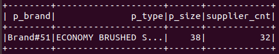


共耗时：26s（2个核，2GB，无数据持久化）

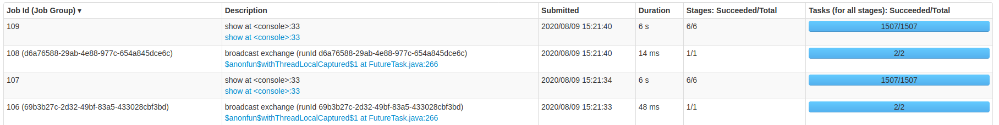

更改持久化方式为 persist (StorageLevel.MEMORY_AND_DISK_SER) ，连续测试两次。

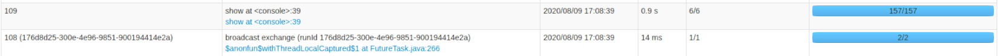

**最优方法：**总耗时 0.9 s，进行参数调优，利用 catch() 方法固定，Task 数为 50，第二次执行。

---

**查询17：**

```scala
val sql_17=spark.sql(" select sum(l_extendedprice) / 7.0 as avg_yearly from lineitem, part where p_partkey = l_partkey and p_brand = 'Brand#23' and p_container = 'WRAP CASE' and l_quantity < ( select 0.2 * avg(l_quantity) from lineitem where l_partkey = p_partkey ) limit 1;")

sql_17.show()
```

结果：

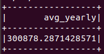


共耗时：41s（2个核，2GB，无数据持久化）

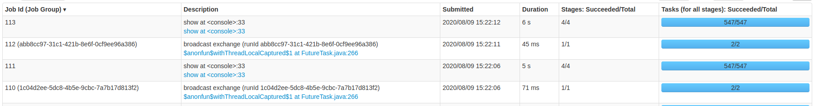

更改持久化方式为 persist (StorageLevel.MEMORY_AND_DISK_SER) ，连续测试两次。

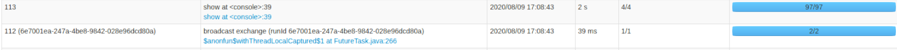

**最优方法：**总耗时 2 s，进行参数调优，利用 catch() 方法固定，Task 数为 50，第二次执行。

---

**查询18：**

```scala
val sql_18=spark.sql(" select c_name, c_custkey, o_orderkey, o_orderdate, o_totalprice, sum(l_quantity) from customer, orders, lineitem where o_orderkey in ( select l_orderkey from lineitem group by l_orderkey having sum(l_quantity) > 314 ) and c_custkey = o_custkey and o_orderkey = l_orderkey group by c_name, c_custkey, o_orderkey, o_orderdate, o_totalprice order by o_totalprice desc, o_orderdate limit 100;")

sql_18.show()
```

结果：

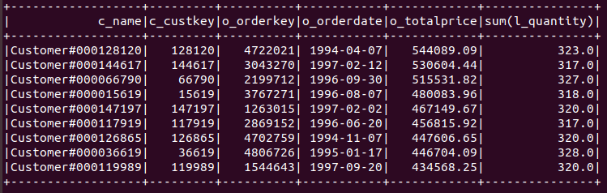


共耗时：46s（2个核，2GB，无数据持久化）

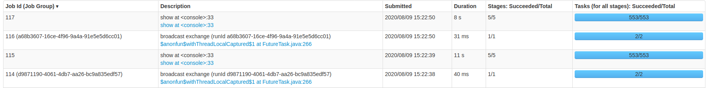

更改持久化方式为 persist (StorageLevel.MEMORY_AND_DISK_SER) ，连续测试两次。


**最优方法：**总耗时 2 s，进行参数调优，利用 catch() 方法固定，Task 数为 50，第二次执行。

---

**查询19：**

```scala
val sql_19=spark.sql(" select sum(l_extendedprice* (1 - l_discount)) as revenue from lineitem, part where ( p_partkey = l_partkey and p_brand = 'Brand#54' and p_container in ('SM CASE', 'SM BOX', 'SM PACK', 'SM PKG') and l_quantity >= 5 and l_quantity <= 5 + 10 and p_size between 1 and 5 and l_shipmode in ('AIR', 'AIR REG') and l_shipinstruct = 'DELIVER IN PERSON' ) or ( p_partkey = l_partkey and p_brand = 'Brand#25' and p_container in ('MED BAG', 'MED BOX', 'MED PKG', 'MED PACK') and l_quantity >= 19 and l_quantity <= 19 + 10 and p_size between 1 and 10 and l_shipmode in ('AIR', 'AIR REG') and l_shipinstruct = 'DELIVER IN PERSON' ) or ( p_partkey = l_partkey and p_brand = 'Brand#42' and p_container in ('LG CASE', 'LG BOX', 'LG PACK', 'LG PKG') and l_quantity >= 24 and l_quantity <= 24 + 10 and p_size between 1 and 15 and l_shipmode in ('AIR', 'AIR REG') and l_shipinstruct = 'DELIVER IN PERSON' ) limit 1;")

sql_19.show()
```

结果：


共耗时：21s（2个核，2GB，无数据持久化）


更改持久化方式为 persist (StorageLevel.MEMORY_AND_DISK_SER) ，连续测试两次。


**最优方法：**总耗时 0.9 s，进行参数调优，利用 catch() 方法固定，Task 数为 50，第二次执行。

---

**查询20：**

```scala
val sql_20=spark.sql(" select s_name, s_address from supplier, nation where s_suppkey in ( select ps_suppkey from partsupp where ps_partkey in ( select p_partkey from part where p_name like 'purple%' ) and ps_availqty > ( select 0.5 * sum(l_quantity) from lineitem where l_partkey = ps_partkey and l_suppkey = ps_suppkey and l_shipdate >= date '1994-01-01' and l_shipdate < date '1994-01-01' + interval '1' year ) ) and s_nationkey = n_nationkey and n_name = 'UNITED KINGDOM' order by s_name limit 1;")

sql_20.show()
```

结果：


共耗时：45s（2个核，2GB，无数据持久化）


更改持久化方式为 persist (StorageLevel.MEMORY_AND_DISK_SER) ，连续测试两次。


**最优方法：**总耗时 2 s，进行参数调优，利用 catch() 方法固定，Task 数为 50，第二次执行。

---

**查询21：**

```scala
val sql_21=spark.sql(" select s_name, count(*) as numwait from supplier, lineitem l1, orders, nation where s_suppkey = l1.l_suppkey and o_orderkey = l1.l_orderkey and o_orderstatus = 'F' and l1.l_receiptdate > l1.l_commitdate and exists ( select * from lineitem l2 where l2.l_orderkey = l1.l_orderkey and l2.l_suppkey <> l1.l_suppkey ) and not exists ( select * from lineitem l3 where l3.l_orderkey = l1.l_orderkey and l3.l_suppkey <> l1.l_suppkey and l3.l_receiptdate > l3.l_commitdate ) and s_nationkey = n_nationkey and n_name = 'FRANCE' group by s_name order by numwait desc, s_name limit 100;")

sql_21.show()
```

结果：


共耗时：62s（2个核，2GB，无数据持久化）


更改持久化方式为 persist (StorageLevel.MEMORY_AND_DISK_SER) ，连续测试两次。


**最优方法：**总耗时 5 s，进行参数调优，利用 catch() 方法固定，Task 数为 50，第二次执行。

---

**查询22：**

```scala
val sql_22=spark.sql(" select cntrycode, count(*) as numcust, sum(c_acctbal) as totacctbal from ( select substring(c_phone from 1 for 2) as cntrycode, c_acctbal from customer where substring(c_phone from 1 for 2) in ('33', '25', '16', '23', '32', '13', '19') and c_acctbal > ( select avg(c_acctbal) from customer where c_acctbal > 0.00 and substring(c_phone from 1 for 2) in ('33', '25', '16', '23', '32', '13', '19') ) and not exists ( select * from orders where o_custkey = c_custkey ) ) as custsale group by cntrycode order by cntrycode limit 1;")

sql_22.show()
```

结果：


共耗时：7.5s（2个核，2GB，无数据持久化）


更改持久化方式为 persist (StorageLevel.MEMORY_AND_DISK_SER) ，连续测试两次。


**最优方法：**总耗时 5 s，进行参数调优，利用 catch() 方法固定，Task 数为 50，第二次执行。

### 查询完毕后对进程的统计


持久化方式为 persist (StorageLevel.MEMORY_AND_DISK_SER) ，进行参数调优，连续测试两次。


持久化方式为 catch()，进行参数调优，连续测试两次。

两种持久化方式所用的 Task Time、GC Time 和读写数据量相近。

## 数据分析

### 数据汇总

| SQL <br />查询编号 |         查询耗时<br /> (s)          |         查询耗时<br /> (s)          |               查询耗时 <br />(s)               |               查询耗时 <br />(s)               |                      查询耗时<br /> (s)                      |                      查询耗时 <br />(s)                      |
| :----------------: | :---------------------------------: | :---------------------------------: | :--------------------------------------------: | :--------------------------------------------: | :----------------------------------------------------------: | :----------------------------------------------------------: |
|         \          | 内存 1 GB <br />单核 <br />未持久化 | 内存 2 GB <br />双核<br /> 未持久化 | 内存 8 GB<br /> 八核 <br />使用 catch() 持久化 | 内存 8 GB <br />八核<br /> 使用 catch() 持久化 | 内存 8 GB <br />八核 <br />使用 catch() 持久化<br />进行参数调优 | 内存 8 GB <br />八核 <br />使用 catch() 持久化<br />进行参数调优 |
|         \          |                  \                  |                  \                  |                   第一次执行                   |                   第二次执行                   |                          第一次执行                          |                          第二次执行                          |
|         1          |                 294                 |                 14                  |                       44                       |                       7                        |                              21                              |                              2                               |
|         2          |                 378                 |                 24                  |                      16.9                      |                      8.8                       |                             14.9                             |                             4.3                              |
|         3          |                 395                 |                 22                  |                      7.6                       |                       4                        |                             16.6                             |                              6                               |
|         4          |                 378                 |                 18                  |                       4                        |                       3                        |                              4                               |                              3                               |
|         5          |                  \                  |                 32                  |                      9.4                       |                       6                        |                             10.2                             |                             5.1                              |
|         6          |                  \                  |                  8                  |                      0.8                       |                      0.7                       |                             0.8                              |                             0.7                              |
|         7          |                  \                  |                 33                  |                       7                        |                       7                        |                              5                               |                              4                               |
|         8          |                  \                  |                 29                  |                      6.9                       |                      4.3                       |                              3                               |                             4.3                              |
|         9          |                  \                  |                 35                  |                      13.1                      |                       11                       |                             9.1                              |                              8                               |
|         10         |                  \                  |                 22                  |                       7                        |                       8                        |                              5                               |                              4                               |
|         11         |                  \                  |                 11                  |                      3.1                       |                       3                        |                             2.2                              |                             2.2                              |
|         12         |                  \                  |                 17                  |                       4                        |                       4                        |                              3                               |                              3                               |
|         13         |                  \                  |                 10                  |                       3                        |                       3                        |                              2                               |                              3                               |
|         14         |                  \                  |                 21                  |                      1.2                       |                       1                        |                             1.1                              |                              1                               |
|         15         |                  \                  |                 35                  |                      0.8                       |                      0.8                       |                             2.1                              |                             1.8                              |
|         16         |                  \                  |                 26                  |                       8                        |                       7                        |                              5                               |                              4                               |
|         17         |                  \                  |                 41                  |                       4                        |                       3                        |                              5                               |                              4                               |
|         18         |                  \                  |                 46                  |                       6                        |                       5                        |                              8                               |                              7                               |
|         19         |                  \                  |                 21                  |                       3                        |                       2                        |                              3                               |                              3                               |
|         20         |                  \                  |                 45                  |                       4                        |                       4                        |                             4.1                              |                              4                               |
|         21         |                  \                  |                 62                  |                       9                        |                       8                        |                              11                              |                              9                               |
|         22         |                  \                  |                 7.5                 |                       7                        |                       8                        |                              8                               |                              9                               |

| SQL<br />  查询编号 |                      查询耗时<br /> (s)                      |                      查询耗时<br /> (s)                      |               查询耗时<br /> (s)               |               查询耗时<br /> (s)               |
| :-----------------: | :----------------------------------------------------------: | :----------------------------------------------------------: | :--------------------------------------------: | :--------------------------------------------: |
|          \          | 内存 8 GB<br /> 八核 <br />使用 presist()  持久化<br />进行参数调优 | 内存 8 GB<br /> 八核<br /> 使用 presist() 持久化<br />进行参数调优 | 参数调优<br />catch() 持久化<br />降低 Task 数 | 参数调优<br />catch() 持久化<br />降低 Task 数 |
|          \          |                          第一次执行                          |                          第二次执行                          |                   第一次执行                   |                   第二次执行                   |
|          1          |                              30                              |                              3                               |                       17                       |                       1                        |
|          2          |                              12                              |                             4.2                              |                      3.5                       |                      0.8                       |
|          3          |                             25.6                             |                              5                               |                      5.5                       |                       3                        |
|          4          |                              9                               |                              5                               |                       2                        |                       2                        |
|          5          |                             11.2                             |                              8                               |                      3.1                       |                      3.1                       |
|          6          |                              1                               |                              1                               |                       1                        |                      0.5                       |
|          7          |                             7.1                              |                              7                               |                      3.1                       |                      3.1                       |
|          8          |                             4.3                              |                             4.2                              |                      2.3                       |                      2.1                       |
|          9          |                             11.1                             |                             8.1                              |                      3.1                       |                       2                        |
|         10          |                              7                               |                              6                               |                       3                        |                       2                        |
|         11          |                             3.5                              |                             2.1                              |                      0.5                       |                      0.3                       |
|         12          |                              5                               |                              4                               |                       3                        |                       2                        |
|         13          |                              4                               |                              3                               |                       1                        |                       1                        |
|         14          |                             2.2                              |                             3.1                              |                      1.1                       |                      0.8                       |
|         15          |                              10                              |                              9                               |                       2                        |                       2                        |
|         16          |                              6                               |                              6                               |                       2                        |                      0.9                       |
|         17          |                             5.1                              |                              6                               |                      3.1                       |                       2                        |
|         18          |                              11                              |                              6                               |                       3                        |                       2                        |
|         19          |                              3                               |                              3                               |                       1                        |                      0.9                       |
|         20          |                             6.1                              |                              4                               |                      2.1                       |                       2                        |
|         21          |                              14                              |                              13                              |                      6.1                       |                       5                        |
|         22          |                              13                              |                              13                              |                       5                        |                       5                        |

### 数据分析

全部数据概览如下图所示：


catch() 与 presist() 对比，第一次执行：


catch() 与 presist() 对比，第二次执行：


更改 Task 数：


第一次与第二次执行对比：

使用 catch() 持久化，未进行参数调优：


使用 catch() 持久化，进行参数调优：


使用 presist() 持久化，进行参数调优：


Task = 50：


#### 结论

1. 对单核 1GB 内存的测试由于耗时过多，未在上述图表中列出。可见cpu核数和内存大小的设置对查询性能的影响是十分显著的。从对双核 2GB 内存的数据与其他数据（八核 8GB 内存）的对比中可以看出，增加核数可以带来最多 70% 的查询性能提升。
2. 对比通过不同方法实现数据持久化时的两次测试时间，可以发现在开始的三到四个查询中第一次查询耗时要显著的大于第二次，这是因为数据的传输与持久化消耗了很多时间。从第一幅数据总览图中可以看到，第一个查询在八核 8GB 内存条件下进行持久化耗时甚至超过了双核 2GB 内存条件下的查询。
3. 在全部数据持久化后，对性能的提升是显著且稳定的，所以各测试中第一次查询和第二次查询的后面十余个查询耗时基本相同，第一次查询耗时一般略高于第二次查询，这也是预料之中的。从总览图中可以看到，在不进行持久化时（双核 2GB 内存）对数据的查询耗时一直维持在一个较高的水平，在引入持久化后，数据仅在开始的查询中耗时偏高，而后迅速回归到一个较低的水平。
4. 实验中尝试通过调整 Task 数量来修正数据倾斜问题，我们分别尝试了将 Task 数设置为50、300、500，结果表明 Task  数为 50 时获得了最优的处理性能，这与预期的利用增加 Task 数的方法规避数据倾斜，提升性能的构想不一致。究其原因，可能是本次实习中数据量不大，数据倾斜不是非常显著，盲目增加 Task 数量导致任务量过多，大大增加了任务调度的时间成本。这启发我们应针对数据量和数据倾斜程度，具体问题具体分析，设置合适的 Task 数量，设置过多或过少均会对性能产生不利影响。
5. 我们对比了利用 persist (StorageLevel.MEMORY_AND_DISK_SER) 和 catch() 两种数据持久化方法，结果表明总体上使用 catch() 方法进行数据持久化并进行参数调优时效果较好，但仍有部分查询使用 presist() 方法效果好。实际上，catch() 方法最终也是通过 presist() 实现的，本次实验中二者的差距仅在于是否对数据进行序列化以减少存储空间的使用。显然对数据的序列化需要消耗一定的时间，故 catch() 方法效果好是在预料之中的，但二者差距不是特别大，针对某些查询 presist() 方法效率甚至更高，所以在内存空间不足时使用 presist() 方法也是很有必要的。 
6. 在跟踪 RDD 存储位置时我们发现，查询开始时仅在内存中持久化了部分数据，在前三个查询语句执行完毕后，内存中即持久化了全部的数据，然而在完成全部22个查询后，持久化的数据被全部转移到了硬盘上。这可能影响了后续查询的效率。

## 心得体会

1. 总的来说，这个实习需要的知识在网上的参考资料比较少，而且大都是针对于yarn模式的参考资料，而在spark-submit以及spark-shell中有部分调优是不支持local模式的，在调优的过程，做过很多的尝试，也正是一步步的实验从而 使得对于spark的理解更加深刻，也更加的熟悉了spark的相关设置与操作
2. 从调优前后的数据可以看出，调优在spark的使用中至关重要，前后的查询时间差距非常大，故而在实际的商用中，对于spark性能的要求也应该是比较高的，所以学好调优工作也是非常重要的。
3. 在数据导入时，也尝试过多种方法，比如从python的pandas导入到spark中，各种语言中有接口真的会方便很多。
4. 处理数据中遇到的问题各不相同，故对特定问题的调优是一个特殊且精细的工作。针对Task数量和持久化方式的调优启发我们要根据实际出现的问题，具体问题具体分析，选择最合适的调优方式，使用最合适的参数。
