# Spark 个人作业

Francio PKU_CCME

### 摘要

本次实习实现了如下操作：

1. 在 Spark RDD 中进行 WordCount 操作，数据在本地利用 python 进行预处理。
2. 使用 pyspark 完成了两个 SQL 查询语句，将所得数据导入 Origen 中作图。
3. 基于 Spark MLlib 实现了利用逻辑斯蒂回归和决策树两种方法对泰坦尼克号生还数据进行预测。数据的预处理在本地利用 python 完成。正确率分别为 84%（逻辑斯蒂回归）和 82% （决策树）。在训练逻辑斯蒂回归模型时尝试调整了正则化项以提高预测正确率。
4. 基于 Spark GraphX 实现了 PageRank ，并对比了动态调用和静态调用两种方式。数据的预处理在本地利用 python 完成。

<!-- more -->

## 实验环境

| 虚拟机                      | 处理器                               | 内存 | 硬盘  | 操作系统                     | Spark 版本 |
| --------------------------- | ------------------------------------ | ---- | ----- | ---------------------------- | ---------- |
| VMware Workstation 15.5 PRO | Inter(R) Core(TM) i7-8750H @ 2.20GHz | 4 GB | 40 GB | ubuntu-18.04.4-desktop-amd64 | 3.0.0      |

## 实验步骤及结论

Spark 的启动：`cd /usr/local/spark/spark-3.0.0-bin-hadoop2.7`,`./bin/spark-shell`

### Spark RDD

此部分实习要求对给出的莎士比亚文集 Shakespere.txt 进行 wordcount ，由于原文中存在大量标点符号和特殊字符，故先在本地进行预处理。

利用 Python 打开文件

```python
    try:
        file_text = open('Shakespeare.txt', 'r', encoding='utf-8')
        file_out = open('Pre_Shakespeare.txt', 'w', encoding='utf-8')
    except LookupError:
        print('指定了未知的编码')
    except UnicodeDecodeError:
        print('读取文件时解码错误')
```

首先使用`list()`方法将文章内容按行拆分为列表，而后遍历列表将行拆分为分立单词，储存在一个新列表`word_al`中。

```python
    finally:
        word_al = []
        text = list(file_text)
        # 拆分行至分立单词，组成列表 word_al
        for line in text:
            word_null = line.split()
            word_al += word_null
            word_null.clear()
        file_text.close()
```

遍历上一步中得到的单词列表，使用`lower()`方法将所有单词中的大写字母转为小写，再判断该单词是否全部由字母或数字组成，如果不是，就利用`filter(str.isalnum,alpha))`获取该段单词中的字母和数字，忽略特殊字符、中文字符和标点，组成新单词写入文件中。

```python
num_alpha = len(word_al)
        for num_alphacheck in range(num_alpha):
            alpha = word_al[num_alphacheck].lower()
            if alpha.isalpha() or alpha.isdigit():
                file_out.write(alpha + " ")
            else:
                wt = "".join(list(filter(str.isalnum,alpha)))
                file_out.write(wt + " ")
        file_out.close()
```

由于统计词频信息与文章结构无关，故最终输出文件忽略了文章结构，为一份以空格分割的单词表。处理完毕，将输出的文件复制到虚拟机，进入 Spark Shell 界面进行后续 scala 命令操作。

利用`textFile()`读取文件后按空格将其拆分为单词，使用`map()`将单词转换为`（单词，1）`键值对的形式，而后用`reduceByKey()`方法统计词频，最终将结果输出。

```scala
val input=sc.textFile("file:///home/francio/Pre_Shakespeare.txt")
val words=input.flatMap(x=>x.split(" "))
val result=words.map(x=>(x,1)).reduceByKey(_+_).foreach(println)
```

下图示出了部分结果：

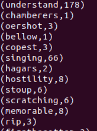

### Spark SQL

此部分利用 pyspark 对 tmdb_5000_movies.csv 进行了两项查询。由于原始数据中存在数组和字典类型的数据，数据间均用英文逗号分隔，Spark 在以 CSV 格式读取文件时可能会引起混淆，导致列错位，故先用 Excel 将原始文件打开，使用替换功能将数组间的全部英文逗号替换为中文逗号，并以 UTF-8 格式保存。观察数据还可以发现数组外存在一对引号，不利于文件处理，尝试后发现将该文件另存为 JSON 文件后再读取可以 忽略引号的影响，故将原始文件另存为 JSON 文件后再进行后续操作。

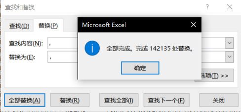

首先利用 pandas 包读取 JSON 文件为 DataFrame 以获得正确的数据类型，而后初始化 SparkContext ,利用`createDataFrame()`方法将 pandas 的 DataFrame 转化为 spark 的 Dataframe 。

使用`printSchema()`方法查看表结构，数据类型信息被保留：

```python
	#先将文件读成pandas中的dataframe
    JSON_FILE_PATH = 'movies.json'
    pandas_df = pd.read_json(JSON_FILE_PATH)
    #再转化成Spark中的dataframe
    sc = SparkContext()
    sqlContest = SQLContext(sc)
    df = sqlContest.createDataFrame(pandas_df)
    # 看一下结构
    df.printSchema()
```

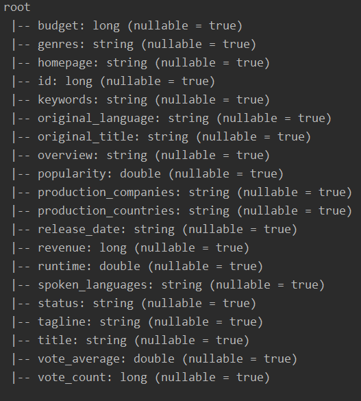

之后进行查询。第一个查询为根据平均评分信息输出排名前十的电影名称：

```python
df.select('title','vote_average').orderBy(F.desc('vote_average')).show(10)
```

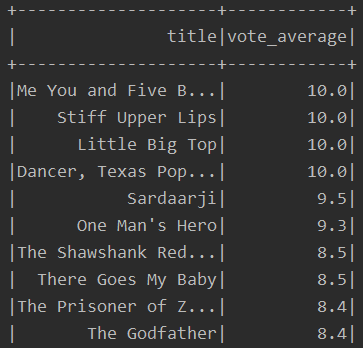

第二个查询统计了各年份上映的电影量。利用`to_date()`方法将字符串类型的时间信息转换为 Date 类型，再用`year()`方法抽取出年份信息，根据年份分类聚集并计数，按年份排序后输出。

```python
df.select(F.year(F.to_date(df.release_date)).alias('year')).groupBy('year').count().orderBy(F.desc('year')).show(100)
```

部分输出结果如图：

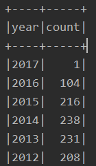


将输出的数据导入 Origen 中进行数据处理，绘制折线图：

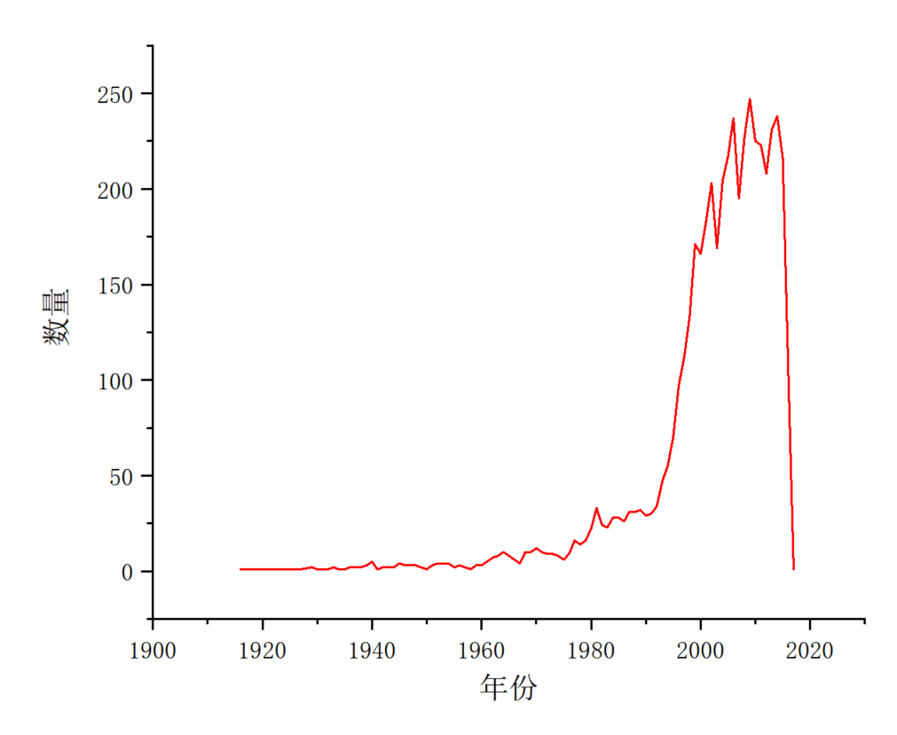

可以看到，电影业从 1990 年左右开始飞速发展，自 2000 年开始进入了较慢的震荡上升期。图中右侧的快速下降线是由于 2017 年数据统计不全（仅有一个数据）导致的。

### Spark MLlib

在对数据集进行学习前，数据的清洗和转化非常重要，由于给出的泰坦尼克号人员生还情况数据集中有大量文本型的数据和缺失值，故首要任务是将文本数据转化为数字，并填充缺失值。此处的预处理过程使用了 Python 中的 pandas 包。

首先对数据集进行查询，获取缺失值信息。此处定义了`checkEmpty(path,doc)`方法，利用`isnull()`方法统计指定文件的缺失值并输出。

```python
def checkEmpty(path,doc):
    titanic = pd.read_csv(path + doc)
    print(titanic.isnull().sum())
```

对原始数据进行查询：

```python
checkEmpty("TitanicTrainTest/","trainwithlabels.csv")
print("==============================================")
checkEmpty("TitanicTrainTest/", "testwithlabels.csv")
print("finish successfully！")
```

结果如下图，可见训练集和测试集中年龄和船舱号数据缺失较多，训练集中还缺失了两个港口信息：

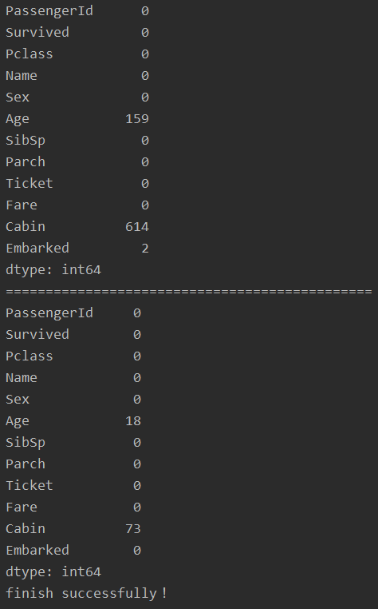

处理文件的操作均处于一个`prepare(path,doc)`方法中。该方法传入路径和文件名信息，并新建一个文件输出处理完毕的数据。

读取文件后首先对姓名信息进行处理，姓名信息中一般包含了 “Mr.” “Mrs.” 等与年龄和阶级地位相关的特征头衔字段，故可以根据头衔对姓名信息进行分类量化。此部分程序定义了一个常见的头衔列表，同时自定义了两个方法`getTitle()`和`replace_titles()`对数据进行处理与改写，并将改写后的数据暂存等待写入新文件。

```python
    titanic = pd.read_csv(path + doc)
    #获取头衔
    title_list = ['Mrs', 'Mr', 'Master', 'Miss', 'Major', 'Rev',
                  'Dr', 'Ms', 'Mlle', 'Col', 'Capt', 'Mme', 'Countess',
                  'Don', 'Jonkheer']
    titanic['Name'] = titanic['Name'].map(lambda x: getTitle(x, title_list))
    titanic['Name'] = titanic.apply(replace_titles, axis=1)
```

`getTitle()`方法接收姓名字符串和头衔列表，判断头衔列表中的元素是否存在于该字符串中。如果存在则返回该元素，不存在则返回 “other” 。

```python
def getTitle(name, titleList):
    for title in titleList:
        if title in name:
            return title
    return "other"
```

`replace_titles()`方法接收整个文件并对上一步的输出数据进行进一步归类，按头衔阶级和性别特征将其分为六类，判断类型后将文件改写为对应的数字。

```python
def replace_titles(x):
    title = x['Name']
    if title in ['Don', 'Major', 'Capt', 'Jonkheer', 'Rev', 'Col']:
        return 1
    elif title in ['Countess', 'Mme']:
        return 2
    elif title in ['Mlle', 'Ms']:
        return 3
    elif title == 'Dr':
        if x['Sex'] == 'Male':
            return 4
        else:
            return 5
    else:
        return 6
```

由于缺失的年龄信息相较于全体数据来说数量较少，故此处利用`median()`方法获取全体年龄数据的均值填充缺失的年龄。

```python
	#年龄以总体均值填充
    titanic['Age']=titanic['Age'].fillna(titanic['Age'].median())
```

将性别信息转化为数字 1 或 0 。

```python
	#数字化性别
    titanic.loc[titanic['Sex']=='male','Sex']=0
    titanic.loc[titanic['Sex']=='female','Sex']=1
```

由于港口缺失值非常少，故此处利用`random`方法让程序自行选择填充的港口。填充完毕后将港口信息转化为数字 1、2 或 3 。

```python
	#数字化港口，随机填充空白
    EmbarkedList = ['S','C','Q']
    titanic['Embarked']=titanic['Embarked'].fillna(EmbarkedList[random.randint(0,2)])
    titanic.loc[titanic['Embarked']=='S','Embarked']=0
    titanic.loc[titanic['Embarked']=='C','Embarked']=1
    titanic.loc[titanic['Embarked']=='Q','Embarked']=2
```

由于船舱号缺失值较多，故不可随机填充。此处首先定义了已有的船舱列表，并定义了一个方法`getCabinNum()`对船舱信息进行处理。

```python
    #获得船舱编号
    cabin_list = ['A', 'B', 'C', 'D', 'E', 'F', 'T', 'G']
    titanic['Cabin'] = titanic['Cabin'].map(lambda x: getCabinNum(str(x), cabin_list))
```

`getCabinNum()`方法传入值为船舱号信息和已有船舱列表，其内部定义了一个字典用于描述船舱号与量化数字的对应关系，如果船舱列表中的编号存在于船舱号信息中，就可以通过查找键的方式返回量化数字信息，对于缺失值，返回数字 9 。

```python
def getCabinNum(name, titleList):
    cabinNumDict = {'A':1, 'B':2,'C':3,'D':4,'E':5,'F':6,'T':7,'G':8}
    for title in titleList:
        if title in name:
            return cabinNumDict[title]
    return 9
```

若将存活信息放置到最后一列，可以方便后续机器学习过程的代码书写，故在处理过程的最后定义了一个`getSurvival()`方法实现存活信息的转化。

```python
	#存活改写
    titanic['Survival'] = titanic['Survived'].map(lambda x: getSurvival(x))
```

```python
def getSurvival(x):
    if x == 0:
        return "0"
    else:
        return "1"
```

由于票号信息难于量化，存活率信息已经被移动至最后一列，故删除这两列信息，之后将最终的结果写入到新文件中。在调试代码时可以令`index = True`方便查看每列信息，最终结果不应包含 index 数据。

```python
	titanic = titanic.drop(['Survived','Ticket'], axis=1)
    titanic.to_csv("TitanicTrainTest/" + "PreLoaded_" + doc,index=False)#index = True
```

整个处理程序的入口如下：

```python
def main():
    # 查看缺失值
    checkEmpty("TitanicTrainTest/","trainwithlabels.csv")
    print("==============================================")
    checkEmpty("TitanicTrainTest/", "testwithlabels.csv")

    prepare("TitanicTrainTest/", "trainwithlabels.csv")
    prepare("TitanicTrainTest/", "testwithlabels.csv")

    # 查看处理完成后的缺失值
    checkEmpty("TitanicTrainTest/", "PreLoaded_trainwithlabels.csv")
    print("==============================================")
    checkEmpty("TitanicTrainTest/", "PreLoaded_testwithlabels.csv")

    print("finish successfully！")

if __name__ == '__main__':
    main()
```

从输出结果来看，处理已基本达到要求，缺失值全部被填充：

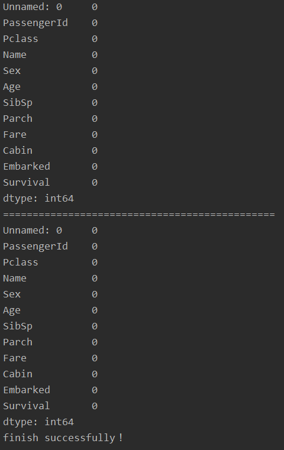

将处理完成后的文件复制至虚拟机，进行后续 Scala 操作。

#### 逻辑斯蒂回归

首先读取文件，将最后一列设为标签列，注册为临时表（titanic）进行查看。之后设置`labelIndexer`和`labelConverter`进行标签的转换。之后设置逻辑斯蒂回归所需的各类参数（lr）,构建 pipeline 并进行训练。

```scala
import org.apache.spark.sql.Row
import org.apache.spark.sql.SparkSession
import org.apache.spark.ml.linalg.{Vector,Vectors}
import org.apache.spark.ml.evaluation.MulticlassClassificationEvaluator 
import org.apache.spark.ml.{Pipeline,PipelineModel}
import org.apache.spark.ml.feature.{IndexToString, StringIndexer, VectorIndexer,HashingTF, Tokenizer}
import org.apache.spark.ml.classification.LogisticRegression
import org.apache.spark.ml.classification.LogisticRegressionModel
import org.apache.spark.ml.classification.{BinaryLogisticRegressionSummary,LogisticRegression}
import org.apache.spark.sql.functions;
import spark.implicits._

case class Titanic(features: org.apache.spark.ml.linalg.Vector, label: Double)

val data = spark.sparkContext.textFile("file:///home/francio/PreLoaded_trainwithlabels.csv").map(_.split(",")).map(p => Titanic(Vectors.dense(p(0).toDouble,p(1).toDouble,p(2).toDouble, p(3).toDouble, p(4).toDouble, p(5).toDouble, p(6).toDouble, p(7).toDouble, p(8).toDouble, p(9).toDouble), p(10).toDouble)).toDF()

data.show()

data.createOrReplaceTempView("titanic")

val df = spark.sql("select * from titanic")

df.map(t => t(1)+":"+t(0)).collect().foreach(println)

val labelIndexer = new StringIndexer().setInputCol("label").setOutputCol("indexedLabel").fit(df)

val trainingData = df

val lr = new LogisticRegression().setLabelCol("indexedLabel").setFeaturesCol("features").setMaxIter(10).setRegParam(0.3).setElasticNetParam(0.3)

val labelConverter = new IndexToString().setInputCol("prediction").setOutputCol("predictedLabel").setLabels(labelIndexer.labels)

val lrPipeline = new Pipeline().setStages(Array(labelIndexer, lr, labelConverter))

val lrPipelineModel = lrPipeline.fit(trainingData)
```

训练完毕后，读取测试数据，使用`lrPipelineModel.transform(testData)`预测生存率，预测完毕后使用`evaluate()`输出正确率。

```scala
val data = spark.sparkContext.textFile("file:///home/francio/PreLoaded_testwithlabels.csv").map(_.split(",")).map(p => Titanic(Vectors.dense(p(0).toDouble,p(1).toDouble,p(2).toDouble, p(3).toDouble, p(4).toDouble, p(5).toDouble, p(6).toDouble, p(7).toDouble, p(8).toDouble, p(9).toDouble), p(10).toDouble)).toDF()

data.show()

data.createOrReplaceTempView("titanictest")

val df = spark.sql("select * from titanictest")

df.map(t => t(1)+":"+t(0)).collect().foreach(println)

val testData = df

val lrPredictions = lrPipelineModel.transform(testData)

val evaluator = new MulticlassClassificationEvaluator().setLabelCol("indexedLabel").setPredictionCol("prediction")

val lrAccuracy = evaluator.evaluate(lrPredictions)

println("Test Error = " + (1.0 - lrAccuracy))
```

输出正确率仅为 52% ，查看预测的数据，发现全部数据均被预测为未生还。

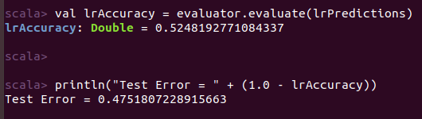

上述情况可能是由于正则化项设定值较高导致拟合效果不好，之后尝试将正则化项调低后再进行训练结果如下：

| 正则化项系数   | 0.3  | 0.2  | 0.1  | 0.05 | 0    |
| -------------- | ---- | ---- | ---- | ---- | ---- |
| **预测正确率** | 52 % | 80 % | 80 % | 80 % | 84 % |

测试表明正则化项设为 0 时可以获得最好的效果，预测正确率为 84 % 。

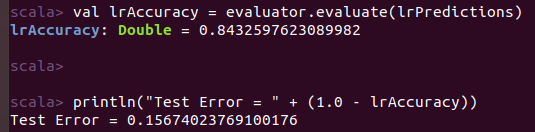

命令更改的部分为：

```scala
val lr = new LogisticRegression().setLabelCol("indexedLabel").setFeaturesCol("features").setMaxIter(10).setRegParam(0).setElasticNetParam(0.3)
```

#### 决策树

用同样的方法读取文件，将模型更换为决策树模型，进行训练并输出结果。

```scala
import org.apache.spark.sql.SparkSession
import org.apache.spark.ml.linalg.{Vector,Vectors}
import org.apache.spark.ml.Pipeline
import org.apache.spark.ml.feature.{IndexToString, StringIndexer, VectorIndexer}
import org.apache.spark.ml.classification.DecisionTreeClassificationModel
import org.apache.spark.ml.classification.DecisionTreeClassifier
import org.apache.spark.ml.evaluation.MulticlassClassificationEvaluator
import spark.implicits._

case class Titanic(features: org.apache.spark.ml.linalg.Vector, label: Double)

val data = spark.sparkContext.textFile("file:///home/francio/PreLoaded_trainwithlabels.csv").map(_.split(",")).map(p => Titanic(Vectors.dense(p(0).toDouble,p(1).toDouble,p(2).toDouble, p(3).toDouble, p(4).toDouble, p(5).toDouble, p(6).toDouble, p(7).toDouble, p(8).toDouble, p(9).toDouble), p(10).toDouble)).toDF()

data.createOrReplaceTempView("titanic")

val df = spark.sql("select * from titanic")

df.map(t => t(1)+":"+t(0)).collect().foreach(println)

val labelIndexer = new StringIndexer().setInputCol("label").setOutputCol("indexedLabel").fit(df)

val trainingData = df

val labelConverter = new IndexToString().setInputCol("prediction").setOutputCol("predictedLabel").setLabels(labelIndexer.labels)

val dtClassifier = new DecisionTreeClassifier().setLabelCol("indexedLabel").setFeaturesCol("features")

val pipelinedClassifier = new Pipeline().setStages(Array(labelIndexer, dtClassifier, labelConverter))

val modelClassifier = pipelinedClassifier.fit(trainingData)

val data_test = spark.sparkContext.textFile("file:///home/francio/PreLoaded_testwithlabels.csv").map(_.split(",")).map(p => Titanic(Vectors.dense(p(0).toDouble,p(1).toDouble,p(2).toDouble, p(3).toDouble, p(4).toDouble, p(5).toDouble, p(6).toDouble, p(7).toDouble, p(8).toDouble, p(9).toDouble), p(10).toDouble)).toDF()

data_test.show()

data_test.createOrReplaceTempView("titanictest")

val df_test = spark.sql("select * from titanictest")

df_test.map(t => t(1)+":"+t(0)).collect().foreach(println)

val testData = df_test

val predictionsClassifier = modelClassifier.transform(testData)

predictionsClassifier.select("predictedLabel", "label", "features").show(20)

val evaluatorClassifier = new MulticlassClassificationEvaluator().setLabelCol("indexedLabel").setPredictionCol("prediction"). setMetricName("accuracy")

val accuracy = evaluatorClassifier.evaluate(predictionsClassifier)

println("Test Error = " + (1.0 - accuracy))
```

结果如下，预测准确率可达 82 %，较调整参数后的逻辑斯蒂回归方法略低。

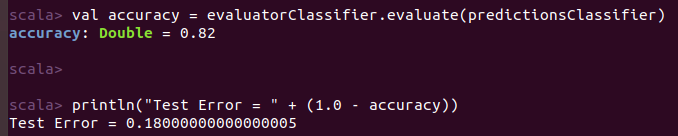

### Spark GraphX 实现 PageRank

在 Spark Shell 里用 Scala 命令实现 PageRank 时，需要将邻接矩阵转换为以空格分隔的节点对的形式，故先在本地进行数据的预处理。

读取邻接矩阵后将其拆分为分立的行，进而遍历每行，将行拆分成单个数字字符。设定行计数器`lineLabel`和列计数器`numLabel`,在遍历至数字字符 “1” 或 “1\n”（可能位于行的结尾处） 时，将行号和列号以行列对的形式写入输出文件中。

```python
if __name__ == '__main__':
    fileIn = open("adj.txt","r",encoding='utf-8')
    fileOutR = open("adj_Relationship.txt","w",encoding='utf-8')

    rolls = list(fileIn)
    lineLabel = 0
    for roll in rolls:
        lineLabel += 1
        nums = roll.split(" ")
        numLabel = 0
        for num in nums:
            numLabel += 1
            if num == "1" or num == "1\n":
                fileOutR.write(str(lineLabel)+" " + str(numLabel)+"\n")
	
    fileIn.close()
    fileOut.close()                
```

处理完毕，将输出文件复制到虚拟机中，执行后续 Scala 命令。

调用 sparkGraphX 相关的包后，进行相关的配置，并将日志级别调整为 “WARN” 避免不必要的输出。之后使用` GraphLoader.edgeListFile()`方法读取预处理得到的节点对应关系文件，将其加载为图。

```scala
package sparkGraphX
import org.apache.spark.graphx.{Graph, GraphLoader, VertexRDD}
import org.apache.spark.{SparkConf, SparkContext}
 
val conf = new SparkConf().setAppName("SimpleGraphX").setMaster("local")
val sc = new SparkContext(conf)
sc.setLogLevel("WARN")
val graph: Graph[Int, Int] = GraphLoader.edgeListFile(sc,"file:///home/francio/adj_Relationship.txt")
```

此处有两种方法对图进行 PageRank 操作，分别为动态方法和静态方法。

动态 PageRank 操作需要设置一个 PageRank 阈值，当 PR 值变动幅度小于该值时即停止计算，使用`collect`和`println`方法收集并输出结果。此处设置的阈值为 0.001。

```scala
val web: VertexRDD[Double] = graph.pageRank(0.001).vertices
web.collect.foreach(println(_))
```

结果如下图所示：

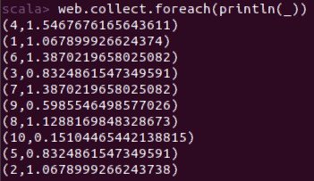

静态 PageRank 操作需要调用`staticPageRank()`方法，需要设置的参数为进行 PageRank 循环计算的次数，此处设置次数为 5 。计算完毕后，收集并输出结果。

```scala
val staticPage: VertexRDD[Double] = graph.staticPageRank(5).vertices
staticPage.collect.foreach(println(_))
```

结果如下图所示：

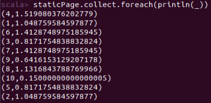

可见两种方法的结果存在一定差异。使用动态方法进行 PR 值的计算要比静态方法更加准确，但耗时明显较静态方法长。将静态方法循环次数改为 30 次后，得到的结果接近动态方法阈值设置为 0.001 的结果。

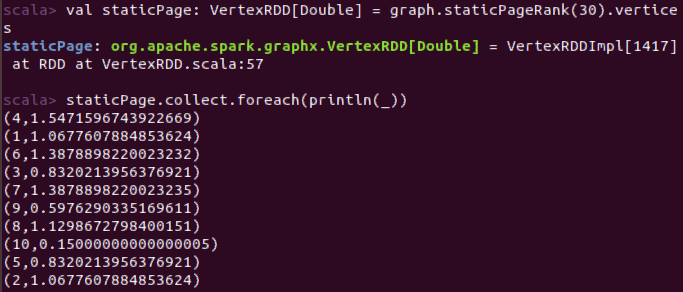

## 体会

1. Spark 相较于 Hadoop 有着更加优秀的性能，且使用方便，在本次实习中仅使用了少量命令就完成了统计词频和 PR 值的计算。但执行命令的压缩导致Spark 对传入的数据格式有着较高的要求，本次实习中耗费了大量时间对数据进行预处理和导入。
2. 实习中采用了两种操作 Spark 的方式，分别为使用 pySpark 和 spark-shell ，两种方式各有优劣。使用 pySpark 可以在操作 Spark 的同时使用python 中丰富的包，可以极大的简化了数据预处理和导入步骤，且可以在得到结果后原位作图分析,同时 python 中可以设置断点，Debug 方便。但 pyspark 最大的缺点为每次运行程序均要重新启动 Spark，效率很低，且在语法使用不够熟练的情况下容易写出一连串 Bug 。Spark-Shell 的优点是可以一边写命令一边观察输出，可以及时发现问题，但难以 Debug ，最后运行时报错往往需要重新分析整段命令，手动定位出错位置。同时 Shell 界面无法回退到上一步代码进行修改，发现代码打错后整段代码都要重新开始。
3. 在处理大数据信息的过程中，数据清洗和参数调整对结果的影响很显著。若想获得好的结果需要正确挖掘数据的信息，并尝试有目的性地调整参数。本次实习的逻辑斯蒂回归部分仅将正则化项下调 0.1 就将预测正确率提升了约 30%。
4. 实际处理数据解决问题时应做到时间成本和结果精度的平衡，在 PR 值计算时的动态和静态方法调用就从运行时间和结果精度两方面出发进行了调整。
