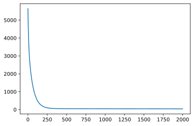
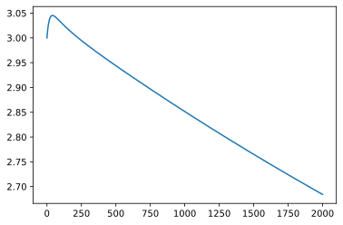
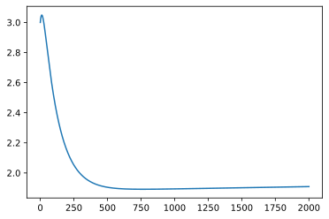
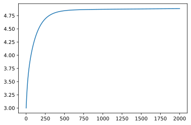
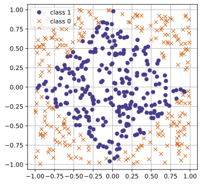
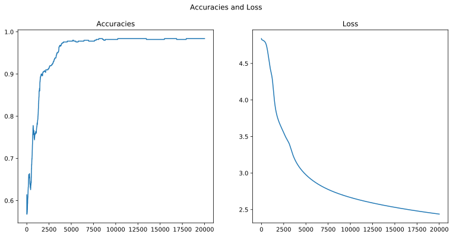
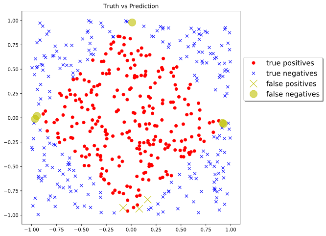

# 神经网络基础

## 多元函数回归与梯度下降法
- 一般可以认为线性回归是乘一个矩阵的伪逆矩阵
- 梯度下降：使loss（方差）最小
- 沿负梯度方向找坑，alpha是学习率，使预测值接近局部最小值


```python
import numpy as np 
num_obs = 100
x1 = np.random.uniform(0,10,num_obs)
x2 = np.random.uniform(0,10,num_obs)
const = np.ones(num_obs)
eps = np.random.normal(0,.5,num_obs)

b = 1.5
theta_1 = 2
theta_2 = 5

y = b*const + theta_1*x1 + theta_2*x2 + eps

x_mat = np.array([const,x1,x2]).T
```

### 偏导梯度与批量梯度计算（batch）
- 求得的是平均梯度，追求对各个参量的平均影响最大（batch normalization）
- 随机梯度下降：快


```python
learning_rate = 1e-3
num_iter = 2000
theta_initial = np.array([3,3,3])

def gradient_descent(learning_rate,num_iter,theta_initial):
    ## initialization steps
    theta = theta_initial
    theta_path = np.zeros((num_iter+1,3))  # 两位数组，存放参数轨迹
    theta_path[0,:] = theta_initial

    loss_vec = np.zeros(num_iter)

    for i in range(num_iter):
        y_pred = np.dot(theta.T,x_mat.T)
        loss_vec[i] = np.sum((y-y_pred)**2) # 记录每一轮迭代的loss
        grad_vec = (y-y_pred).dot(x_mat)
        grad_vec /= num_obs
        # 随机梯度下降
        # for j in range(len(y_pred)):
        #     grad_vec = (y[j]-y_pred[j])*(x_mat[j,:])
        #     theta = theta+learning_rate*grad_vec
        theta = theta + learning_rate*grad_vec
        theta_path[i+1,:] = theta
    return theta_path, loss_vec 

```


```python
import matplotlib.pyplot as plt
theta_path,loss_vect = gradient_descent(learning_rate,num_iter,theta_initial)
plt.plot(loss_vect)
plt.show()
```



    


```python
plt.plot(theta_path[:,0])
plt.show()
```



    


```python
plt.plot(theta_path[:,1])
plt.show()
```



    


```python
plt.plot(theta_path[:,2])
plt.show()
```



    


## 传统神经网络理论基础
- 二层神经网络：需要大量数据拟合，思想即位非线性sigmoid函数激活，无限的隐含层理论上可以拟合任意函数，但需要大量具有好的特征的样本
- 多层神经网络：CNN：兼顾了模型拟合和特征工程，认为本身的输入需要经过特征工程的修饰，先通过神经网络提取特征，仔由后面的网络拟合新的特征


```python
# Sigmoid
def sigmoid(x):
    return 1.0/(1.0+np.exp(-x))
```

## 单元神经网络与前馈网络
- sigmoid函数作为激活函数将数据反馈为0-1
- 单元神经网络：可实现布尔逻辑，局限在于异或问题
- 多分类：认为正确答案只有一个，输出一个one-hot向量
- Softmax函数：将最后一组神经元中的输出转化为归一化的离散概率分布
- Softmax推断：概率值最大的作为最终预测值
- softmax与交叉熵损失函数
- 输入-权重-输出。权重矩阵由训练得到
- 输出端加一个sigmoid变换


```python
def logic_gate(w1,w2,b):
    return lambda x1,x2:sigmoid(w1*x1+w2*x2+b)

def test(gate):
    for a,b in (0,0),(0,1),(1,0),(1,1):
        print('{} , {} : {}'.format(a,b,np.round(gate(a,b))))
```


```python
or_gate = logic_gate(20,20,-10)
test(or_gate)
print("#")
nand_gate = logic_gate(-10,-10,14)
test(nand_gate)
print("#")
and_gate = logic_gate(10,10,-19)
test(and_gate)
print("#")
```

    0 , 0 : 0.0
    0 , 1 : 1.0
    1 , 0 : 1.0
    1 , 1 : 1.0
    #
    0 , 0 : 1.0
    0 , 1 : 1.0
    1 , 0 : 1.0
    1 , 1 : 0.0
    #
    0 , 0 : 0.0
    0 , 1 : 0.0
    1 , 0 : 0.0
    1 , 1 : 1.0
    #


```python
# XOR问题：
def xor_gate(a,b):
    c = or_gate(a,b)
    d = nand_gate(a,b)
    return and_gate(c,d)
test(xor_gate)
```

    0 , 0 : 0.0
    0 , 1 : 1.0
    1 , 0 : 1.0
    1 , 1 : 0.0


## 前馈神经网络
- 单层输出+偏置sigmoid后作为下一层的输入
- 一组矩阵打包成一个batch输入神经网络，输出的也是一组数
- 向前传播计算流：输入-计算- sigmoid-在传入下一层。。。。。。，最后输出一个概率分布


```python
W_1 = np.array([[2,-1,1,4],[-1,2,-3,1],[3,-2,-1,5]])
W_2 = np.array([[3,1,-2,1],[-2,4,1,-4],[-1,-3,2,-5],[3,1,1,1]])

W_3 = np.array([[-1,3,-2],[1,-1,-3],[3,-2,2],[1,2,1]])
x_in = np.array([.5,.8,.2])
x_mat_in = np.array([[.5,.8,.2],[.1,.9,.6],[.2,.2,.3],[.6,.1,.9],[.5,.5,.4],[.9,.1,.9],[.1,.8,.7]])

def soft_max_vec(vec):
    return np.exp(vec)/(np.sum(np.exp(vec)))

print("Matrix W_1\n")
print(W_1)
print("-"*30)
print("vector input x_in\n")
print(x_in)
print("-"*30)

```

    Matrix W_1
    
    [[ 2 -1  1  4]
     [-1  2 -3  1]
     [ 3 -2 -1  5]]
    ------------------------------
    vector input x_in
    
    [0.5 0.8 0.2]
    ------------------------------


向前传播计算流


```python
z_2 = np.dot(x_in,W_1)
z_2
```


    array([ 0.8,  0.7, -2.1,  3.8])


```python
a_2 = sigmoid(z_2)
a_2
```


    array([0.68997448, 0.66818777, 0.10909682, 0.97811873])


```python
z_3 = np.dot(a_2,W_2)
a_3 = sigmoid(z_3)

z_4 = np.dot(a_3,W_3)
y_out = soft_max_vec(z_4)
y_out
```


    array([0.72780576, 0.26927918, 0.00291506])


矩阵数据前馈计算


```python
def soft_max_mat(mat):
    return np.exp(mat)/(np.sum(np.exp(mat),axis=1).reshape(-1,1))

print('batch矩阵输入 -- starts with the x_mat_in\n')
print(x_mat_in)
```

    batch矩阵输入 -- starts with the x_mat_in
    
    [[0.5 0.8 0.2]
     [0.1 0.9 0.6]
     [0.2 0.2 0.3]
     [0.6 0.1 0.9]
     [0.5 0.5 0.4]
     [0.9 0.1 0.9]
     [0.1 0.8 0.7]]


```python
z_2 = np.dot(x_mat_in,W_1)
z_2
```


    array([[ 0.8,  0.7, -2.1,  3.8],
           [ 1.1,  0.5, -3.2,  4.3],
           [ 1.1, -0.4, -0.7,  2.5],
           [ 3.8, -2.2, -0.6,  7. ],
           [ 1.7, -0.3, -1.4,  4.5],
           [ 4.4, -2.5, -0.3,  8.2],
           [ 1.5,  0.1, -3. ,  4.7]])


```python
a_2 = sigmoid(z_2)
z_3 = np.dot(a_2,W_2)
a_3 = sigmoid(z_3)
z_4 = np.dot(a_3,W_3)
y_out = soft_max_mat(z_4)
y_out
```


    array([[0.72780576, 0.26927918, 0.00291506],
           [0.62054212, 0.37682531, 0.00263257],
           [0.69267581, 0.30361576, 0.00370844],
           [0.36618794, 0.63016955, 0.00364252],
           [0.57199769, 0.4251982 , 0.00280411],
           [0.38373781, 0.61163804, 0.00462415],
           [0.52510443, 0.4725011 , 0.00239447]])


## 反向传播
- 向前传播-计算loss-反向传播
- 一般采用批量梯度以保证学习过程的平稳
- 多层网络计算流程符号体系：层号作为上标
- 每层梯度计算看作一个独立的网络
-  反向传播BUG：多层训练训不出来或者震荡解，不收敛，假设了前一层输入是稳定的，但对整个模型的训练使得输入也改变了，每次迭代的损失函数超平面都在变化，不保证迭代能得到最优解


```python
# 生成数据
num_obs = 500
x_mat_1 = np.random.uniform(-1,1,size = (num_obs,2))# -1~1均匀分布
x_mat_bias = np.ones((num_obs,1))
x_mat_full = np.concatenate((x_mat_1,x_mat_bias),axis = 1)# 三维数据

# x,y坐标值绝对值较大的小于0.5，返回True
# y = ((np.maximum(np.abs(x_mat_full[:,0]),np.abs(x_mat_full[:,1])))<.5).astype(int)

# 距离原点距离1的菱形区域
y = ((np.abs(x_mat_full[:,0])+np.abs(x_mat_full[:,1]))<1).astype(int)
print(y)
```

    [1 0 1 0 0 0 0 0 1 0 0 0 1 1 1 1 0 0 1 0 1 0 1 0 0 0 0 1 1 0 1 0 1 1 0 1 0
     0 0 0 1 0 0 1 1 0 1 1 1 0 0 0 0 1 0 1 0 0 0 1 1 0 1 1 1 0 1 1 0 0 1 1 0 1
     1 0 1 0 0 1 0 0 1 0 0 1 1 0 0 0 1 1 0 1 1 1 0 1 0 0 1 1 1 1 0 1 1 1 1 0 1
     1 0 1 1 0 1 1 0 0 0 0 0 1 1 1 1 1 1 0 1 1 0 1 1 0 1 1 0 1 0 1 0 1 0 1 1 0
     1 0 1 0 0 1 1 1 0 1 1 0 1 0 0 1 1 1 1 0 0 1 1 1 0 1 0 0 1 0 0 1 1 0 1 0 1
     1 0 0 1 0 1 1 1 1 1 1 0 1 0 0 0 0 1 1 0 0 1 1 1 0 1 0 1 1 0 0 1 0 0 0 1 0
     1 0 0 0 0 1 1 0 1 1 1 0 1 1 0 0 0 1 0 0 0 1 0 1 0 1 0 0 1 1 1 0 0 1 1 1 0
     0 1 1 0 1 1 1 0 0 0 1 0 0 1 0 0 1 0 1 0 1 0 1 1 1 0 0 1 0 0 1 0 1 1 1 0 1
     0 1 1 1 1 1 0 0 0 1 1 1 1 1 0 0 1 1 1 1 1 0 0 0 0 0 1 1 1 0 0 1 1 1 0 0 0
     1 1 1 1 0 1 0 0 1 1 1 1 1 0 1 1 1 1 0 0 0 1 0 1 0 1 1 1 0 1 0 1 0 0 0 1 0
     0 1 1 1 1 1 1 0 0 0 0 1 0 1 1 0 1 1 1 0 1 1 0 0 0 1 1 1 0 1 0 0 1 1 1 0 0
     0 1 0 0 1 1 1 0 1 1 1 1 0 1 1 0 0 1 1 0 1 1 1 0 0 1 1 1 0 1 1 1 0 0 0 0 1
     0 0 0 1 1 0 0 1 0 1 0 1 1 1 0 0 0 1 1 0 0 1 0 0 0 1 0 0 0 1 1 1 0 1 1 0 0
     1 0 0 1 0 0 0 1 0 0 1 0 1 0 0 1 1 0 1]


```python
fig,ax = plt.subplots(figsize = (5,5))
ax.plot(x_mat_full[y==1,0],x_mat_full[y == 1,1],"ro",label = 'class 1',color = "darkslateblue")
ax.plot(x_mat_full[y==0,0],x_mat_full[y == 0,1],"bx",label = 'class 0',color = "chocolate")
ax.grid(True)
ax.legend(loc = "best")
ax.axis('equal')
```


    (-1.096532064683622,
     1.0938515916787686,
     -1.0932023894969345,
     1.0974541486826945)



    


```python
# 模型：两层网络，sigmoid激活函数
# 向前传播与反向传播
def forward_pass(W_1,W_2):
    global x_mat
    global y
    global num_

    # 向前传播
    z_2 = np.dot(x_mat,W_1)
    a_2 = sigmoid(z_2)
    z_3 = np.dot(a_2,W_2)
    y_pred = sigmoid(z_3).reshape((len(x_mat),))
    # 反向传播
    J_z_3_grad = -y+y_pred
    J_W_2_grad = np.dot(J_z_3_grad,a_2)
    a_2_z_2_grad = sigmoid(z_2)*(1-sigmoid(z_2))
    J_W_1_grad = (np.dot((J_z_3_grad).reshape(-1,1),W_2.reshape(-1,1).T)*a_2_z_2_grad).T.dot(x_mat).T

    # 记录多层的梯度
    gradient = (J_W_1_grad,J_W_2_grad)

    return y_pred,gradient
```


```python
def loss_fn(y,y_pred):
    return np.log(np.sum((y-y_pred)**2))
```


```python
def plot_loss_accuracy(loss_vals,accuracies):
    plt.figure(figsize = (13,6))
    plt.figure(1)
   
    ax_1 = plt.subplot(121)
    ax_1.set_title("Accuracies")
    plt.plot(accuracies)

    ax_2 = plt.subplot(122)
    ax_2.set_title("Loss")
    plt.plot(loss_vals)

    plt.suptitle("Accuracies and Loss")
```


```python
W_1 = np.random.uniform(-1,1,size = (3,4))
W_2 = np.random.uniform(-1,1,size = (4))
num_iter = 20000
learning_rate = .001
x_mat = x_mat_full

loss_vals,accuracies = [],[]
for i in range(num_iter):
    # 向前传播并反向修正
    y_pred,(J_W_1_grad,J_W_2_grad) = forward_pass(W_1,W_2)
    # 调整模型参数
    W_1 = W_1 - learning_rate*J_W_1_grad
    W_2 = W_2 - learning_rate*J_W_2_grad
    # 计算loss和正确率
    curr_loss = loss_fn(y,y_pred)
    loss_vals.append(curr_loss)
    acc = np.sum((y_pred >= .5)==y)/num_obs
    accuracies.append(acc)

    # 每500次迭代打印一次loss和正确率
    if ((i%2000)==0):
        print('iteration {}, log loss is {:.4f}, accuracy is {}'.format(
            i,curr_loss,acc
        ))

plot_loss_accuracy(loss_vals,accuracies)
```

    iteration 0, log loss is 4.8399, accuracy is 0.568
    iteration 2000, log loss is 3.6910, accuracy is 0.906
    iteration 4000, log loss is 3.1294, accuracy is 0.974
    iteration 6000, log loss is 2.8777, accuracy is 0.978
    iteration 8000, log loss is 2.7496, accuracy is 0.982
    iteration 10000, log loss is 2.6662, accuracy is 0.982
    iteration 12000, log loss is 2.6041, accuracy is 0.984
    iteration 14000, log loss is 2.5536, accuracy is 0.982
    iteration 16000, log loss is 2.5104, accuracy is 0.984
    iteration 18000, log loss is 2.4724, accuracy is 0.984



    


```python
# 可视化结果
pred1 = (y_pred>=0.5)
pred0 = (y_pred<0.5)
fig,ax = plt.subplots(figsize = (8,8))
# true predictions
ax.plot(x_mat[pred1 & (y==1),0],x_mat[pred1 & (y==1),1],'ro',label = "true positives")
ax.plot(x_mat[pred0 & (y==0),0],x_mat[pred0 & (y==0),1],'bx',label = "true negatives")
# false predictions
ax.plot(x_mat[pred1 & (y==0),0],x_mat[pred1 & (y==0),1],'yx',label = "false positives",markersize=15)
ax.plot(x_mat[pred0 & (y==1),0],x_mat[pred0 & (y==1),1],'yo',label = "false negatives",markersize=15,alpha = .6)
ax.set(title = "Truth vs Prediction")
ax.legend(bbox_to_anchor = (1,0.8),fancybox = True,shadow = True,fontsize = 'x-large')
```


    <matplotlib.legend.Legend at 0x1ff7fc6d088>


​    

​    


## Pytorch基础
- tensor：高维vector
- randn-like：数据类型会继承，注意。
- 共享数据：type case error问题
- cuda：GPU加速
- Autograd：自回归模型，与数据流图概念概念绑定
	- 生成tenser的函数认为是可导的
	- backward：反向传播


```python
# Tensor 的声明与初始化
import torch
x = torch.zeros(5,3,dtype = torch.long)
print(x)
```

    tensor([[0, 0, 0],
            [0, 0, 0],
            [0, 0, 0],
            [0, 0, 0],
            [0, 0, 0]])


```python
x = torch.tensor([5.5,3])
print(x)
```

    tensor([5.5000, 3.0000])


```python
# "空Tensor"
x = torch.empty(5,3)
print(x)
y = torch.empty(5,3)
y = torch.randn_like(x,dtype = torch.float)
print(y)
print(id(x))
print(id(y))
```

    tensor([[0., 0., 0.],
            [0., 0., 0.],
            [0., 0., 0.],
            [0., 0., 0.],
            [0., 0., 0.]])
    tensor([[-0.5637,  0.1810,  0.0713],
            [-0.3830, -1.0565, -0.1881],
            [ 0.3225,  1.1899,  0.0575],
            [-2.0213,  1.5770, -0.1231],
            [ 1.4329,  0.1756, -0.7572]])
    2195174509288
    2196868855272


```python
x = torch.rand(5,3) # 重新生成
 
print(x)
print(id(x))
```

    tensor([[0.3905, 0.2527, 0.4674],
            [0.2537, 0.3735, 0.1435],
            [0.9109, 0.2139, 0.5439],
            [0.9387, 0.1172, 0.2522],
            [0.9255, 0.0894, 0.4308]])
    2195174545512


```python
# 运算
y = torch.ones(5,3,dtype = torch.int)
print(x+y)
print(x.add_(y))
# 自动转型
# print(y.add_(x)) # result type Float can't be cast to the desired output type Int
```

    tensor([[1.3905, 1.2527, 1.4674],
            [1.2537, 1.3735, 1.1435],
            [1.9109, 1.2139, 1.5439],
            [1.9387, 1.1172, 1.2522],
            [1.9255, 1.0894, 1.4308]])
    tensor([[1.3905, 1.2527, 1.4674],
            [1.2537, 1.3735, 1.1435],
            [1.9109, 1.2139, 1.5439],
            [1.9387, 1.1172, 1.2522],
            [1.9255, 1.0894, 1.4308]])


```python
# 切片与广播
x[2:] = torch.tensor([1,2,3])
print(x)
y = torch.tensor([0,1,2])
print(x*y)
```

    tensor([[1.3905, 1.2527, 1.4674],
            [1.2537, 1.3735, 1.1435],
            [1.0000, 2.0000, 3.0000],
            [1.0000, 2.0000, 3.0000],
            [1.0000, 2.0000, 3.0000]])
    tensor([[0.0000, 1.2527, 2.9348],
            [0.0000, 1.3735, 2.2869],
            [0.0000, 2.0000, 6.0000],
            [0.0000, 2.0000, 6.0000],
            [0.0000, 2.0000, 6.0000]])


```python
# 与Numpy ndarray 共享数据定义
a = torch.ones(5,dtype = torch.int)
print(a)
b = a.numpy()
print(b)
b += 1
print(a)
a[3] = 6
print(b)
```

    tensor([1, 1, 1, 1, 1], dtype=torch.int32)
    [1 1 1 1 1]
    tensor([2, 2, 2, 2, 2], dtype=torch.int32)
    [2 2 2 6 2]


```python
# 类型自动升级，赋值语句生成新的对象
b = b + 1.0
print(b)
print(a)
```

    [3. 3. 3. 7. 3.]
    tensor([2, 2, 2, 6, 2], dtype=torch.int32)


对向量直接计算要比使用for循环逐元素计算快


```python
# GPU 加速
if torch.cuda.is_available():
    device = torch.device('cuda')
    y = torch.ones_like(x,device = device)
    x = x.to(device)
    z = x+y
    print(z)
    print(z.to('cpu',torch.double))
else:
    print("No cuda avaiaable")
```

    tensor([[2.3905, 2.2527, 2.4674],
            [2.2537, 2.3735, 2.1435],
            [2.0000, 3.0000, 4.0000],
            [2.0000, 3.0000, 4.0000],
            [2.0000, 3.0000, 4.0000]], device='cuda:0')
    tensor([[2.3905, 2.2527, 2.4674],
            [2.2537, 2.3735, 2.1435],
            [2.0000, 3.0000, 4.0000],
            [2.0000, 3.0000, 4.0000],
            [2.0000, 3.0000, 4.0000]], dtype=torch.float64)


```python
# Autograd, NN模型回归机制,requires_grad = True用于跟踪计算
x = torch.ones(2,2,requires_grad = True)
print(x)
y = x+1
print(y)
z = y*2
print(z)
```

    tensor([[1., 1.],
            [1., 1.]], requires_grad=True)
    tensor([[2., 2.],
            [2., 2.]], grad_fn=<AddBackward0>)
    tensor([[4., 4.],
            [4., 4.]], grad_fn=<MulBackward0>)


```python
out = z.mean()
print(out)

```

    tensor(4., grad_fn=<MeanBackward0>)


```python
# out.backward(retain_graph=True)
# print(x.grad)
# #print(y.grad)
```

## 卷积神经网络
- 全连接网络的缺陷
	- 计算量非常大
	- 从计算机视觉出发：相关性是局部的，没有必要把所有像素相互关联
- 卷积神经网络：局部连接+权值共享，目的是学出多个kernel（但不知道有几个kernel）
	- 目标：kernel稳定，可提取出特征，用kernel提取的特征扔给分类器后可以较好的分类
	- kernel在图片上滑动时不需要改变自身权重，是全局的kernel（局部运行，但权重针对全局，权值共享）
	-   池化：即子采样，降采样（特征的尺度不同）
		- 池化具有平移旋转和尺度（规模）不变性
		- 想法：将图像矩阵压缩后用相同大小的核去观察，观察到的原图信息更多
		- 多核多通道卷积神经网络
- 多个kernel对应输出多个通道，即对应多维空间
- pitting：图像周围补一圈0
- 步长：卷积核一次走几个像素‘
- 层级化卷积神经网络：通过层次化降采样发现更大的特征，再通过polling尽可能将底层小特征传至高层
	- 大特征为小特征的组合
	- 消除类小特征丢失的缺陷
-  梯度消失问题
	- 一般可换用RELU，但大梯度流过relu将使权重无法更新，神经元死掉
- RELU 配合特征提取，可认为是层次化的不同尺度下的特征提取系，将特征传给分类器的前一层

- 卷积神经网络实现手写数字集分类：卷积，激活，池化，全连接，激活
- 读入数据：Dataloader
- forward：前馈计算
- optimizer：尽量使梯度下降不走回头路
- 数据增广：在高维空间中的分类面中可允许的误差的减小，SVM
- 数据标准化：可增加正确率
- Batch normalization：统计激活的batch的均值与方差，保证样本数据平稳，防止梯度消失
- 指标：精确率，准确率，召回率

- 可视化工具：visdom
- batch 与loss可视化
- CNN可视化，梯度上升，反卷积，遮挡敏感度等

- Pytorch中的Hook
	- hook机制可以实现一些额外的功能，又不用修改主代码，用以提取非叶子张量的梯度等
	- 可获取输入输出信息
-  白盒攻击：反响溯源过程，找到梯度的敏感特征
- 语义理解：较难实现

